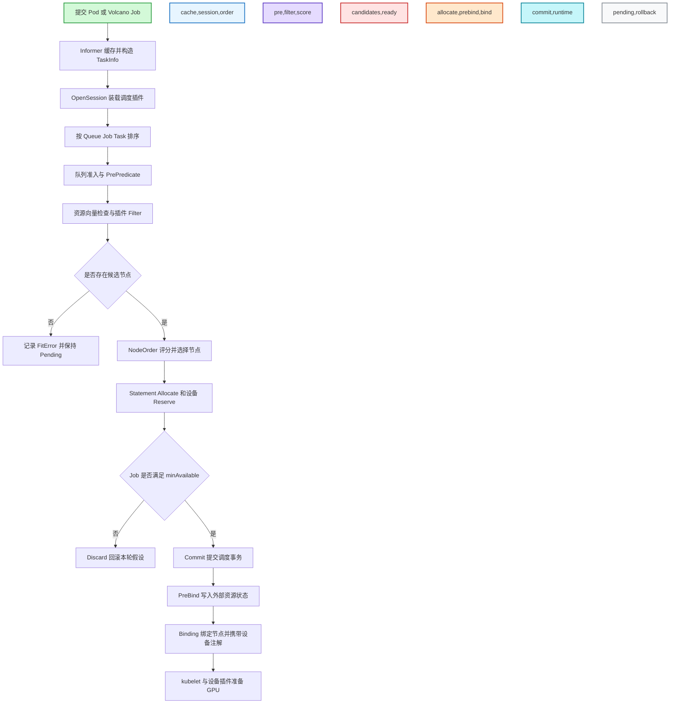
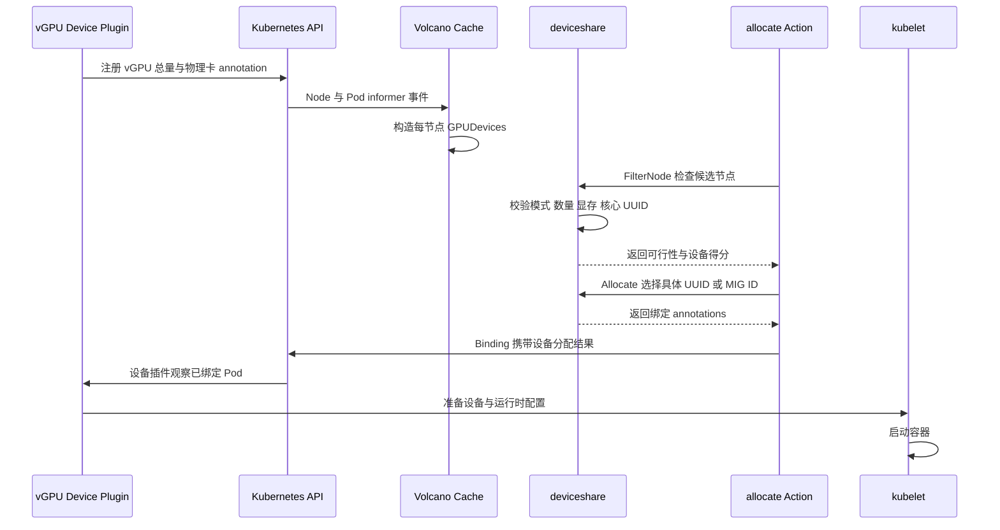
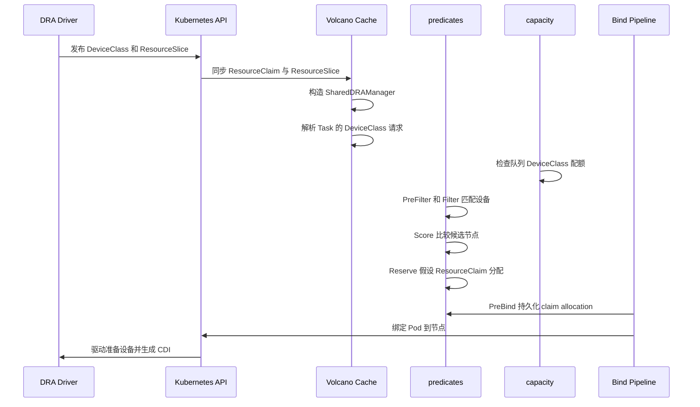

# Volcano GPU 调度设计与源码导读

本文面向希望从使用方式一路读到调度器实现的开发者，说明 Volcano 如何接收 GPU 请求、筛选和评分节点、预留具体设备，以及最终把 Pod 绑定到节点。

本文基于仓库版本 `v1.16.0-alpha.1-13-gcaf21f3d4`、提交 `caf21f3d447c8f6d52fc0e48ab6db2b2f3773373`。GPU、DRA 和 Kubernetes API 都是版本敏感能力；阅读其他分支时，应重新核对资源名、feature gate 和 API 版本。

配套清单位于 [`example/gpu-scheduling`](../../example/gpu-scheduling/README.md)。

## 1. 先回答：Volcano 有几种使用 GPU 的方法

按用户提交工作负载时使用的资源接口划分，当前代码有 **3 类主流入口**；如果把仍保留的旧兼容接口算上，则一共是 **4 类**：

| 类别 | 用户接口 | Volcano 是否感知具体 GPU | 隔离方式 | 建议 |
| --- | --- | --- | --- | --- |
| 1. Kubernetes 扩展资源整卡 | `nvidia.com/gpu`，或设备插件发布的 MIG 资源名 | 否，只把它当标量资源 | 由设备插件和硬件决定 | 独占整卡的首选 |
| 2. Volcano vGPU | `volcano.sh/vgpu-number`、`volcano.sh/vgpu-memory`、`volcano.sh/vgpu-cores` | 是，维护每张物理卡的 UUID、显存、核心和占用 | HAMI-core 软件隔离，或 Dynamic MIG 硬件隔离 | GPU 共享的推荐入口 |
| 3. Kubernetes DRA | `DeviceClass`、`ResourceClaim`、`ResourceClaimTemplate` | Volcano 调用 Kubernetes DRA 插件；具体设备由 DRA 驱动描述和分配 | 由 DRA 驱动、CDI 和硬件决定 | 采用 DRA 生态时使用，注意版本门槛 |
| 4. 旧 GPU Number / GPU Sharing | `volcano.sh/gpu-number`、`volcano.sh/gpu-memory` | 是，按设备编号维护旧式设备池 | 旧 Volcano device plugin | 自 v1.9 起废弃，仅用于存量兼容 |

第二类 vGPU 还包含两条真正不同的设备分配路径：

- **HAMI-core**：通过 CUDA API 拦截限制显存和核心比例，适合细粒度共享。
- **Dynamic MIG**：从允许的 MIG geometry 中选择硬件切片，适合需要硬隔离和稳定性能的任务。

因此也可以记为：**3 个主流入口、4 个含兼容入口、vGPU 内部 2 种切分模式**。

### 1.1 MIG 和 time-slicing 为什么没有再单独计数

如果 NVIDIA device plugin 把静态 MIG profile 发布为 `nvidia.com/mig-*`，或把 time-slicing 副本仍发布成 `nvidia.com/gpu`，Volcano 侧看到的仍是 Kubernetes 标量扩展资源，走第一类通用流程。切分、注入和隔离行为来自设备插件，不是另一套 Volcano 调度算法。

Volcano vGPU 的 Dynamic MIG 不同：调度器会读取每张卡的状态并选择 MIG geometry 和实例，所以属于第二类 device-aware 流程。

## 2. 所有方式共享的 Volcano 调度骨架

无论请求的是整卡、vGPU 还是 DRA，外层批调度逻辑相同：先按 Queue、Job、Task 排序，再做节点过滤和评分；只有满足 gang 的 `minAvailable` 时才提交事务并绑定。



关键源码入口：

1. [`Scheduler.runOnce`](../../pkg/scheduler/scheduler.go#L124) 打开 Session，并按配置依次执行 action。
2. [`OpenSession`](../../pkg/scheduler/framework/framework.go#L34) 构造快照并调用各插件的 `OnSessionOpen` 注册扩展点。
3. [`allocate.Action.Execute`](../../pkg/scheduler/actions/allocate/allocate.go#L122) 明确了 Queue → Job → Task → Predicate → NodeOrder 的五级主流程。
4. [`allocateResourcesForTasks`](../../pkg/scheduler/actions/allocate/allocate.go#L719) 对每个 Task 执行 PrePredicate、并行节点过滤、评分和假设分配。
5. [`Statement.Allocate`](../../pkg/scheduler/framework/statement.go#L256) 修改 Session 内状态并触发插件的 `AllocateFunc`。
6. [`Statement.Commit`](../../pkg/scheduler/framework/statement.go#L402) 只在 Job ready 后把操作送入异步绑定队列；[`Statement.Discard`](../../pkg/scheduler/framework/statement.go#L375) 逆序回滚失败的 gang 尝试。
7. [`SchedulerCache.BindTask`](../../pkg/scheduler/cache/cache.go#L1457) 先执行 PreBind，再调用 Kubernetes Binding API。

### 2.1 GPU 请求如何进入资源向量

[`NewTaskInfo`](../../pkg/scheduler/api/job_info.go#L207) 调用 [`GetPodResourceRequest`](../../pkg/scheduler/api/pod_info.go#L68)，把 Pod 的 CPU、内存和标量扩展资源保存为 `TaskInfo.InitResreq` / `Resreq`。标量资源由 [`NewResource`](../../pkg/scheduler/api/resource_info.go#L86) 写入 `ScalarResources`。

`allocate` action 在调用插件前先检查 `task.InitResreq <= node.FutureIdle()`；因此 `nvidia.com/gpu`、vGPU 资源以及旧 GPU 资源首先都受到节点总量约束。vGPU 和旧 GPU 模式还会额外进入逐设备过滤，解决只看节点总量无法识别的单卡显存碎片问题。

## 3. 方法一：`nvidia.com/gpu` 整卡或通用扩展资源

### 3.1 适用场景

- 分布式训练，每个 worker 独占一张或多张 GPU。
- NVIDIA device plugin 已经发布 `nvidia.com/gpu`。
- 静态 MIG、time-slicing 或其他厂商设备已经被 device plugin 映射为 Kubernetes 扩展资源，且不需要 Volcano 选择具体设备 ID。

示例见 [`01-full-gpu-job.yaml`](../../example/gpu-scheduling/01-full-gpu-job.yaml)。

### 3.2 主流程

1. NVIDIA device plugin 把 `nvidia.com/gpu` 写入 Node 的 `status.capacity` 和 `status.allocatable`。
2. Pod admission 后，请求进入 `TaskInfo.Resreq.ScalarResources`。
3. Queue 插件可把 GPU 纳入配额或公平性计算；DRF、capacity 等都复用通用资源向量。
4. `allocate.predicate` 先比较 Task 请求与 Node 的 `FutureIdle`，过滤 GPU 数量不足的节点。
5. `predicates` 插件再运行亲和性、污点、端口、卷和其他 Kubernetes Filter。
6. `binpack`、`nodeorder` 等对候选节点评分。若希望 GPU 显式参与 binpack，需要配置 `binpack.resources: nvidia.com/gpu`。
7. gang 条件满足后提交 Binding。kubelet 调用 NVIDIA device plugin 的 Allocate，后者为容器选择实际 GPU 并完成设备注入。

关键代码：

- GPU 标准资源名常量：[`GPUResourceName`](../../pkg/scheduler/api/resource_info.go#L40)。
- 通用资源检查：[`allocate.predicate`](../../pkg/scheduler/actions/allocate/allocate.go#L985)。
- 节点分组与评分：[`prioritizeNodes`](../../pkg/scheduler/actions/allocate/allocate.go#L881)。
- 扩展资源 binpack 参数：[`binpack.calculateWeight`](../../pkg/scheduler/plugins/binpack/binpack.go#L94)。
- 最终 Kubernetes Binding：[`DefaultBinder.Bind`](../../pkg/scheduler/cache/cache.go#L229)。

### 3.3 配置 GPU binpack

```yaml
- name: binpack
  arguments:
    binpack.weight: 10
    binpack.cpu: 1
    binpack.memory: 1
    binpack.resources: nvidia.com/gpu
    binpack.resources.nvidia.com/gpu: 5
```

这会提高“已经使用较多 GPU 的节点”的得分，从而收拢 GPU 任务，为其他节点保留连续空闲资源。它只改变节点评分，不改变设备隔离。

### 3.4 静态 MIG 和 time-slicing 示例

静态 MIG 的资源名由 NVIDIA device plugin 配置决定，Pod 写法仍是扩展资源：

```yaml
resources:
  limits:
    nvidia.com/mig-1g.10gb: 1
```

time-slicing 常仍请求 `nvidia.com/gpu: 1`。Volcano 只看到一个可计数副本，无法从这个资源名判断实际物理卡、显存份额或性能隔离；这些语义完全由 NVIDIA device plugin 配置承担。

## 4. 方法二：Volcano vGPU

### 4.1 组件和资源模型

vGPU 需要同时部署 Volcano scheduler 和 `volcano-vgpu-device-plugin`。默认资源名定义在 [`pkg/scheduler/api/devices/config/vgpu.go`](../../pkg/scheduler/api/devices/config/vgpu.go#L20)：

| 资源 | 含义 |
| --- | --- |
| `volcano.sh/vgpu-number` | 容器需要的 vGPU 数量 |
| `volcano.sh/vgpu-memory` | 每个 vGPU 需要的显存量，默认单位由 device plugin 配置约定 |
| `volcano.sh/vgpu-memory-percentage` | 每个 vGPU 需要的显存百分比；只有配置了该资源名时生效 |
| `volcano.sh/vgpu-cores` | 每个 vGPU 的核心百分比，通常为 0 到 100 |

设备插件还在 Node annotation `volcano.sh/node-vgpu-register` 中注册 GPU UUID、每卡显存、可共享数量、型号、健康状态和节点模式。调度器通过 [`NewGPUDevices`](../../pkg/scheduler/api/devices/nvidia/vgpu/device_info.go#L94) 解码这些数据。

### 4.2 调度器配置

参考 [`00-vgpu-scheduler-configmap.yaml`](../../example/gpu-scheduling/00-vgpu-scheduler-configmap.yaml)。核心配置是：

```yaml
- name: deviceshare
  arguments:
    deviceshare.VGPUEnable: true
    deviceshare.SchedulePolicy: binpack
    deviceshare.ScheduleWeight: 10
```

`SchedulePolicy` 有两种设备级策略：

- `binpack`：优先使用已经占用显存较多的设备，尽量填满少量 GPU。
- `spread`：优先使用尚未被分配的设备，分散负载。

Pod annotation `volcano.sh/vgpu-podgroup-policy: spread` 是另一层约束：它避免同一个 PodGroup 的两个 Pod 落到同一张物理 GPU。它与全局设备评分策略可以同时使用。

### 4.3 vGPU 主流程



源码链路：

1. [`deviceshare.enablePredicate`](../../pkg/scheduler/plugins/deviceshare/deviceshare.go#L96) 解析 vGPU 开关、策略和权重，并注册设备类型。
2. [`NodeInfo.setNodeOthersResource`](../../pkg/scheduler/api/node_info.go#L356) 在节点快照中建立 `GPUDevices`。
3. [`deviceshare.OnSessionOpen`](../../pkg/scheduler/plugins/deviceshare/deviceshare.go#L223) 注册 `PredicateFn` 和 `NodeOrderFn`。
4. [`GPUDevices.FilterNode`](../../pkg/scheduler/api/devices/nvidia/vgpu/device_info.go#L307) 用快照执行无副作用试分配并缓存得分。
5. [`checkNodeGPUSharingPredicateAndScore`](../../pkg/scheduler/api/devices/nvidia/vgpu/utils.go#L379) 逐容器、逐设备检查：
   - Pod 指定的 `volcano.sh/vgpu-mode` 是否匹配节点模式；
   - UUID allowlist / denylist；
   - 可共享实例数、单卡剩余显存和剩余核心；
   - 核心为 100 时是否能独占；
   - GPU 型号和 PodGroup 设备 spread 约束。
6. [`sortedDeviceIndicesByPolicy`](../../pkg/scheduler/api/devices/nvidia/vgpu/utils.go#L529) 决定 binpack / spread 的设备遍历顺序。
7. `Statement.Allocate` 触发 [`predicates` 的 AllocateFunc](../../pkg/scheduler/plugins/predicates/predicates.go#L213)，再调用 [`GPUDevices.Allocate`](../../pkg/scheduler/api/devices/nvidia/vgpu/device_info.go#L321) 进行真实的内存台账更新并生成绑定 annotations。
8. 如果 gang 不满足或后续失败，[`GPUDevices.Release`](../../pkg/scheduler/api/devices/nvidia/vgpu/device_info.go#L280) 回退设备台账和临时 annotations。

调度器写入的核心 annotations 包括：

- `volcano.sh/vgpu-node`
- `volcano.sh/vgpu-ids-new`
- `volcano.sh/devices-to-allocate`
- `volcano.sh/vgpu-time`
- `volcano.sh/bind-phase`

这些 annotations 被放进 Kubernetes `Binding`，API Server 在绑定节点时原子合并到 Pod；这样避免“先 patch Pod、后 bind”之间的竞态。

### 4.4 HAMI-core 流程

示例见 [`02-vgpu-hami-core-job.yaml`](../../example/gpu-scheduling/02-vgpu-hami-core-job.yaml)。

1. 节点由 device plugin 注册为 `hami-core` 模式。
2. Pod 可显式写 `volcano.sh/vgpu-mode: hami-core`；省略时也允许匹配任意支持模式的节点。
3. 调度器按显存、核心、共享数量等条件选择物理 GPU UUID。
4. [`HAMICoreFactory.TryAddPod`](../../pkg/scheduler/api/devices/nvidia/vgpu/hamicore.go#L31) 在试分配中累计 `UsedNum`、`UsedMem`、`UsedCore`。
5. 绑定后，device plugin 和 HAMI-core 为容器注入目标 GPU，并在 CUDA 调用层执行显存和核心限制。

适合：推理、小模型、Notebook、低利用率任务，以及没有 MIG 能力的 GPU。

### 4.5 Dynamic MIG 流程

示例见 [`03-vgpu-dynamic-mig-job.yaml`](../../example/gpu-scheduling/03-vgpu-dynamic-mig-job.yaml)。

1. 节点 GPU 必须支持并启用 MIG，device plugin 把节点注册为 `mig` 模式。
2. 调度器从 `volcano-vgpu-device-config` 读取 GPU 型号对应的 `knownMigGeometries`。
3. Pod 用相同的 vGPU 数量和显存资源，并通过 `volcano.sh/vgpu-mode: mig` 强制选择 MIG 节点。
4. [`MIGFactory.TryAddPod`](../../pkg/scheduler/api/devices/nvidia/vgpu/mig.go#L31) 调用 `findMatch`：
   - 如果该物理 GPU 已采用某个 geometry，只能从这个 geometry 的剩余实例选择；
   - 如果尚未采用 geometry，按配置顺序选择第一个可满足请求的 geometry；
   - 在 geometry 内按显存从小到大选择能够容纳请求的 MIG 实例。
5. 返回值不是普通 GPU UUID，而是编码了 geometry 和位置的 MIG ID。device plugin 根据该结果创建或复用 MIG 实例，再交给容器。

请求 8 GiB 显存最终可能得到 10 GiB 的 MIG profile，这是离散硬件切片的正常结果。

### 4.6 vGPU 当前实现边界

- 节点只有一种共享模式，但集群可由 HAMI-core 节点和 MIG 节点混合组成。
- 当前 [`getSharingMode`](../../pkg/scheduler/api/devices/nvidia/vgpu/utils.go#L368) 只识别 `mig`；其他值回退为 `hami-core`。代码虽然定义了 `mps` 常量，但当前没有注册 MPS `SharingFactory`，不能把它当作已完成的第三种 vGPU 模式。
- `deviceshare.GPUSharingEnable`、`deviceshare.GPUNumberEnable`、`deviceshare.VGPUEnable` 不能任意同时打开；冲突检查见 [`deviceshare.go`](../../pkg/scheduler/plugins/deviceshare/deviceshare.go#L115)。
- 单纯设置 vGPU 扩展资源不够，节点还必须有有效的 `volcano.sh/node-vgpu-register` annotation；否则不会建立逐设备池。

## 5. 方法三：Kubernetes DRA GPU

DRA 不再把 GPU 只表示成一个整数，而是由驱动发布 `DeviceClass` 和 `ResourceSlice`，用户通过 `ResourceClaim` 描述设备需求。Volcano 复用 Kubernetes `DynamicResources` 调度插件完成筛选、评分、Reserve 和 PreBind。

示例见 [`04-dra-gpu-job.yaml`](../../example/gpu-scheduling/04-dra-gpu-job.yaml)。该清单使用本仓库依赖的 Kubernetes 1.36 `resource.k8s.io/v1` API；旧集群需要按其 Kubernetes 版本调整 API 和字段。

### 5.1 DRA 主流程



源码链路：

1. [`SchedulerCache.addEventHandler`](../../pkg/scheduler/cache/cache.go#L626) 在 `DynamicResourceAllocation` feature gate 开启时创建 `ResourceClaim` assume cache、`ResourceSliceTracker` 和 `SharedDRAManager`，核心初始化位于 [`cache.go`](../../pkg/scheduler/cache/cache.go#L831)。
2. [`buildTaskDRAInfo`](../../pkg/scheduler/cache/cache.go#L1924) 把 claim 请求按 `DeviceClass` 聚合到 `TaskInfo.DRAResreq`，供 Volcano capacity 插件进行队列配额核算。
3. [`PredicatesPlugin.InitPlugin`](../../pkg/scheduler/plugins/predicates/predicates.go#L474) 注册 Kubernetes `DynamicResources` 的 `PreFilter`、`Filter`、`Reserve`、`Score` 和 `PreBind` 扩展点，DRA 部分见 [`predicates.go`](../../pkg/scheduler/plugins/predicates/predicates.go#L633)。
4. 节点过滤和评分仍由 Volcano allocate action 驱动，但具体 DRA 可行性来自 Kubernetes `DynamicResources` 插件。
5. [`PredicatesPlugin.PreBind`](../../pkg/scheduler/plugins/predicates/predicates.go#L886) 在普通 Pod Binding 之前持久化 ResourceClaim 分配；失败时 [`PreBindRollBack`](../../pkg/scheduler/plugins/predicates/predicates.go#L909) 执行 Unreserve。
6. capacity 插件用 `deviceclass/<class>` 和 `<dimension>.deviceclass/<class>` 两种键核算设备数量与 consumable capacity。解析入口是 [`parseDRAResourceList`](../../pkg/scheduler/plugins/capacity/capacity.go#L142)，分配检查入口是 [`checkDRAAllocatable`](../../pkg/scheduler/plugins/capacity/capacity.go#L246)。

### 5.2 启用要求

至少需要：

- Kubernetes 集群开启与自身版本匹配的 DRA API / feature gates。
- Volcano scheduler 进程开启 `DynamicResourceAllocation=true`。
- 安装 GPU DRA driver，并确保容器运行时启用 CDI。
- Volcano `predicates` 插件存在于 scheduler 配置。
- 如果要做队列 DRA 配额，再启用 `capacity` 插件及其 DRA 参数。

当前提交的一个重要细节：[`PredicatesPlugin.New`](../../pkg/scheduler/plugins/predicates/predicates.go#L124) 直接从进程 feature gate 初始化 `dynamicResourceAllocationEnable`，但没有读取文档中出现过的 `predicate.DynamicResourceAllocationEnable` ConfigMap 参数。因此在这个版本上，**scheduler 进程的 `--feature-gates=DynamicResourceAllocation=true` 才是必要开关，不能只依赖 ConfigMap 参数**。capacity 插件自己的两个 DRA 参数则确实会被读取。

另一个容易踩坑的字段是 Queue guarantee：当前 CRD 的结构是 `spec.guarantee.resource`，不是把 ResourceList 直接放到 `spec.guarantee` 下。capacity 插件也读取 [`queue.Queue.Spec.Guarantee.Resource`](../../pkg/scheduler/plugins/capacity/capacity.go#L1091)。

参考配置：

```yaml
actions: "enqueue, allocate, backfill, reclaim"
tiers:
- plugins:
  - name: priority
  - name: gang
- plugins:
  - name: drf
  - name: predicates
  - name: capacity
    arguments:
      capacity.DynamicResourceAllocationEnable: true
      capacity.DRAConsumableCapacityEnable: true
  - name: nodeorder
```

### 5.3 DRA 队列配额

```yaml
apiVersion: scheduling.volcano.sh/v1beta1
kind: Queue
metadata:
  name: gpu-dra
spec:
  reclaimable: true
  capability:
    "deviceclass/gpu.nvidia.com": "8"
  deserved:
    "deviceclass/gpu.nvidia.com": "4"
  guarantee:
    resource:
      "deviceclass/gpu.nvidia.com": "1"
```

多个 Pod 引用同一个 shareable `ResourceClaim` 时，capacity 插件按 claim 去重，只计一次配额。相关实现位于 [`incrementalTaskDRA`](../../pkg/scheduler/plugins/capacity/capacity.go#L321) 和 `resourceClaimRefs` 引用计数。

### 5.4 当前限制

- `buildTaskDRAInfo` 会跳过 `FirstAvailable` 和 `allocationMode: All` 的 **Volcano 队列配额核算**；Kubernetes DRA 调度插件本身仍可能处理受支持的请求。
- consumable capacity 需要相应 feature gate，并只解决逻辑配额，不解决单设备物理碎片。
- allocate action 尚未接入 DRA `PostFilter`；源码中的 TODO 位于 [`allocate.go`](../../pkg/scheduler/actions/allocate/allocate.go#L811)。极端的多 claim、部分 PreBind 成功后重试场景需要特别测试。
- DRA API 在不同 Kubernetes 版本变化较大，示例不能跨版本机械复制。

## 6. 方法四：旧 GPU Number / GPU Sharing

这两种模式从 Volcano v1.9 起已经废弃，但当前代码仍保留兼容实现。

| 旧模式 | 资源 | 行为 |
| --- | --- | --- |
| GPU Number | `volcano.sh/gpu-number` | 分配指定数量的空闲整卡 |
| GPU Sharing | `volcano.sh/gpu-memory` | 按单卡剩余显存把多个 Pod 放到同一张卡 |

示例见：

- [`05-legacy-gpu-number-pod.yaml`](../../example/gpu-scheduling/05-legacy-gpu-number-pod.yaml)
- [`06-legacy-gpu-memory-sharing-pods.yaml`](../../example/gpu-scheduling/06-legacy-gpu-memory-sharing-pods.yaml)

### 6.1 旧流程

1. 旧 Volcano device plugin 把 `volcano.sh/gpu-number` 和 `volcano.sh/gpu-memory` 写入 Node capacity。
2. scheduler 配置只启用 `deviceshare.GPUNumberEnable` 或 `deviceshare.GPUSharingEnable` 其中一个。
3. [`gpushare.NewGPUDevices`](../../pkg/scheduler/api/devices/nvidia/gpushare/device_info.go#L56) 用节点总显存除以 GPU 数量，构造按整数 ID 编号的设备池。
4. [`FilterNode`](../../pkg/scheduler/api/devices/nvidia/gpushare/device_info.go#L162) 调用：
   - [`predicateGPUbyNumber`](../../pkg/scheduler/api/devices/nvidia/gpushare/share.go#L172) 选择空闲设备；或
   - [`predicateGPUbyMemory`](../../pkg/scheduler/api/devices/nvidia/gpushare/share.go#L156) 选择单卡剩余显存足够的设备。
5. [`Allocate`](../../pkg/scheduler/api/devices/nvidia/gpushare/device_info.go#L213) 生成 `volcano.sh/gpu-index` 和 `volcano.sh/predicate-time` annotations。
6. kubelet 调用旧 device plugin，插件通过 `NVIDIA_VISIBLE_DEVICES`、`VOLCANO_GPU_ALLOCATED` 等环境变量把结果传入容器。

旧 GPU Number、旧 GPU Sharing 不能同时启用，旧模式也不能与 vGPU 同时启用；当前代码会在发现冲突时直接 `Fatal`。新部署应优先迁移到 `nvidia.com/gpu` 或 Volcano vGPU。

两个旧模式使用不同的 scheduler 配置，不能合并：

```yaml
# 旧整卡计数模式
- name: deviceshare
  arguments:
    deviceshare.GPUNumberEnable: true
```

```yaml
# 旧显存共享模式
- name: deviceshare
  arguments:
    deviceshare.GPUSharingEnable: true
```

## 7. 如何选择

| 需求 | 推荐方案 | 原因 |
| --- | --- | --- |
| 大模型训练、通信密集型训练、整卡独占 | `nvidia.com/gpu` | 路径最简单，故障面最小 |
| 多租户推理、Notebook、小模型共享 | vGPU HAMI-core | 可按显存和核心做细粒度共享 |
| A100 / H100 上需要硬件隔离 | vGPU Dynamic MIG | MIG 实例提供硬件级隔离 |
| 已采用 Kubernetes DRA 和 GPU DRA driver | DRA | 结构化设备请求、驱动级设备描述和 CDI 工作流 |
| 只想扩大 `nvidia.com/gpu` 可分配副本数 | NVIDIA time-slicing | 配置简单，但 Volcano 不提供份额隔离 |
| 维护老 Volcano device plugin 集群 | 旧 GPU Number / Sharing | 仅作为迁移过渡 |

## 8. 学习源码的建议顺序

1. 先读 [`scheduler.go`](../../pkg/scheduler/scheduler.go#L124) 和 [`allocate.go`](../../pkg/scheduler/actions/allocate/allocate.go#L122)，理解 Session 与 action。
2. 再读 [`statement.go`](../../pkg/scheduler/framework/statement.go#L256)，理解 gang 调度为何能回滚。
3. 跟踪 [`TaskInfo`](../../pkg/scheduler/api/job_info.go#L207) 和 [`Resource`](../../pkg/scheduler/api/resource_info.go#L59)，理解所有扩展资源如何进入统一向量。
4. 整卡路径读 `binpack`、`drf`、`capacity`；它们不关心 GPU 设备 ID。
5. vGPU 路径从 [`Devices` 接口](../../pkg/scheduler/api/shared_device_pool.go#L34) → `deviceshare` → `vgpu.GPUDevices` → HAMI-core / MIG factory。
6. DRA 路径从 cache 的 `SharedDRAManager` → predicates 的 `DynamicResources` → PreBind → capacity DRA quota。

## 9. 排障检查表

### 整卡一直 Pending

- `kubectl get node -o yaml` 是否有足够的 `nvidia.com/gpu` allocatable。
- Pod 是否设置 `schedulerName: volcano`，Volcano Job 是否设置 `spec.schedulerName: volcano`。
- Queue capability、deserved 或 DRF 是否限制了 GPU。
- 查看 Pod event 中的 `Insufficient nvidia.com/gpu`、污点或亲和性错误。

### vGPU 一直 Pending

- Node 是否同时具有 `volcano.sh/vgpu-number`、`volcano.sh/vgpu-memory`、`volcano.sh/vgpu-cores` allocatable。
- Node 是否有合法的 `volcano.sh/node-vgpu-register` annotation。
- `deviceshare.VGPUEnable` 是否为 true，且没有同时打开旧 GPU 模式。
- Pod 的 `vgpu-mode` 是否和节点模式一致。
- 单卡剩余显存 / 核心是否满足，而不仅是节点总量满足。
- UUID allowlist、denylist、GPU 型号过滤和 PodGroup spread 是否把所有设备排除了。

### DRA 一直 Pending

- scheduler 进程 feature gate、API Server DRA API、CDI 和 DRA driver 是否都已开启。
- `DeviceClass`、`ResourceSlice`、`ResourceClaim` 是否存在，claim 是否已分配或出现错误条件。
- `predicates` 是否已加载，日志中是否初始化 `DynamicResources`。
- capacity 的 `deviceclass/*` 配额是否耗尽。
- 示例 API 版本是否与实际 Kubernetes 版本一致。
