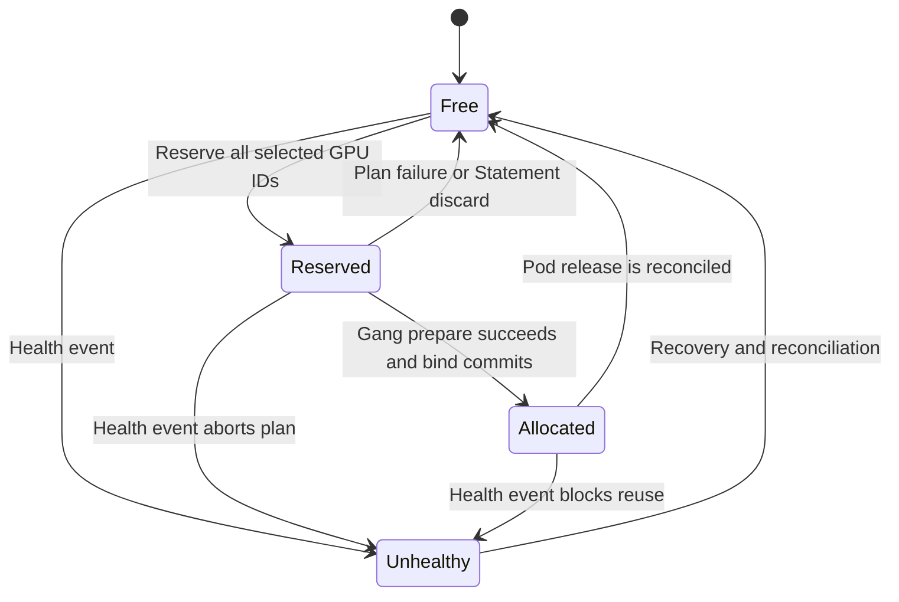

# Volcano NVIDIA GPU 拓扑感知调度设计方向

> 状态：调研与设计草案，不代表 Volcano 已实现或社区已接受的方案
>
> 范围：只讨论 NVIDIA GPU；其他 xPU 将使用同一模板分别调研
>
> 关联议题：[volcano-sh/volcano#5751](https://github.com/volcano-sh/volcano/issues/5751)
>
> 主要灵感：[HAMi GPU 拓扑感知调度](https://project-hami.io/zh/docs/developers/gpu-topology-scheduling)
>
> 源码基线：Volcano `066835c315403ea8c1c79a40c37f4186bc0b641b`；HAMi `4e408d84c12b768ea729f628d8568e53a580a58d`

## 1. 文档目的

Issue #5751 需要的是一个通用 xPU 拓扑感知调度框架。本文件暂不直接抽象所有厂商，而是先用 NVIDIA GPU 做一条可以落地、验证和讨论的纵向切片：

1. 节点侧如何发现 GPU、NVLink、NVSwitch、PCIe 和 NUMA 拓扑；
2. 如何把厂商数据转换为 Volcano scheduler 可消费的拓扑快照；
3. scheduler 如何在绑定 Pod 前选择 Node、拓扑域和具体 GPU UUID；
4. PodGroup 如何先完成整组规划与预留，再进入绑定；
5. 如何通过 HAMi/vGPU Annotation 或 DRA 落实 scheduler 选出的设备 ID；
6. 哪些设计能够复用于后续 Ascend NPU、MetaX sGPU 等专题，哪些只属于 NVIDIA。

本文刻意区分四种状态：

| 标记 | 含义 |
| --- | --- |
| 当前实现 | 当前本地 Volcano 或 HAMi 源码中已经存在 |
| 可复用能力 | Volcano 已有组件，但尚未组成 #5751 的完整链路 |
| 本文提议 | 本文建议的新接口、模型或行为 |
| 后续研究 | 本 GPU 专题不做最终决定，留给跨 xPU 汇总设计 |

## 2. 核心结论

建议先实现一个 GPU-only 的 `gpu-topology-aware` 垂直方案：

- 节点侧组件通过 NVML 获取物理拓扑，scheduler 不直接加载 NVML；
- Provider 将 HAMi Annotation、显式 Mock Annotation 或未来 DRA 数据转换为同一个 GPU 拓扑快照；
- scheduler cache 分离保存“较稳定的物理拓扑”和“快速变化的设备占用状态”；
- 调度插件先过滤 Fabric/HyperNode，再过滤 Node 和节点内 GPU Domain，最后选择具体 GPU UUID；
- 硬约束按拓扑域判断可行性，不能只比较 GPU 总数或只比较一个综合分数；
- 软约束可以借鉴 HAMi 的 GPU Pair Score，但 Pair Score 只作为派生指标，不作为长期唯一数据模型；
- PodGroup 的 Node、Domain 和 GPU UUID 必须先整组规划、整组预留，任意一步失败都整组回滚；
- 只有能够执行指定 GPU ID 的 HAMi/vGPU 或 DRA Adapter 才能提供严格保证；原生 Device Plugin 的 kubelet 侧 `GetPreferredAllocation` 最多只能提供 best-effort。

## 3. 问题定义

### 3.1 总量满足不等于拓扑满足

假设一个节点有两个互不相连的 NVLink Domain：

```text
Domain-A: GPU0 GPU1 GPU2 GPU3 GPU4 GPU5      6 张空闲
Domain-B: GPU8 GPU9                          2 张空闲
节点空闲总数                                 8 张
```

一个要求 8 张 GPU 且必须处于同一 NVLink Domain 的 Pod，不能使用上述节点。只检查 `nvidia.com/gpu=8` 会得到错误的可调度结论。

### 3.2 节点选择之后再选卡已经太晚

如果只依赖 kubelet Device Manager 或 Device Plugin 的 `GetPreferredAllocation`：

- Volcano 在 Node Predicate 阶段看不到节点内碎片；
- Volcano 不能因为“8 张卡分散在两个 Domain”而拒绝这个 Node；
- 多个 Pod 的调度周期可能同时认为同一组 GPU 可用；
- PodGroup 无法在任何一个 Pod 绑定前，验证所有 Pod 的 GPU ID 规划都成功；
- scheduler 无法将节点内 GPU Domain 与跨节点 HyperNode/Fabric 统一考虑。

因此，拓扑和具体设备可用状态必须在 scheduler 调度周期内可见。

### 3.3 GPU 拓扑至少有三个层次

| 层次 | NVIDIA 示例 | 调度含义 |
| --- | --- | --- |
| GPU 设备层 | GPU UUID、MIG Parent UUID | 最终分配和并发冲突的基本身份 |
| 节点内拓扑层 | NVLink Island、NVSwitch Domain、PCIe Root、NUMA | 判断单个 Pod 的本地 GPU 组合是否有效 |
| 跨节点拓扑层 | NVL72 Fabric、普通 IB/RoCE HyperNode | 判断 PodGroup 是否处于同一 GPU Fabric 或合适的网络范围 |

普通多节点 GPU 集群不能因为节点间存在 InfiniBand，就把不同节点上的 GPU 当作一个 NVLink Domain。只有硬件明确提供跨节点 NVLink Switch Fabric 时，才能建立跨节点 GPU Fabric Domain。

## 4. 目标与非目标

### 4.1 第一阶段目标

- 支持节点内 NVIDIA GPU 拓扑发现和规范化；
- 支持稳定 GPU UUID、健康状态、拓扑域和 GPU Pair Link；
- 支持 `required` 和 `preferred` 两类拓扑约束；
- 支持单 Pod 多 GPU 的同域分配；
- 支持 PodGroup 的整组设备规划、预留和回滚；
- 支持 `compact`、`preserve` 两种 GPU 选择倾向；
- 支持 Mock/KWOK 测试，不依赖真实 GPU；
- 兼容插件关闭时的现有 Volcano 行为；
- 为 HAMi/vGPU Annotation Adapter 和 DRA Adapter 预留落地接口。

### 4.2 非目标

- 不把 NCCL 自动生成的 Ring/Tree 当成物理拓扑事实；
- 不在 scheduler 进程中加载 `libnvidia-ml.so`；
- 不在第一阶段承诺真实 NVL72 硬件验证；
- 不在本文件确定所有 xPU 的最终 Canonical API；
- 不把动态链路吞吐、拥塞率和错误率作为第一阶段调度输入；
- 不承诺 Kubernetes API Server 能对多个 Pod 执行原子 Binding；
- 不把 MIG Instance 误当作相互独立的物理 NVLink 端点。

## 5. HAMi 当前机制及可借鉴点

### 5.1 已验证的 HAMi 数据流

HAMi 的 NVIDIA device-plugin 在节点侧执行：

```text
NVML 初始化
  -> 枚举物理 GPU 和 UUID
  -> 遍历所有有向 GPU Pair
  -> 查询 PCIe/NUMA Common Ancestor
  -> 查询直连 NVLink 或 NVSwitch 链路数
  -> 计算 GPU Pair Score
  -> 写入 Node Annotation hami.io/node-nvidia-score
```

对应源码：

- `pkg/device/nvidia/links.go`：PCIe/NUMA、NVLink、NVSwitch 识别；
- `pkg/device/nvidia/calculate_score.go`：有向拓扑图和分数矩阵；
- `pkg/device-plugin/nvidiadevice/nvinternal/plugin/register.go`：Node Annotation 发布；
- `pkg/device/nvidia/device.go`：scheduler 读取矩阵并选择设备组合。

HAMi 的基础评分大致表达为：

```text
跨 CPU Socket       10
同 CPU 或 NUMA      20
同 Host Bridge      30
多个 PCIe Switch    40
单个 PCIe Switch    50
同板卡              60
每条 NVLink        +100
```

多卡请求枚举候选组合，累加组合内每个无序 GPU Pair 的分数，选择总分最高的组合。单卡请求优先选择与其他卡总连接分最低的卡，以保留强连接组合。

### 5.2 值得直接借鉴的设计

| HAMi 机制 | 对 Volcano GPU 方案的启发 |
| --- | --- |
| NVML 运行在节点侧 | 硬件发现与 scheduler 策略解耦 |
| UUID 作为设备身份 | 避免 GPU Index 在重启、驱动变化后不稳定 |
| Device Pair Matrix | 为多 GPU 组合提供统一比较输入 |
| 同时考虑 PCIe 和 NVLink | 没有 NVLink 时仍可进行降级排序 |
| 单卡保留强连接组合 | 降低小任务对未来大任务的拓扑碎片化 |
| 非对称 NVLink 降级为 0 | 不因局部硬件/驱动异常导致整个插件崩溃 |
| Node Annotation 发布 | 适合第一阶段 Mock 和兼容 Provider |

### 5.3 不应直接复制的部分

#### Pair Score 不能替代明确拓扑域

分数 `250` 可以表达“PCIe 基础关系 50 加两条 NVLink 200”，但它没有直接表达：

- 两张 GPU 是否属于同一硬约束 Domain；
- Domain 是 NVLink Island 还是 NVSwitch Fabric；
- Domain 是否跨 Node；
- 拓扑信息属于哪一代快照；
- 这个分数是否由真实数据、Mock 数据或兼容推导产生。

因此本文建议以显式 `Domain + Membership + Link` 为规范模型，Pair Score 作为 Provider 生成的派生字段。

#### HAMi 的拓扑矩阵是设备注册快照，不是实时遥测

当前 HAMi `RegisterInAnnotation()` 在设备注册编码未变化时跳过更新，因此它不能被理解为每 30 秒重新采集的实时 NVLink 带宽。Volcano Provider 必须携带 `generation` 和 `observedAt`，并定义过期行为。

#### 当前机制主要解决节点内选卡

所检查的 HAMi 实现主要在已经进入某个 Node 的候选设备中选择卡。Issue #5751 还要求 Fabric/HyperNode、Node、Local Domain、Device ID 的联合规划，以及 PodGroup 级 reservation。

## 6. Volcano 当前能力与缺口

本节描述本地 Volcano 基线 `066835c3`，不等价于对所有上游版本的声明。

### 6.1 可复用能力

| 当前能力 | 源码位置 | 可复用方式 |
| --- | --- | --- |
| 设备统一接口 `Devices` | `pkg/scheduler/api/shared_device_pool.go` | 已有 `FilterNode`、`ScoreNode`、`Allocate`、`Release` |
| 设备预留返回值 | `pkg/scheduler/api/devices/reservation.go` | `DeviceReservation` 可携带绑定 Annotation 和 Opaque 数据 |
| NVIDIA vGPU 具体 UUID 选择 | `pkg/scheduler/api/devices/nvidia/vgpu` | 已能选择 UUID 并维护显存、核心和使用次数 |
| 绑定 Annotation 传递 | `TaskInfo.PodAnnotations`、`DefaultBinder.Bind` | 可把具体 GPU ID 随 Binding 原子写入单个 Pod |
| 调度事务 | `pkg/scheduler/framework/statement.go` | `Allocate`、`Discard`、`Commit` 可作为 reservation 生命周期骨架 |
| DRA Reserve/Unreserve/PreBind | `pkg/scheduler/plugins/predicates` | 可作为未来 DRA Allocation Adapter |
| HyperNode | `network-topology-aware` plugin | 可表示跨节点网络或 GPU Fabric 的粗粒度范围 |
| 设备 Dry-run Clone | `Devices.DeepCopy` | 可用于候选方案模拟和拓扑感知抢占 |

### 6.2 当前缺口

- `DevicePairScore` 类型已经存在于 `pkg/scheduler/api/devices/device_info.go`，但当前调度路径没有消费它；
- `vgpu.GPUDevice` 保存 UUID、显存、核心、健康和 PodMap，但没有显式 GPU Domain；
- vGPU 当前主要按 `binpack`、`spread` 等策略逐卡扫描，没有对多卡组合执行拓扑评分；
- `FilterNode()` 可以判断总卡数和单卡容量，但不能拒绝“总数足够、同域数量不足”的节点；
- 当前 Device Allocation 由 `Statement.Allocate` 的事件回调逐 Task 执行；
- 当前 `Statement.Commit()` 遍历 operation，并逐 Task 调用 `AddBindTask`，不存在“整组 Adapter Prepare 全部成功后才允许任何 Pod 进入绑定队列”的统一屏障；
- HyperNode 保存的是节点级拓扑，不适合承载每张 GPU 的快速变化状态；
- Native `nvidia.com/gpu` 路径只能选择 Node，具体设备通常由 kubelet Device Manager 决定。

这些能力足以支撑一个 GPU-only PoC，但还不能宣称 Issue #5751 已实现。

## 7. GPU 场景分解

### 7.1 场景 G1：单节点多个 NVLink Island

```text
Node-A
  Domain nvlink-0: GPU0 GPU1 GPU2 GPU3
  Domain nvlink-1: GPU4 GPU5 GPU6 GPU7
```

- 请求 4 GPU、`required/nvlink`：可以从任意一个完整 Domain 分配；
- 请求 6 GPU、`required/nvlink`：失败，不能把两个 Island 聚合为一个 Domain；
- 请求 6 GPU、`preferred/nvlink`：允许退化，但需要降低 Node/Plan Score 并记录退化原因。

### 7.2 场景 G2：单节点 NVSwitch 全互联

如果所有 GPU 属于同一 NVSwitch Domain，硬约束主要是容量和健康状态。Pair Score 用于处理非对称链路、降级链路或非均质连接。

### 7.3 场景 G3：单 GPU 请求保护强连接组合

单 GPU 请求可以采用 HAMi 的 `preserve` 倾向：计算每张候选 GPU 与其他空闲 GPU 的连接潜力，优先消耗连接潜力最低的 GPU。

该策略应该是软优化，不能凌驾于健康、显存、独占、MIG Parent 和用户 allowlist/denylist 等硬条件。

### 7.4 场景 G4：普通多节点 GPU 集群

节点内是 NVLink/NVSwitch，节点间是 InfiniBand 或 RoCE：

- 每个 Pod 的 GPU 必须首先满足本节点 Local Domain 约束；
- PodGroup 的节点范围可继续由 Volcano HyperNode/network-topology-aware 选择；
- 不允许把多个节点的本地 NVLink Domain 合并成一个 GPU Fabric Domain。

### 7.5 场景 G5：跨节点 NVLink Switch Fabric

NVL72 等系统可以在多个计算节点之间形成 GPU Fabric。本文只保留模型和接口位置：

- `FabricDomain` 可以包含多个 Node 和 GPU UUID；
- HyperNode 保存成员 Node 和轻量容量摘要；
- 详细 GPU、Link、Health、Reservation 状态保留在 Device Topology Cache；
- 第一阶段使用 Mock 模拟，不要求真实硬件验证。

## 8. 建议架构

```mermaid
flowchart LR
    subgraph source["GPU Topology Sources"]
        nvml["NVML Node Agent"]
        hami["HAMi Node Annotations"]
        mock["Mock Topology Objects"]
        dra["DRA ResourceSlices"]
    end

    subgraph normalize["Provider and Normalization"]
        provider["GPU Topology Provider"]
        validate["Identity Freshness Validation"]
    end

    subgraph cache["Volcano Scheduler Cache"]
        physical["Physical Topology Snapshot"]
        ledger["Device State and Reservations"]
        summary["Domain Capacity Index"]
    end

    subgraph schedule["Scheduling Cycle"]
        fabric["Select Fabric or HyperNode"]
        node["Filter and Score Nodes"]
        domain["Select Local GPU Domain"]
        ids["Select Concrete GPU UUIDs"]
        gang["Reserve Whole PodGroup"]
    end

    subgraph enforce["Allocation Enforcement"]
        hamiAdapter["HAMi or vGPU Adapter"]
        draAdapter["DRA Adapter"]
        bind["Batch Prepare then Pod Bind"]
    end

    source --> provider --> validate
    validate --> physical
    validate --> summary
    physical --> fabric --> node --> domain --> ids --> gang
    summary --> node
    ledger --> domain
    gang --> ledger
    gang --> hamiAdapter --> bind
    gang --> draAdapter --> bind

    classDef input fill:#d3f9d8,stroke:#2f9e44,color:#1b4332
    classDef process fill:#e5dbff,stroke:#5f3dc4,color:#3b2f70
    classDef store fill:#fff4e6,stroke:#e67700,color:#7f4f00
    classDef action fill:#c5f6fa,stroke:#0c8599,color:#064b55
    class nvml,hami,mock,dra input
    class provider,validate,fabric,node,domain,ids,gang process
    class physical,ledger,summary store
    class hamiAdapter,draAdapter,bind action
```



架构上的关键边界是：

- Provider 只负责发现数据的解析、规范化、身份校验和新鲜度；
- Cache 负责快照、索引、占用和 reservation；
- Plugin 只依赖规范模型，不读取厂商 Annotation；
- Adapter 只负责把已选设备 ID 落实到 HAMi/vGPU 或 DRA；
- HyperNode 只保存跨节点拓扑摘要，不保存每个 GPU 的动态状态。

## 9. 规范数据模型建议

### 9.1 物理拓扑和动态状态必须分离

```text
PhysicalTopologySnapshot
  较稳定：GPU 身份、Domain、Link、Parent、Health、Generation

DeviceLedger
  快速变化：Free、Reserved、Allocated、Unhealthy、Unknown
```

Provider 不应直接发布“当前空闲 GPU 数量”作为最终事实，因为 Pod、ResourceClaim、scheduler reservation 和健康事件可能并发变化。Provider 提供拓扑和健康观察；scheduler 根据已观察工作负载及本地 reservation 推导可分配状态。

### 9.2 候选 Go 模型

以下只是 GPU 专题内部候选，后续需要与其他 xPU 文档比较后再决定是否提升为通用 API。

```go
type GPUTopologySnapshot struct {
    Provider   string
    Generation string
    ObservedAt time.Time
    Devices    map[string]*GPUDevice
    Domains    map[string]*GPUTopologyDomain
    Links      map[DevicePair]*GPULink
}

type GPUDevice struct {
    ID          string
    NodeName    string
    ParentID    string
    Health      HealthState
    Allocatable bool
    DomainIDs   []string
    Attributes  map[string]string
}

type GPUTopologyDomain struct {
    ID        string
    Scope     DomainScope
    Kind      DomainKind
    ParentID  string
    NodeNames []string
    DeviceIDs []string
}

type GPULink struct {
    From           string
    To             string
    Kind           LinkKind
    Weight         int64
    BandwidthClass string
    Healthy        bool
}

type DeviceLedgerEntry struct {
    DeviceID   string
    State      DeviceState
    OwnerUID   string
    Generation string
}
```

建议的枚举语义：

```text
DomainScope: NodeLocal | CrossNode
DomainKind:  NVLinkIsland | NVSwitchFabric | PCIeRoot | NUMA | Unknown
LinkKind:    NVLink | NVSwitch | PCIe | SameNUMA | CrossNUMA | Unknown
DeviceState: Free | Reserved | Allocated | Unhealthy | Unknown
```

### 9.3 稳定身份

- 物理 GPU：使用完整 GPU UUID；
- MIG：使用 MIG UUID，同时记录 `ParentID=GPU UUID`；
- Domain ID：由 Provider 提供稳定 ID，不能只使用数组下标；
- 跨节点 Fabric：ID 必须在参与节点间一致；
- 每次快照带 `Provider + Generation`；
- scheduler restart 后通过已绑定 Pod、ResourceClaim 或 Adapter 状态重建 `Allocated`，不恢复未确认的旧 `Reserved`。

### 9.4 MIG 和 vGPU 的特殊处理

- NVLink 拓扑属于物理 GPU，而不是每个 MIG Instance；
- MIG Instance 继承 Parent GPU 的 Domain Membership；
- 多个 MIG Instance 位于同一 Parent 时，不能在 Pair Score 中当作两个独立 NVLink 端点；
- vGPU 的显存和核心切分属于容量模型，拓扑选择应先映射到 Parent GPU UUID；
- 第一阶段的硬拓扑验收建议以整卡 GPU 为主；MIG 场景应使用 Parent 去重后再判断 Domain。

## 10. Topology Provider

### 10.1 接口草案

```go
type GPUTopologyProvider interface {
    Name() string
    Snapshot(ctx context.Context, nodeName string) (*GPUTopologySnapshot, error)
    Validate(snapshot *GPUTopologySnapshot) error
}
```

实际实现可以由 informer 主动推送更新，不要求 scheduler 热路径每次同步调用 `Snapshot()`。该接口主要表达 Provider 的责任边界。

### 10.2 第一阶段 Provider

| Provider | 输入 | 能力 | 限制 |
| --- | --- | --- | --- |
| MockAnnotationProvider | 显式 Domain、Device、Link JSON | hard/soft；KWOK；可构造碎片 | 只用于验证模型与算法 |
| HAMiAnnotationProvider | `hami.io/node-nvidia-register`、`hami.io/node-nvidia-score` | 快速复用现有环境；软 Pair Score | Pair Score 不足以可靠表达所有 hard Domain |
| NVMLCompanionProvider | 节点 Agent 发布的显式 Domain Snapshot | hard/soft；真实 UUID 和健康 | 需要新增或扩展节点侧组件 |
| DRAProvider | ResourceSlice、Device Attributes | 与 Kubernetes 新设备 API 对接 | 依赖集群版本和驱动数据完整性 |

### 10.3 HAMi 兼容 Provider 的边界

HAMi Pair Score 可以直接用于 `preferred` 排序。若通过分数阈值或 NVLink 连通分量推导 Domain，只能标记为 `Inferred`：

- 默认不能用于严格 `required` 保证；
- 必须保存推导规则和源 Generation；
- 推导结果不一致或 Pair 数据非对称时，hard 请求应 fail closed；
- soft 请求可以将异常 Pair 记为最低分并产生 Warning/Event。

要支持可证明的 hard Domain，建议节点侧显式发布 Domain Membership，而不是让 scheduler 反推硬件结构。

### 10.4 新鲜度和错误策略

| 情况 | `required` | `preferred` |
| --- | --- | --- |
| Snapshot 缺失 | Node 不可用于该请求 | 回退到普通 GPU 策略并降分 |
| Snapshot 过期 | 默认 fail closed | 允许配置降级，记录原因 |
| UUID 与设备注册不一致 | 拒绝 Snapshot | 忽略不一致设备并降级 |
| 非对称 Link | 相关 Pair 不可用于 hard Domain | Pair 记最低分并告警 |
| Generation 在预留后变化 | 重新验证或回滚 Plan | 重新评分，禁止静默沿用旧 ID |

过期阈值应配置化；本文不预设未经压测和现场数据支持的固定秒数。

## 11. 工作负载 API 方向

第一阶段建议使用可选 Annotation 快速验证，后续再决定是否进入 PodGroup API。以下 key 仅为草案：

```yaml
metadata:
  annotations:
    scheduling.volcano.sh/gpu-topology-policy: required
    scheduling.volcano.sh/gpu-topology-scope: pod
    scheduling.volcano.sh/gpu-topology-level: nvlink
    scheduling.volcano.sh/gpu-allocation-policy: compact
```

建议语义：

| 字段 | 候选值 | 含义 |
| --- | --- | --- |
| `gpu-topology-policy` | `disabled`、`preferred`、`required` | 是否启用软/硬拓扑约束 |
| `gpu-topology-scope` | `container`、`pod`、`podgroup` | 哪些 GPU 必须共同满足拓扑要求 |
| `gpu-topology-level` | `nvlink`、`nvswitch`、`pcie`、`numa`、`fabric` | 请求的拓扑层级 |
| `gpu-allocation-policy` | `compact`、`preserve`、`spread` | 同等可行方案的选择倾向 |

默认值必须保持兼容：没有 Annotation 时继续使用现有 deviceshare 和 node scoring 行为。

建议的配置优先级：

```text
Pod 明确配置 > PodGroup 配置 > scheduler plugin 默认值
```

如果 Pod 与 PodGroup 的 hard 约束矛盾，应返回明确的不可调度原因，不能静默覆盖。

## 12. 调度算法

### 12.1 规划顺序

Issue #5751 建议的顺序是：

```text
Fabric 或 HyperNode
  -> Node
  -> Local GPU Domain
  -> Concrete GPU UUIDs
  -> Whole PodGroup Reservation
  -> Allocation Adapter Prepare
  -> Bind
```

节点内 GPU-only MVP 可以从 `Node -> Local Domain -> UUID` 开始，但 Plan 数据结构需要保留 Fabric 字段，避免后续为 NVL72 重写事务模型。

### 12.2 硬约束过滤

对每个候选 Node：

1. 根据资源、健康、allowlist/denylist、MIG Parent 等条件得到可用 GPU；
2. 按目标 Domain Membership 建立 `domainID -> free GPU IDs` 索引；
3. 只要有一个 Domain 可以完整满足请求，该 Node 才可行；
4. 不能把多个 Domain 的容量相加满足 `required`；
5. 对 PodGroup，所有 Task 的 Node、Domain、UUID 方案都完成前，不进入绑定。

建议不可调度原因至少区分：

```text
GPU_TOPOLOGY_SNAPSHOT_MISSING
GPU_TOPOLOGY_SNAPSHOT_STALE
GPU_TOPOLOGY_DOMAIN_INSUFFICIENT
GPU_TOPOLOGY_DEVICE_UNHEALTHY
GPU_TOPOLOGY_DEVICE_RESERVED
GPU_TOPOLOGY_GENERATION_CHANGED
GPU_TOPOLOGY_ID_ENFORCEMENT_UNAVAILABLE
```

### 12.3 多 GPU 软评分

HAMi 使用组合内 Pair Score 总和。Volcano 可以保留该指标，但建议采用确定性的字典序目标：

```text
1. hard constraint feasible
2. domain span 最小
3. minimum pair score 最大
4. total pair score 最大
5. fragmentation cost 最小
6. Node、Domain、GPU UUID 字典序稳定决胜
```

`minimum pair score` 放在总分之前，可以避免一个很差的 Pair 被多个高分 Pair 掩盖。

组合评分示意：

```text
Combination C = {GPU0, GPU1, GPU2}

pairScores = {
  score(GPU0, GPU1),
  score(GPU0, GPU2),
  score(GPU1, GPU2),
}

minPair = min(pairScores)
total   = sum(pairScores)
```

### 12.4 单 GPU `preserve` 策略

对每张候选 GPU，计算它与同一可用 Domain 中其他空闲 GPU 的连接潜力：

```text
preservationCost(gpu) = sum(score(gpu, otherFreeGPU))
```

优先选择 `preservationCost` 最低的 GPU。若分数缺失或全部相同，则回退到现有 binpack/spread 策略和稳定 UUID 顺序。

### 12.5 控制组合复杂度

直接枚举 `C(n,k)` 在 8 卡节点通常可接受，但在 72 GPU Fabric 中不可扩展。建议：

- 先按 Domain 过滤，缩小候选集；
- 全互联且 Pair Score 相同的 Domain 直接按稳定顺序选择；
- 小候选集使用精确枚举；
- 超过可配置组合预算时使用 greedy max-min expansion 或 branch-and-bound；
- 在 Plan Result 中记录 `Exact` 或 `Heuristic`，便于测试和观测；
- 组合预算和算法切换点由 benchmark 决定，不在设计阶段拍脑袋固定。

## 13. PodGroup 规划和 Reservation

### 13.1 Plan 模型

```go
type GPUGangPlan struct {
    UID                string
    JobID              string
    TopologyGeneration map[string]string
    Assignments        map[TaskID]GPUTaskAssignment
    State              PlanState
}

type GPUTaskAssignment struct {
    NodeName       string
    FabricDomainID string
    LocalDomainID  string
    DeviceIDs      []string
    Adapter        string
}
```

Plan 必须保存具体 GPU ID，而不是只保存“该 Node 有 8 张卡”。后续 Filter、Reserve、PreBind 和 Adapter 都消费同一份决定，不能在每个阶段重新随机选卡。

### 13.2 状态机



### 13.3 事务不变量

1. 一个 GPU ID 同一时刻最多属于一个有效 Reservation Owner；
2. `Reserved` 必须带 `planUID` 和 `topologyGeneration`；
3. 为 PodGroup 规划时，任意 Task 失败都释放之前预留的全部 GPU；
4. 在所有 Task 的 Adapter Prepare 成功前，不允许任何 Task 进入 bind queue；
5. `Statement.Discard`、调度异常、健康变化和 Generation 变化都必须触发 Unreserve；
6. scheduler restart 后，未持久化确认的 Reservation 不能直接视为 Allocated；
7. 已绑定设备从 Pod Annotation、ResourceClaim 或 Adapter 状态恢复为 Allocated。

### 13.4 与当前 Statement 的结合点

当前调用链大致为：

```text
Statement.Allocate
  -> Allocate event callback
  -> predicates Reserve plugins
  -> Devices.Allocate
  -> TaskInfo.PodAnnotations

Statement.Commit
  -> each operation
  -> AddBindTask
  -> asynchronous PreBind and Bind
```

本文建议增加一个整组屏障，概念上分为：

```text
PlanGang
  -> ReserveAllDeviceIDs
  -> PrepareAllAllocationAdapters
  -> CommitPlan
  -> EnqueuePreparedBindContexts

任一步失败
  -> AbortAllAdapters
  -> UnreserveAllDeviceIDs
  -> Statement.Discard
```

可以先在 GPU 插件内部实现，再评估是否提升为通用 `Statement.Prepare()` / `Statement.Abort()` 能力。不能简单把多个逐 Pod `Allocate()` 调用当成整组原子预留。

### 13.5 Kubernetes Binding 的现实边界

即使 Volcano 在绑定前完成整组准备，Kubernetes 仍然按 Pod 提交 Binding。若第一个 Pod 已绑定、第二个 Pod 的 API 请求失败，无法通过 scheduler 将第一个 Pod“解绑”。

因此第一阶段承诺应写成：

> 在任何 Pod 开始绑定之前，整组 Node、Domain、GPU ID 和 Adapter Prepare 必须全部成功。

严格的“所有 Pod API Binding 原子成功”需要额外控制器、SchedulingGate、工作负载启动屏障或失败补偿机制，不应在本设计中虚假承诺。

## 14. Allocation Adapter

### 14.1 建议接口

```go
type GPUAllocationAdapter interface {
    Name() string
    SupportsExactDeviceIDs() bool
    Prepare(ctx context.Context, plan *GPUGangPlan) error
    Commit(ctx context.Context, plan *GPUGangPlan) error
    Abort(ctx context.Context, plan *GPUGangPlan)
    Reconcile(ctx context.Context) ([]ObservedGPUAllocation, error)
}
```

### 14.2 HAMi/vGPU Adapter

Volcano 当前 vGPU 路径已经能够生成并随 Binding 传递：

```text
volcano.sh/vgpu-node
volcano.sh/vgpu-ids-new
volcano.sh/devices-to-allocate
volcano.sh/vgpu-time
volcano.sh/bind-phase
```

GPU Topology Plugin 不应自己重复编码这些协议，而应把 `DeviceIDs` 交给 vGPU Adapter，由 Adapter 生成现有 Annotation。

验收条件是对应 Device Plugin/HAMi-core 确实执行指定 ID。若 Adapter 只能给出偏好而不能保证 ID，应将 `SupportsExactDeviceIDs()` 返回 false，拒绝 `required` 请求或显式降级为 best-effort。

### 14.3 DRA Adapter

DRA 路径可以复用 predicates 中的 Filter、Reserve、Unreserve 和 PreBind 生命周期。需要进一步确认：

- ResourceSlice 是否暴露稳定 GPU ID 和 Domain Attribute；
- Driver 是否允许 scheduler 选择并提交确定设备；
- ResourceClaim 分配结果和 GPUGangPlan 如何保持同一 Generation；
- 多 Pod/多 Claim 的 Prepare 和 rollback 如何组成整组屏障。

### 14.4 Native Device Plugin Adapter

原生 `nvidia.com/gpu` 在 scheduler 中通常只体现数量，设备 ID 由 kubelet 决定。除非增加可执行指定 ID 的配套协议，否则：

- 可以做 Node/Domain capacity 的预判；
- 可以给出偏好；
- 不能对最终 GPU UUID 做 hard guarantee；
- 不应宣称完成 #5751 的 exact device assignment。

## 15. HyperNode 集成

GPU 拓扑和 Volcano 网络拓扑应该分层协作：

```text
HyperNode
  保存：成员 Node、网络层级、Fabric ID、聚合空闲容量摘要

GPU Device Topology Cache
  保存：GPU UUID、Local Domain、Pair Link、Health、Reserved、Allocated
```

普通 IB/RoCE 集群：

```text
HyperNode 选择适合的节点集合
每个 Node 内独立选择 Local GPU Domain
```

跨节点 NVLink Fabric：

```text
HyperNode 或 Fabric Index 先选择共同 Fabric
GPU Cache 再从 Fabric 成员 Node 中选择具体 GPU UUID
```

不建议把每张 GPU 的 reservation 写入 HyperNode CR，因为这会放大 API Server 更新频率和对象体积，也会把 scheduler 热状态与拓扑管理 CR 耦合。

## 16. 失败处理与一致性

### 16.1 拓扑更新

- Provider 更新以 Node/Fabric 为单位原子替换 Snapshot；
- 读路径通过 Generation 获得一致视图；
- 已存在 Reservation 引用旧 Generation 时，Commit 前重新验证；
- 设备从 Domain 移除或变为 Unhealthy 时，未绑定 Plan 立即 Abort；
- 已绑定 Pod 不强制迁移，但设备禁止被再次分配并产生告警。

### 16.2 Scheduler 高可用和重启

- `Reserved` 是 scheduler 临时状态，需要 owner 和 lease/epoch；
- 新 leader 不应盲目继承无法验证的旧 Reservation；
- `Allocated` 从已绑定 Pod、ResourceClaim 或 Adapter 实际状态重建；
- Provider Generation 与 Allocation Observation 不一致时进入 `Unknown`，在 reconciliation 完成前禁止 hard allocation。

### 16.3 抢占

拓扑感知抢占不能只计算被释放的 GPU 总数，还要模拟 victim 移除后的 Domain 分布。可复用 `Devices.DeepCopy()` 和当前 SimulatePredicate 路径，但必须增加：

- victim device ID 的可恢复映射；
- 模拟后的 Domain Capacity Index；
- 抢占失败时对 reservation 和 device ledger 的完整回滚；
- 避免多个候选抢占方案同时占用同一 GPU ID。

抢占不建议纳入第一个最小 PR，但数据模型和 DeepCopy 必须从一开始支持。

## 17. 可观测性

建议至少输出以下指标：

```text
volcano_gpu_topology_snapshot_age_seconds
volcano_gpu_topology_snapshot_devices
volcano_gpu_topology_domain_free_devices
volcano_gpu_topology_plan_duration_seconds
volcano_gpu_topology_plan_candidates
volcano_gpu_topology_reservations
volcano_gpu_topology_plan_rollback_total
volcano_gpu_topology_fallback_total
volcano_gpu_topology_unschedulable_total
```

日志和 Event 应包含：

- Pod/PodGroup、Node、Fabric、Local Domain、GPU UUID；
- policy、scope、level、allocation policy；
- topology generation 和 provider；
- exact/heuristic/fallback；
- 明确失败码，不只输出 `not enough gpu`；
- 不在默认日志级别完整打印大型 72 GPU Pair Matrix。

## 18. 测试设计

### 18.1 Provider 单元测试

- HAMi register/score 正常解码；
- UUID 缺失、重复、未知 Pair；
- 非对称 Pair；
- 显式 Domain Membership；
- Snapshot 过期；
- Generation 更新；
- MIG Parent 继承和去重；
- Annotation 尺寸和无效 JSON。

### 18.2 算法单元测试

- 单卡 `preserve` 选择最弱连接卡；
- 多卡选择最大 `minPair` 和 `totalPair`；
- 6+2 碎片不能满足 8 卡 required 请求；
- soft 请求允许跨域但正确降分；
- 全互联等分时结果确定；
- 组合预算触发 heuristic；
- allowlist/denylist、健康和 reservation 优先于拓扑分数；
- 多 MIG Instance 不能伪装为多个物理 NVLink Endpoint。

### 18.3 Volcano Framework 测试

- 两个 Pod 都能在规划阶段获得同域设备；
- 第二个 Pod 规划失败时，第一个 Pod 的 GPU reservation 回滚；
- 两个并发 PodGroup 不能获得同一个 GPU UUID；
- `Statement.Discard` 将 `Reserved` 恢复为 `Free`；
- Generation 在 Plan 和 Commit 之间变化时拒绝提交；
- 任一 Adapter Prepare 失败时没有 Pod 进入 bind queue；
- Device Plugin best-effort Adapter 不能接受 required 请求；
- 抢占 dry-run 不污染真实 Device Ledger。

### 18.4 KWOK 和 Mock E2E

Issue #5751 推荐先使用 KWOK 和 Mock topology。建议构造：

| 场景 | 预期 |
| --- | --- |
| 8 GPU 单 NVSwitch Domain | 8 卡 required 成功 |
| 两个 4 GPU NVLink Island | 8 卡 required 失败 |
| 6+2 空闲碎片 | 8 卡 required 失败且不绑定 |
| 两 Node 普通 IB | 每 Pod 本地同域；不组成跨节点 NVLink Domain |
| Mock NVL72 Fabric | PodGroup 只在共同 Fabric 成员内规划 |
| 健康事件发生在 Reserve 后 | 整组 Abort 和 rollback |
| 两个并发 PodGroup | 无重复 GPU UUID |

### 18.5 性能测试

比较以下模式：

```text
plugin disabled baseline
topology enabled but workload disabled
preferred local topology
required local topology
PodGroup gang reservation
cross-node mock fabric
```

记录：

- 调度吞吐；
- P50/P95/P99 scheduling latency；
- Snapshot 更新 CPU 和延迟；
- Device/Domain/Pair Index 内存；
- reservation contention 和 rollback 数量；
- 8、16、72 GPU 密集节点的组合算法成本。

目标阈值应在基线 benchmark 后与社区确认，不在本草案中捏造固定性能数字。

## 19. 分阶段实现建议

### Phase 0：设计和 Mock Model

- 确认 GPU 专题术语和边界；
- 定义内存 Snapshot、Domain、Link、Ledger、Plan；
- 实现 MockAnnotationProvider；
- 完成 6+2、同域、并发 reservation 单元测试；
- 不修改真实 Device Plugin。

### Phase 1：HAMi 软拓扑兼容

- 读取 HAMi register 和 pair score Annotation；
- 映射为 `preferred` Pair Link；
- 支持单卡 preserve、多卡 combination score；
- 缺失或异常时安全回退；
- 明确不把 inferred Domain 当作 hard guarantee。

### Phase 2：显式 Node-local GPU Domain

- 节点侧发布稳定 Domain Membership；
- 支持 `required/nvlink` 和 `required/nvswitch`；
- 在 Node Filter 阶段识别域内碎片；
- 选择具体 GPU UUID；
- 建立 Device Ledger 和 Generation 校验。

### Phase 3：PodGroup 两阶段 Reservation

- 建立 GPUGangPlan；
- 整组 Reserve/Prepare/Abort；
- 在 `Statement.Commit` 前增加统一屏障；
- 验证第二个 Task 失败时整组回滚；
- 验证并发 PodGroup 不重复选卡。

### Phase 4：Allocation Adapter

- HAMi/vGPU exact-ID Adapter；
- DRA Adapter；
- Native Device Plugin best-effort 能力声明；
- restart/reconciliation；
- 绑定失败补偿和可观测性。

### Phase 5：GPU Cross-node Fabric

- 将 Fabric Domain 与 HyperNode 对接；
- Mock NVL72；
- 增量 Domain Summary；
- 跨节点 gang planning；
- 性能和故障注入测试。

## 20. 建议源码落点

以下为方向，不是已经存在的文件：

```text
pkg/scheduler/api/devices/gpu/topology/
  types.go                 GPU Snapshot、Domain、Link、Plan
  ledger.go                Free、Reserved、Allocated、Unhealthy
  score.go                 Pair Score 和组合评分

pkg/scheduler/plugins/gpu-topology-aware/
  plugin.go                Session 注册和 workload policy
  filter.go                Node 和 Domain 可行性
  score.go                 Node、Domain、Device 评分
  planner.go               单 Pod 和 PodGroup Plan
  reservation.go           Reserve、Commit、Abort

pkg/scheduler/topology/provider/gpu/
  mock_annotation.go
  hami_annotation.go
  dra.go

pkg/scheduler/topology/adapter/gpu/
  hami_vgpu.go
  dra.go
  native_device_plugin.go
```

需要修改或对接的现有位置：

| 现有位置 | 方向 |
| --- | --- |
| `pkg/scheduler/api/shared_device_pool.go` | 评估是否扩展拓扑/Plan 能力，避免厂商逻辑进入通用接口 |
| `pkg/scheduler/api/devices/nvidia/vgpu` | 复用 UUID 容量检查和 Annotation 编码，不在此处保存全局拓扑图 |
| `pkg/scheduler/plugins/deviceshare` | 与新插件协调 Filter/Score/Allocate 的责任顺序 |
| `pkg/scheduler/framework/statement.go` | 增加整组 Prepare 屏障或等价事务扩展 |
| `pkg/scheduler/plugins/predicates` | 对接 DRA Reserve/Unreserve/PreBind |
| `pkg/scheduler/cache` | 保存物理 Snapshot、动态 Ledger 和 Plan Reservation |
| `network-topology-aware` | 只对接 Fabric/HyperNode 粗粒度选择和摘要 |

## 21. 关键设计选择

### 21.1 新插件还是直接扩展 deviceshare

建议使用独立 `gpu-topology-aware` plugin 负责拓扑约束和 Plan，deviceshare 继续负责厂商容量、已有策略和分配协议。

理由：

- topology-aware 需要 PodGroup 和 HyperNode 视角，不只是单 Node 的 `GPUDevices`；
- Provider 和 Adapter 需要独立测试；
- 未来跨 xPU 汇总时，可以把共性上提而不重写每个 deviceshare backend；
- 插件关闭时不改变现有调度路径。

需要解决的是两个插件不能分别重新选择一次 GPU。拓扑插件产出的 Plan 必须通过 Cycle/Task State 交给 deviceshare Adapter，后者只能验证并落实，不能换卡。

### 21.2 Domain-first 还是 Score-only

建议：hard 使用 Domain-first，soft 使用 Domain + Pair Score。

```text
hard: 是否存在一个满足请求的 Domain
soft: 在可行 Domain 和组合之间选择最优者
```

Score-only 无法稳定表达“绝对不能跨域”的语义，也难以解释不可调度原因。

### 21.3 Annotation 还是 CRD

第一阶段使用 Annotation/Mock 可以缩短验证路径，但 scheduler 内部不能依赖 Annotation 格式。Provider 先规范化，后续可把来源替换为 CRD、DRA 或厂商 API。

是否新增 CRD 留到多个 xPU 文档汇总后决定，避免只按 NVIDIA 模型设计通用 API。

## 22. 风险

| 风险 | 影响 | 缓解方向 |
| --- | --- | --- |
| Pair Matrix 随设备数平方增长 | 72 GPU 对象和解析成本 | Domain Index 优先；Link 稀疏化；避免热路径重复解析 |
| Annotation 大小限制 | 大 Fabric 无法完整存储 | Annotation 仅用于 MVP；后续 CRD/DRA/Provider Cache |
| UUID 和 Topology Generation 漂移 | 错误分配旧设备 | Commit 前验证；stable ID；reconciliation |
| Scheduler HA 并发 | 重复 reservation | leader epoch、owner、统一 ledger、幂等 Abort |
| Native Device Plugin 不执行 ID | hard 语义落空 | Adapter capability；required fail closed |
| MIG/vGPU 与物理 GPU 混淆 | 虚假多端点和错误评分 | Parent UUID 归一化和去重 |
| 组合搜索爆炸 | 调度延迟上升 | Domain-first、预算、exact/heuristic 标记 |
| 部分 Pod 已绑定 | 不能真正 API 原子回滚 | bind 前整组 prepare；启动屏障或补偿控制器 |
| 与 network-topology-aware 重复评分 | 权重和责任混乱 | Fabric 粗粒度由 HyperNode；设备细粒度由 GPU plugin |

## 23. 待社区确认的问题

1. 第一阶段 workload API 使用 Annotation，还是直接设计 PodGroup 字段？
2. `required` 是否必须要求 Adapter 支持 exact device IDs？本文建议必须。
3. GPU Topology Cache 应位于 SchedulerCache，还是由插件私有并通过 Snapshot 挂载？
4. `Statement` 是否增加通用两阶段 Prepare/Abort，还是先做 GPU plugin 内部 barrier？
5. HAMi Pair Score Provider 是否只支持 soft，还是社区接受某种可审计的 Domain 推导规则？
6. MIG hard topology 的第一阶段范围是完全排除，还是以 Parent GPU 去重后支持？
7. HyperNode 的 Fabric Summary 需要哪些最小字段，才能避免扫描全部 GPU？
8. scheduler restart 后 Reservation 的权威恢复源是什么？
9. Native Device Plugin best-effort 是否应该暴露为独立 policy，避免用户误认为 hard guarantee？
10. 对 NVL72 的 Mock 模型使用 GPU Pair、显式 Fabric Membership，还是二者同时存在？

## 24. 后续 xPU 专题统一模板

后续每种 xPU 文档建议保留以下相同章节，方便最终横向比较：

1. 硬件拓扑术语；
2. 节点内和跨节点拓扑边界；
3. 官方发现 API/工具；
4. 稳定设备 ID；
5. Domain 层级和 Link 类型；
6. 健康、分区和虚拟化模型；
7. 现有 Device Plugin/DRA/Annotation 协议；
8. hard 和 soft 约束语义；
9. 具体 ID 执行能力；
10. reservation、release、preemption 和 restart；
11. Mock 数据与测试场景；
12. 性能规模；
13. 厂商特有字段；
14. 可提升为通用模型的字段；
15. 无法统一、必须保留在 Provider/Adapter 的部分。

建议的文档目录：

```text
docs/design/xpu-topology-aware/
  01-nvidia-gpu-topology-aware-design-zh.md
  02-ascend-npu-topology-research-zh.md
  03-metax-sgpu-topology-research-zh.md
  90-xpu-topology-comparison-zh.md
  99-generic-xpu-topology-aware-design-zh.md
```

最终 `90` 文档只做事实和语义比较，`99` 文档再决定通用 API、Provider、Cache、Plugin 和 Adapter 接口。

## 25. GPU 专题可输出给最终通用设计的候选共性

| 候选共性 | GPU 证据 | 是否直接定稿 |
| --- | --- | --- |
| Stable Device ID | GPU UUID | 否，需比较其他 xPU ID 稳定性 |
| Local Domain | NVLink Island、NVSwitch | 否，需比较 HCCS、MetaXLink |
| Cross-node Fabric | NVLink Switch Fabric | 否，需比较其他跨节点互联 |
| Health | NVML Device/Link 状态 | 基本可共用，但枚举需统一 |
| Free/Reserved/Allocated/Unhealthy | gang reservation 所需 | 很可能共用 |
| Provider Generation | 防止拓扑漂移 | 很可能共用 |
| hard/preferred | 同域强约束与软评分 | 很可能共用 |
| Allocation Adapter Capability | exact ID 或 best-effort | 很可能共用 |
| Parent Device | MIG Parent GPU | 需比较其他虚拟化模型 |
| Pair Link Weight | NVLink/PCIe 派生分数 | 不宜作为唯一通用模型 |

## 26. 参考资料

- [Issue #5751: Support Generic xPU Topology-Aware Scheduling](https://github.com/volcano-sh/volcano/issues/5751)
- [HAMi GPU 拓扑感知调度](https://project-hami.io/zh/docs/developers/gpu-topology-scheduling)
- [HAMi `calculate_score.go` at baseline](https://github.com/Project-HAMi/HAMi/blob/4e408d84c12b768ea729f628d8568e53a580a58d/pkg/device/nvidia/calculate_score.go)
- [HAMi `links.go` at baseline](https://github.com/Project-HAMi/HAMi/blob/4e408d84c12b768ea729f628d8568e53a580a58d/pkg/device/nvidia/links.go)
- [HAMi `register.go` at baseline](https://github.com/Project-HAMi/HAMi/blob/4e408d84c12b768ea729f628d8568e53a580a58d/pkg/device-plugin/nvidiadevice/nvinternal/plugin/register.go)
- [NVIDIA NVLink and NVLink Switch](https://www.nvidia.com/en-us/data-center/nvlink/)
- [Kubernetes Device Plugins](https://kubernetes.io/docs/concepts/extend-kubernetes/compute-storage-net/device-plugins/)
- [Kubernetes Dynamic Resource Allocation](https://kubernetes.io/docs/concepts/scheduling-eviction/dynamic-resource-allocation/)
- Volcano local source baseline:
  - `pkg/scheduler/api/shared_device_pool.go`
  - `pkg/scheduler/api/devices/device_info.go`
  - `pkg/scheduler/api/devices/reservation.go`
  - `pkg/scheduler/api/devices/nvidia/vgpu/`
  - `pkg/scheduler/plugins/deviceshare/`
  - `pkg/scheduler/plugins/predicates/`
- `pkg/scheduler/framework/statement.go`
- `pkg/scheduler/plugins/network-topology-aware/`
