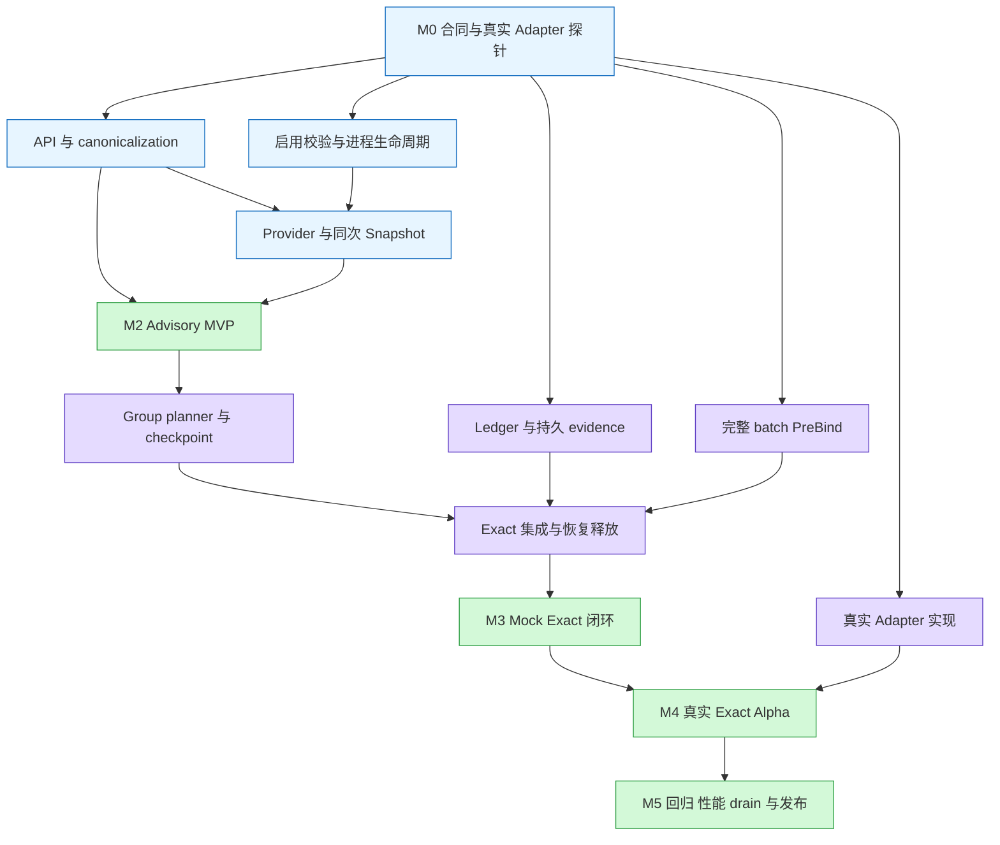

# Volcano 通用 xPU 拓扑感知调度 V4 开发计划

> 基线：[V4 设计](./99-generic-xpu-topology-aware-design-zh-v4.md)。本计划细化其第 12 章，不修改 V4 的语义与保证边界。
>
> 状态：待实施计划；任务均未因本文创建而完成。源码核对日期：2026-09-16；本地 HEAD：`7604cc7d3`。
> 下文“现有”指本地 checkout，“新增/建议”指拟开发内容，不代表上游已经接受。

## 1. 交付目标与拆分原则

建议按 **合同冻结 → 数据与启用基础 → Advisory MVP → Mock Exact 闭环 → 真实 Exact Alpha → 发布验收** 推进。
V4 中的“PR 1”和“PR 3”各自包含多个跨组件改动，本计划将其拆成 19 个可建 Issue 的工作包；较大的工作包还可拆成多个 PR。

最先交付一个可安装、可配置、可解释调度结果的 Advisory MVP；Exact 路径完成事务、恢复、释放和真实 Adapter 验证后再开放能力声明。

### 1.1 发布能力分级

| 交付物 | 用户可验证的行为 | 放行条件 |
| --- | --- | --- |
| 数据基础 M1 | catalog、可信 Provider、NodeUID identity、同次 Session snapshot、canonical policy | 配置/API/并发一致性测试通过；尚不作为可用调度功能发布 |
| Advisory MVP M2 | `soft` topology preference、确定性 Compact、缺数据时可解释退化 | gate/plugin 同时有效；hard 仍 fail closed；不创建 per-device allocation owner |
| Mock Exact 闭环 M3 | 模拟设备上验证四种 `applyTo × scope`、整组规划、提交屏障、恢复和释放 | 故障注入与重启测试通过；只能说明调度协议正确性 |
| 真实 Exact Alpha M4 | 至少一个真实 backend 使用 scheduler 选定 ID，并能恢复和证明 Released | M3 + 真实 Adapter conformance + 运行时 ID 核验 |
| 发布候选 M5 | 安装、升级、drain、关闭、容量与性能边界可复现 | 完整回归、E2E、性能报告及运维手册通过 |

贯穿所有工作包的约束：

- 复用 JobInfo/SubJobInfo、Queue/Gang/Predicate/HyperNode 和 Statement；不新建平行调度循环或 readiness 系统。
- `scope + domainClass` 必须贯通 API、catalog、Provider、索引、planner、assignment、anchor、恢复和迁移拒绝。
- hard 不降级为 soft；未知 class 对两种 mode 都是 authoring error。soft 数据不可用只能失去 preference。
- Exact 的完整 reservation、Adapter Prepare、持久 evidence、全组 PreBind 必须先于第一条 Kubernetes Bind。
- Kubernetes Bind 仍然逐 Pod 发生；成功绑定的 Pod 不能靠内存回滚撤销。
- `Unknown`、超时、Pod 删除、eviction 请求均不能作为释放证据；只有 authoritative `Released` 允许复用对应 owner 的设备。
- 中间 PR 保持 feature 默认关闭。Exact 链路未完整时，即使已注册 Adapter，也不得让 hard policy 进入不完整提交路径。

### 1.2 首期范围

包含：Annotation/Mock Provider、Node-local 和显式 Fabric、PodGroup/SubGroup、Pod/VCJob authoring、单普通 Container 整卡、
稳定跨 wave anchor、单 active leader、一个真实 Exact Adapter、现有抢占/回收产生的释放正确性。

延期：DRA claim/ResourceSlice、MIG/vGPU/共享几何、多 Container/init 生命周期、topology-aware victim selection、
自动推导 Fabric、通信 ring 优化、active-active reservation、workload 同时启动屏障。
选择 HAMi companion 作为 backend 候选也不意味着首期支持 vGPU 请求形状。

## 2. 源码基线与实际改动面

| 区域 | 已核对的现状 | 对开发计划的影响 |
| --- | --- | --- |
| [配置解析](../../../pkg/scheduler/util.go)、[加载与重载](../../../pkg/scheduler/scheduler.go) | `UnmarshalSchedulerConf` 做部分校验；`loadSchedulerConf` 存在默认配置/上一配置路径 | XPU-02 必须区分首次非法启动与热更新失败，防止回退配置丢失 xPU intent |
| [Helm values](../../../installer/helm/chart/volcano/values.yaml) | 已有 `scheduler_feature_gates`、`admission_feature_gates`、`scheduler_config_override` | 复用现有参数，增加 xPU 示例和渲染测试，无需重复造开关 |
| [自动 PodGroup](../../../pkg/controllers/podgroup/pg_controller_handler.go) | 有 `buildPodGroupFromPod`、`parseNetworkTopologyFromPod`、`shouldUpdateExistingPodGroup` | 新增 strict xPU canonicalization，不照搬无效 network mode 的默认回退 |
| [VCJob controller](../../../pkg/controllers/job/job_controller_actions.go)、[更新校验](../../../pkg/webhooks/admission/jobs/validate/admit_job.go) | 已有 Job/partition 到 PodGroup/SubGroup 的 NetworkTopology 转换；`validateJobUpdate` 对其他 spec 变化严格限制 | 新字段要覆盖两级转换，并专门实现 V4 quiescent 更新规则，不能只补 struct |
| [JobInfo.SetPodGroup](../../../pkg/scheduler/api/job_info.go) | SubJobs 仅在初次设置或 SubGroupPolicy 变化时重建 | 新 policy/fingerprint 的缓存失效需要覆盖顶层 policy 变化，避免保留旧 SubJob 视图 |
| [ClusterInfo](../../../pkg/scheduler/api/cluster_info.go)、[Snapshot](../../../pkg/scheduler/cache/cache.go)、[openSession](../../../pkg/scheduler/framework/session.go) | 尚无 DeviceTopology；Snapshot 在主锁下取得集群视图 | XPU-06 增加同次捕获，且 Node replacement 与 topology publish 协调 |
| [allocate](../../../pkg/scheduler/actions/allocate/allocate.go)、[recorder](../../../pkg/scheduler/actions/allocate/recorder.go) | 有 worksheet、HyperNode trial、nomination、Save/RecoverOperations 和多处分支提交 | XPU-09 需对所有提交分支做 checkpoint/AdmissionSet 审计，不只改主循环 |
| [Statement](../../../pkg/scheduler/framework/statement.go) | `Commit()` 无 error；Merge 转移 operations；SaveOperations 克隆 Task operations | 新增 error-returning exact 路径；可复制试算数据，但不得复制可提交 participant/token |
| [Bind cache](../../../pkg/scheduler/cache/cache.go)、[PreBinder](../../../pkg/scheduler/cache/interface.go) | `AddBindTask` 单项入队；`executePreBinds` 保留成功项；rollback 无错误结果 | XPU-12 新增完整 batch 契约，审计已有 PreBinder 的副作用与补偿能力 |
| [Condition](../../../pkg/scheduler/framework/session.go)、[JobUpdater](../../../pkg/scheduler/framework/job_updater.go) | Condition 按 Type 替换，再经 JobUpdater 写回 | xPU 与 gang 需要统一 outcome 选择和 controller blocker 保护 |
| [backfill](../../../pkg/scheduler/actions/backfill/backfill.go)、[preempt](../../../pkg/scheduler/actions/preempt/preempt.go)、[reclaim](../../../pkg/scheduler/actions/reclaim/reclaim.go) | allocate 之外还有直接 `Session.Allocate` 和 Statement 提交路径 | XPU-13/14 要审计旁路提交和释放，不能仅保护 allocate action |

上述核对是源码阅读，不是运行验证；本次未发现 V4 命名的 gate、plugin、snapshot 或 group anchor 的 Go 实现。

## 3. M0：先冻结哪些开发合同

M0 不是重写设计。输出短决策记录、接口草案与反例用例，解决会导致多个组件返工的问题。
“建议起点”用于安排评审，不表示最终 API 已确定。

| 决策 | 建议起点与必须产出的结论 | 阻塞的工作 |
| --- | --- | --- |
| D1：catalog 权威载体 | 比较受控版本化 ConfigMap 与 cluster-scoped API；优先验证能否复用受控配置。冻结发布者、RBAC、原子 fingerprint、历史版本保留、scheduler/webhook/controller 分发和不可读行为 | XPU-03 的存储实现、04、05 |
| D2：anchor/evidence 持久载体 | 优先评估复用真实 Adapter durable record，PodGroup 仅保存引用；若无法 CAS/枚举恢复则选独立受控载体。明确 owner、RecordRevision、epoch、结果未知处理和 GC | XPU-11、14、15 |
| D3：framework 扩展形状 | 在最小 hook 与 participant 中选一种；兼容普通 Commit，冻结 exact 错误返回、唯一 owner、batch preparation/acceptance 和异步 handoff 生命周期 | XPU-09、12、13 |
| D4：首个真实 Adapter | 用 XPU-01 的小实验验证：选中 ID 可执行、reservation 可恢复、显式 Released、旧 epoch 可拒绝。未证明前不承诺 Exact Alpha 日期 | XPU-15、真实硬件环境 |
| D5：API 与 schema | 冻结 class 名语法、默认值、selector 冲突判定、strict JSON、大小上限、legacy tombstone/CEL 的生成方式；确认 API server 支持的 schema 校验环境 | XPU-03、04 |
| D6：authoring 与活动状态 | 明确哪个持久视图证明 quiescent；最终 reserve 与 policy mutation 如何借助 CAS/fingerprint/fencing 排除竞态；不能只查 webhook 的一次内存快照 | XPU-04、11、13 |
| D7：激活与 action 兼容 | 冻结 `schedulerName → accepted activation config` 映射、digest、reload/drain、recovery readiness；列出 backfill/抢占等是否接入 exact 或对相应任务明确阻塞 | XPU-02、13、14 |
| D8：组合与状态归属 | 明确一个 Statement 涉及多个 SubGroup、多条 resource policy 时的 group context、共同 reservation、失败补偿和 anchor CAS；Job 级与 SubGroup 级约束必须同时满足 | XPU-08～14 |

两项需要写进决策记录的实现细节：

1. **gate 关闭时允许删除 policy** 仍受 V4 §3.5 的 quiescent 限制；活动 allocation/anchor 未 drain 时不能借删除绕过保护。
2. `soft` 只做 preference，不建立 hard anchor。MVP 如何体现 Group soft preference 要给出可复现评分例子；不能让软约束排除普通可行 Node。

### XPU-01：真实 Adapter 探针

在大规模修改 Statement 前，针对一个候选 backend 完成小实验：

1. 选定非默认设备 ID，提交两次相同 token 的 reservation/prepare，核对 backend 是否保持同一 assignment。
2. 从实际容器/设备运行时读出设备身份，与 plan 的 PodUID、ContainerName、ResourceName、NodeUID 和 DeviceIDs 对照。
3. 重启 Adapter 客户端或 owner 进程后枚举未决 reservation；缺项必须能区分 Released 与 Unknown。
4. 请求释放并取得明确 Released 证据；验证旧 epoch 或过期 token 不能覆盖新 owner。
5. 明确 Fabric 测试是否有真实互联硬件、可信 facts publisher 和可重复的失败注入手段。

产物是 backend 能力表、运行日志/断言、尚缺的协议和硬件清单。已有 backend 没有 exact-ID 或 durable/release 语义时，
把结果作为 D4 决策输入；先完成 Advisory 和 Mock 协议工作，真实 Exact 排期按新增 backend 工程重估。

## 4. 依赖、工作包和估算

### 4.1 依赖总览

图展示主线和可并行分支；具体依赖以 4.2 表为准。



### 4.2 可直接建 Issue 的工作包

估算单位为工程人日，含实现、对应测试和一次正常代码评审修改；不含等待 maintainer、硬件采购、厂商协议开发及大规模基础设施搭建。
它是基于当前拆分的初估，M0 和 XPU-01 后必须重估；并行不会减少总人日。

角色：A = API/controller；S = scheduler/cache/framework；R = runtime Adapter；Q = 测试/发布。角色可由同一人承担。
依赖列表示完成/合入所需条件；接口冻结后可先写纯逻辑、Fake 和测试。

| ID | 工作包 / 建议 PR 主题 | 依赖 | 主责 | 人日 |
| --- | --- | --- | --- | --- |
| XPU-00 | 冻结 API、framework、持久化、活动状态与验收合同 | 无 | A/S/R | 5～8 |
| XPU-01 | 真实 Adapter 可执行性探针与硬件验收方案 | 00 的初版合同；结果反哺 D4 | R | 4～6 |
| XPU-02 | Feature/plugin activation、validator、process manager 骨架 | 00/D7 | S | 4～6 |
| XPU-03 | Public API、catalog、canonical types 与生成链 | 00/D1/D5 | A/S | 6～9 |
| XPU-04 | authoring canonicalization、mutation、Condition 聚合 | 02、03；D6 | A | 6～9 |
| XPU-05 | Annotation/Mock Provider、Normalizer、可信发布 | 02、03 | S | 6～9 |
| XPU-06 | topology live cache、NodeUID、immutable paired snapshot | 02、03、05 | S | 6～9 |
| XPU-07 | plugin/compiler、soft score 与 Advisory MVP | 04、06 | S | 4～6 |
| XPU-08 | 完整 Group planner、四种语义与 bounded search | 07；D8 | S | 7～11 |
| XPU-09 | allocate checkpoint、AdmissionSet 与 Statement 唯一 owner | 08；D3 | S | 6～9 |
| XPU-10 | all-or-nothing ledger、Adapter contract 与 Fake backend | 06、08；D3 | S/R | 6～9 |
| XPU-11 | durable evidence、GroupPlacementAnchor 与 CAS | 03、08、10；D2/D6 | S/R | 5～8 |
| XPU-12 | complete-batch PreBind、rollback 与队列接收 | 02；D3、assignment/handoff 合同 | S | 6～9 |
| XPU-13 | Exact 提交主链与所有 action 入口防绕过 | 09、10、11、12 | S | 5～8 |
| XPU-14 | reconciliation、重启/fencing、eviction/release/drain | 11、13 | S/R | 7～11 |
| XPU-15 | 一个真实 Exact Adapter 与 runtime ID 验证 | 01、10、11；与 13/14 联调 | R | 8～14 |
| XPU-16 | Mock/真实 Group、Fabric、失败注入 E2E | 14；真实部分依赖 15 | Q/S/R | 6～10 |
| XPU-17 | metrics、性能与并发容量基线 | 07 可启动；hard 部分依赖 14 | Q/S | 4～6 |
| XPU-18 | 安装示例、升级/drain/回滚与发布清单 | 04、16、17 | A/Q | 3～5 |

总量约 **104～162 工程人日**；M2 所需 XPU-00～07 约 **41～62 人日**，其中包含提前执行的真实 Adapter 探针。
这些不是已投入工时，也不是交付承诺。

### 4.3 与 V4 原 PR 划分的对应

| V4 粗粒度阶段 | 本计划工作包 |
| --- | --- |
| PR 0：contract review | XPU-00、01 |
| PR 1：model/provider/identity | XPU-02、03、05、06 |
| PR 2：snapshot/Advisory | XPU-04、06、07 |
| PR 3：Exact transaction | XPU-08～15 |
| PR 4：Fabric/Group E2E 与发布 | XPU-16～18；Fabric 模型与纯规划提前在 05/08 落地 |

## 5. M1/M2：先完成可运行的 Advisory 路径

### XPU-02：启用校验与进程生命周期

**落点**：现有 `pkg/features/volcano_features.go`、`pkg/scheduler/{util,scheduler}.go`、
`pkg/scheduler/framework/plugins.go`、`pkg/scheduler/plugins/factory.go`；新增 manager 与 activation validator，目录在 M0 冻结。

- 注册默认关闭的 `XPUTopologyAwareScheduling` 和 `xpu-topology-aware` builder；复用两个进程的 feature-gate 参数。
- 严格校验 plugin arguments：unknown key/value、重复 resource owner、identity/capability 不匹配、禁用必要 callback 均失败。
- 首次配置无效不进入调度 Ready；热更新完整验证后原子接受，失败保留旧配置及其 manager，不提前停止旧 owner。
- activation digest 覆盖 gate、plugin 参数、Provider identity、descriptor source 与 resource owner，贯通 immutable view、Plan、Reservation、SchedulerEpoch。
- feature gate 是进程启动参数；只对 scheduler 配置做热更新。关闭 gate 必须先用旧配置 drain，再统一重启 scheduler/admission。
- 将 catalog/config readiness、resource recovery readiness、单 Node freshness 区分；单 Node 未同步只影响相应候选。
- process manager 持有 Provider/cache/ledger/Adapter/recovery；per-Session plugin 仅持只读 view 和 overlay。
- 在 core 层保护存量 typed policy 与 authoring blocker，不能依赖被关闭 plugin 的 callback 才拒绝任务。
- 使用 activity/recovery 接口做 reload/drain 校验；接口接入真实 evidence 前，对无法证明安全的变更拒绝。

**完成条件**：四种 gate/plugin 组合、首次启动与重载、配置不可读、digest 失配、Session 重建均有测试；manager 不重复启动；
两个 gate 都关闭时普通 workload 行为一致。完整 drain 的运行验收在 XPU-14/18 完成。

### XPU-03：API、catalog 与 canonical model

**落点**：现有 `staging/src/volcano.sh/apis/pkg/apis/{scheduling,batch}/`、CRD 生成目录；
新增共享 canonicalization/catalog/model 包。共享逻辑不得依赖 scheduler 实例或 live ledger。

- 增加 PodGroup/SubGroup policy 与 VCJob/partition ergonomic 字段；补 internal/versioned types、deepcopy、conversion 和 client 生成。
- 实现 default/validate/stable sort/dedup/fingerprint；canonical selector 排序、重叠 selector 检测、多 policy 冲突使用同一实现。
- 定义 NodeUID-safe DeviceKey、LocalDomainKey、FabricKey、DomainClassKey、Node/Fabric class-bearing model。
- 实现 catalog 权威读取、resource 粒度 fingerprint、历史 descriptor retention 和 reader 同步状态。
- policy fingerprint 与 descriptor fingerprint 分离；新 descriptor 使未提交编译/计划失效，旧版本仅供活动记录恢复/drain。
- Go/canonical model 不包含 `tier/tierName`；served schema 用 reject-only tombstone + CEL 拒绝，生成后不能丢失该规则。
- 明确 `allocationStrategy` 等禁用字段在 typed schema 与 annotation 的拒绝路径，不能只依赖客户端 Strict。

**完成条件**：三种 authoring 输入的同义 intent 得到同一 fingerprint；不同 resource/scope 的同名 class 不冲突；
通过真实 API server schema 测试证明旧字段被拒绝，而非先 prune 后接受；生成链重复运行无差异。

### XPU-04：controller/webhook 与可解释状态

**落点**：现有 `pkg/controllers/podgroup/pg_controller_handler.go`、`pkg/controllers/job/job_controller_actions.go`、
`pkg/webhooks/admission/{jobs,podgroups,pods}/`、`JobInfo.SetPodGroup`、Session/JobUpdater/status update 路径。

- 支持 direct PodGroup、VCJob、Deployment/ReplicaSet、StatefulSet、bare Pod；所有入口最终物化 `PodGroup.spec.deviceTopology`。
- strict annotation parser 拒绝重复 JSON key、未知版本/字段、超限及无效类型；typed/owner/annotation 多源比较 canonical fingerprint。
- 解析失败或成员冲突时整组 Pending，即使 canonical spec 为空也保留 blocker；scheduler 不直接读 workload annotation。
- 实现 quiescent/no-op/活动 mutation 规则，包含删除 policy、Pod template rollout、VCJob 与生成 PodGroup 的 UID/RV CAS。
- 为 VCJob 现有更新校验加入精确的 xPU 规则，不放开其他 spec；同步更新 Job/SubJob 的 policy 与 compiled-cache 失效。
- 提前校验单普通 Container 正整数整卡、request/limit 及 Group 成员形状；scheduler 对运行时可见对象再次校验。
- 统一 outcome：controller authoring blocker 优先，之后具体 xPU reason 优于泛化资源不足；解决后清除陈旧 True，保留其他 status 字段。

**完成条件**：入口矩阵、成员不一致、活动期删除、合法 no-op、status conflict retry、controller/scheduler 交错写回均覆盖；
admission 读取失效 catalog/activation 时 fail closed。D6 的真实活动状态与并发 mutation 验收需在 XPU-11/13 回补。

### XPU-05：可信 Provider 和 Normalizer

**落点**：新增 `pkg/scheduler/topology/provider/`（建议）与测试 fixtures；现有 Node informer/workqueue 入口。

- 实现 Annotation 与 Mock 两种输入；输出相同 ReplaceFacts/ClearFacts、Pending/Synced、generation/freshness 合同。
- Node RV 只做相等验证；同 generation 仅接受内容一致 heartbeat；invalid payload 保留最后有效事实但不刷新有效期。
- 规范化 catalog class、membership closure、去重、无环、resource/scope；禁止从 Link、Node 或 HyperNode 猜 hard Domain。
- Node-local facts 与 single-owner complete Fabric 分开验证；Fabric member 必须解析到当前 UID/generation/local Domain。
- Provider/Adapter capability 引用同一 descriptor fingerprint；缺 Adapter 不阻断有效 soft facts 发布。
- 提供可信 publisher 的最小输入规范、RBAC 与 admission 保护；拒绝 workload/scheduler 身份篡改 topology annotation。

**完成条件**：重复 ID 跨 Node 合法、同 Node 冲突非法；错误 class、循环成员、乱序更新、owner/member 变化与伪造发布全部有测试。
首期不额外开发通用硬件发现 DaemonSet；真实 facts 采集器是否需要由 XPU-01 确认，并计入 Adapter 范围调整。

### XPU-06：live cache、identity 与同次 snapshot

**落点**：现有 `pkg/scheduler/cache/{cache,event_handlers}.go`、`api/cluster_info.go`、`framework/session.go`；
新增 topology cache 与 immutable indexes。

- 协调 Node identity 变化、Provider publish 和主 cache：只出现“旧 UID + 旧 view”或“新 UID + Pending”。
- 固定锁序 `SchedulerCache.Mutex → topologyCache.mu`；parse、closure、Adapter RPC、持久 I/O 在锁外。
- Snapshot 在同一临界区获取 Node/Job/Queue 与 immutable topology pointer；plugin 不再次 snapshot。
- 建立 DomainsByClass、ProvidersByClass、NodeToDomains、SchedulableByDomain 等稳定索引，发布后 map/slice 不可变。
- Node/Fabric/descriptor replacement 使旧候选失效；有 owner 的旧 key 留 tombstone，清理通过后续 ledger/reconcile 接口决定。
- 区分 facts、health、allocation overlay；不把 Node aggregate 数量当单个 Domain 的可用数量。

**完成条件**：并发 Node replacement、旧 UID ClearFacts、descriptor 切换、source 删除、旧 Session 不变、锁序/race 测试通过。
有 owner tombstone 的全生命周期在 XPU-10/14 联测。

### XPU-07：Advisory MVP

**落点**：新增 `pkg/scheduler/plugins/xpu-topology-aware/`（建议），复用 JobValid/Predicate/BatchNodeOrder/EventHandler。

- compiler 使用 canonical spec、DomainClassKey 与 immutable view；分清 unknown、unsupported、Pending、stale、not enforceable。
- 实现只对有证据 topology 评分的 soft preference 与 deterministic Compact；稳定排序与 tie-break 可复现。
- Node/Fabric membership feasibility 做成可复用纯函数，供后续 hard planner 使用；soft 不因 topology 缺失过滤 Node。
- Group soft 使用既有成员/Session placement 的可解释偏好，不建立持久 hard anchor；不跨 Session 保留伪造设备 owner。
- 配置相同、workload 无 policy 时，不改变其他 plugin 的候选与评分；不注册第二个 HyperNode gradient 或 JobReadyFn。
- Exact transaction readiness 尚未成立时，所有 hard policy 明确失败，不因 Fake/registry 中出现 Adapter 而提前放行。

**M2 验收演示**：安装 gate/plugin → 提交 catalog/facts → 用 direct PodGroup 和 Deployment annotation 分别调度 soft workload →
观察确定性 preference → 删除/过期 facts 后普通候选仍可调度 → 同一请求改 hard 后获得明确不可执行原因且无 Bind。

## 6. M3：完整的 Mock Exact 闭环

这一阶段允许内部逐步接线，但只能在 XPU-08～14 和对应故障测试全部完成后开启 Mock hard E2E。
恢复或批量提交缺失的中间版本不能被标记为 Exact Alpha。

### XPU-08：side-effect-free Group planner

**落点**：新增 plugin planner/model 包，扩展 `framework/session_plugins.go` 注册合同；不接管 gang readiness。

- 以 PodGroupUID/SubGroupID 标识稳定 Group，输入当前 AdmissionSet、普通候选交集、固定成员及 anchor。
- 分别实现 Pod+Node、Group+Node、Pod+Fabric、Group+Fabric；验证本地域与 Fabric policy 组合，以及 Job/SubGroup 双层约束。
- Group+Node 共享具体 LocalDomainKey/NodeUID；Group+Fabric 共享显式 FabricKey；Pod policy 允许各 Pod 选择不同实例。
- Fabric-only policy 使用显式成员设备并集，不隐含每 Pod 单一本地域；额外 Pod+Node policy 才增加该限制。
- 基于 plan-owned NodeInfo clone 重放 CPU/内存/Pod 资源与已有固定成员；DeviceKey 独立去重，重叠 Domain 不重复计数。
- 固定 Node 的 finalization 必须使用 AssignedNodes；不可局部换 Node/Device 后沿用旧 group plan。
- 实现 deterministic Compact、bounded backtracking、search-state/domain/attempt/deadline budget；无解与预算耗尽使用不同 reason。
- 返回完整 immutable placements、DomainSelections、assignments 和引用 fingerprint；规划阶段零 ledger/Adapter 副作用。

**完成条件**：V4 §11.4 场景表全部变成表驱动测试；随机打乱输入仍得到相同 plan；greedy 失败但受限回溯可解的案例有覆盖；
多 Pod 分别可放但合计 CPU/内存不足的候选被拒绝；调用 Fake 证明 planning 不访问外部 allocator。

### XPU-09：AdmissionSet、checkpoint 与 Statement ownership

**落点**：现有 `actions/allocate/{allocate,recorder}.go`、`framework/statement.go` 与对应测试。

- 从 winning Statement 的全部新增 Allocate operations 构造 AdmissionSet；包含已 Ready Group 的新增 Task。
- 在 allocation attempt 起点建立 checkpoint，最迟必须在任何旁路 mutation 前；final reserve 前确认其覆盖完整。
- 保存/恢复 worksheet 与 task iterator、fit errors、nomination、SubJob/HyperNode choice、recorder、derived score 和未归 Statement 的 overlay。
- Discard 负责 Task/Node operation，checkpoint 负责其余状态；最终提交成功才 adopt checkpoint。
- 审计普通、hard network topology、SubGroup、nomination fast path 的每个 Commit 分支；组成员不能漏入普通单 Pod 提交。
- Save/RecoverOperations 仅保存/重建可试算状态；Merge 显式转移可提交 context 的唯一所有权，避免双 Commit/双释放。
- exact 路径返回 error；失败前保留可回滚 operations；普通 workload 的既有 Commit 保持兼容。

**完成条件**：第一次 reserve/revalidation 失败后，第二次完整 replan 的 worksheet、候选、nomination 与干净运行一致；
试算多个 HyperNode、恢复最佳 Statement 后，只能有一个可提交 participant；Already Ready 和多 SubGroup 都不漏成员。

### XPU-10：ledger、Adapter 合同与 Fake backend

**落点**：topology live cache/ledger；新增 `pkg/scheduler/topology/adapter/`（建议）与通用 conformance fixture。

- 区分 Session TentativeReserved 和 live Held/Binding/Allocated/ReconcilePending；health 变化不释放 owner。
- final reserve 对完整 DeviceKeys 做 all-or-nothing revalidation/CAS，任一冲突零修改；按稳定 key 加锁。
- 只检查 plan 引用的 UID、membership、class descriptor、request 与 owner，不因无关全局 revision/heartbeat 改变而拒绝。
- 实现 identity/capability registry、单 resource 单 exact owner；不与 deviceshare/DRA 对同一批设备重复 reserve。
- 冻结 Reserve/PrepareBind/Commit/Compensate/Release/Recover/Reconcile、稳定 token/digest 与 handoff identity 校验。
- Fake 可注入第 N 项失败、超时但实际成功、空结果、缺项、重复请求、旧 epoch 和迟到回复。
- backend 未确认空闲或恢复未完成的 ID 不标 Free；事实里“存在且健康”不是无占用证明。

**完成条件**：冲突零修改、并发竞争只成功一个 owner、部分/空 reconcile 一律 Unknown、重复 token 幂等；
plan 缺一成员或请求/UID 改变时不能创建 reservation；现有 Node 资源记账不被 topology ledger 二次扣减。

### XPU-11：持久证据与跨 wave anchor

**落点**：D2 选择的 durable store/Adapter record 与 PodGroup 引用；复用既有 status 更新能力，不预设新的 Group CRD。

- 持久记录 GroupRef、PolicyFingerprint、descriptor/membership fingerprint、完整 assignment、PlanDigest、epoch、phase 和 CAS revision。
- 对每条 Group hard policy 保存一个 class-bearing selection；Pod policy 不制造共享 anchor。
- 首次 exact handoff 前写 anchor/evidence；后续 wave 用固定 selection 校验完整计划。
- Reserve 已成功但 scheduler evidence 尚未写入时发生崩溃，必须能从 backend durable reservation 恢复，不能留下不可枚举孤儿 owner。
- 区分明确写失败与写结果未知；后者按稳定 record key/token 查询 reconciliation，不能以“不存在”重新分配。
- 与 D6 活动状态检查衔接；policy mutation、descriptor 更新和新 reservation 的竞态必须由 CAS/fingerprint/fencing 收敛。
- Group 终止且 reservation/allocation/reconciliation 全结束后才能 GC；旧 Node/class evidence tombstone 随 owner 清理。

**完成条件**：`minAvailable=4, replicas=10` 首 wave 只放 4 个，后续 6 个仍锚定同一实例；重启后也成立；
同名 class 的新 fingerprint 不能重解释旧 anchor；持久化超时和并发 mutation 都不会产生第二个 anchor/owner。

### XPU-12：全组 PreBind 与不可拆分 batch

**落点**：现有 `cache/{cache,interface}.go`、binder registry/BindContext、相关 PreBinder 与测试。

- 新 batch 接口一次接收完整 BindContexts；在队列可消费前验证全部 PodUID/NodeUID/handoff/digest。
- 对完整 batch 执行 PreBind；第 N 个失败时，按已执行记录逆序 rollback 前面全部相关副作用。
- 审计实际注册的 PreBinder（含 volume/device 等）：是否可重试、失败调用本身是否产生副作用、是否能证明 rollback 完成。
- 对不满足 batch/幂等 rollback 合同的组合明确拒绝 Exact 激活或任务；不能跳过已有必要 PreBind。
- 定义 prepared batch 的不可拆分 queue item、幂等接受、队列关闭/取消与 compensation owner 转移。
- worker 校验 Prepared/digest 后逐 Pod Bind；prepared batch 不重复调用现有 per-context executePreBinds。

**完成条件**：任意成员 PreBind 失败，成功提交的 BindContexts=0、Kubernetes Bind 调用=0；所有需要补偿的副作用被处理，
结果不明进入 reconciliation。batch 超过现有 `batchNum` 也不会被拆开预处理或提前消费。

### XPU-13：连接 Exact 提交主链，关闭旁路

**落点**：allocate、Statement exact coordinator、cache batch submission；审计所有能进入 Bind 的 action/shortcut。

实现并用调用轨迹固定以下顺序：

```text
checkpoint → complete plan → tentative Allocate
→ final ledger hold → Adapter Reserve + Prepare all assignments
→ durable anchor/evidence → all batch PreBind
→ Adapter Commit → accept one complete prepared batch → per-Pod Bind
```

- 任一提交前错误：batch preparation → Adapter → ledger → Statement/Session → checkpoint，逆序补偿。
- batch 接受后，将 token/evidence/重试与补偿责任移交唯一 owner；不得继续由 Session close 释放。
- Adapter Commit 成功而 batch acceptance 失败/未知时也要恢复，不能把 Commit 成功等同于 Kubernetes 已 Bind。
- 部分 Bind 成功后对成功项观察/reconcile，对失败/未绑定项补偿；不伪造多 Pod 原子 rollback。
- core final guard 验证 hard 新 Allocate 全部走 exact。backfill、nomination、preemption/reclaim 等路径要么接入该合同，
  要么对不能满足合同的 xPU 分配明确阻塞，并写出支持矩阵；它们仍需正确处理普通 workload。
- Exact capability 只有在 required hooks、durable store、Adapter capability、recovery readiness 全部成立后才可用于 hard。

**完成条件**：追踪每个失败点的 Adapter/queue/Bind 调用次数；所有路径都无法绕过完整 AdmissionSet 与 barrier；
普通 workload 及现有设备插件回归通过，不出现双 allocator owner。

### XPU-14：恢复、释放、fencing 与 drain

**落点**：process manager 的 recovery worker、ledger、cache Pod/Node event、preempt/reclaim/eviction 和 activation reload。

- Node/Provider 同步后 Recover，按 digest/NodeUID/DeviceKey/evidence 重建 owner；未匹配项 quarantine/ReconcilePending。
- 按 resource 关闭恢复期间 hard 调度；follower 仅 warm read-only view，不 reserve/commit/handoff。
- 单 active leader + backend durable lease/fencing；旧 SchedulerEpoch 的迟到请求/响应不能覆盖新 owner。
- 三态 reconcile 逐 token 回答；error、空列表、缺项、Pod NotFound 均 Unknown。只有匹配 owner 的 Released 才 Free。
- Evict/Deallocate/删除事件只发起 ReleaseRequested；Releasing、FutureIdle、nomination 不代表 ID 已可复用。
- eviction 取消/回滚保留同一 owner；pipeline 仅持可重建 hint，设备释放后重新完整规划。
- drain 同时检查非终态 policy、reservation、allocation、anchor、reconciliation；旧配置保持管理职责直至清空。
- 节点重建、descriptor 更替、Fabric owner 替换的历史 evidence 可恢复，且不进入新候选。

**M3 完成条件**：用持久 Fake 在每个跨系统边界崩溃/重启，均无重复分配和错误 Free；旧 leader 注入无效；
抢占发出到 Released 之前新请求始终不能占用 victim ID；drain 失败保持原配置，完成后才允许关闭。

## 7. M4/M5：真实设备验证与发布

### XPU-15：真实 Exact Adapter

**落点**：D4 选择的 backend/companion 与 Adapter 包；必要的 backend 修改单独建 PR，保持 protocol conformance 可复用。

- 对真实 backend 实现 XPU-10 合同，复用 XPU-01 探针，不在 Filter/Score/Prepare 中重新运行 chooser 替换 DeviceIDs。
- 建立 runtime identity 观测：plan、durable reservation、Pod/container 实际设备逐项关联，输出可审计证据。
- 完成 lease/epoch、幂等操作、进程重启恢复、显式 release 和超时 Unknown。
- 与已有同 resource 的普通 workload/历史 allocation 对账；不能因它们没有 xPU policy 就误把实际占用的设备视为 Free。
- 验证与 deviceshare/DRA/原有 scheduler 分配路径的单 owner 组合；不兼容组合在配置/任务入口拒绝。
- 至少一套真实 Node-local exact-ID 环境；若声明真实 Fabric 能力，另需该 Fabric 硬件、可信 membership 与跨 Node ID 核验。

**M4 完成条件**：同一 conformance suite 同时跑 Fake 与真实 backend；真实容器 ID 等于 plan、重启恢复不漂移、
释放后才复用、失败注入不泄漏/双分配。只有本地硬件验证时，发布说明只声明已验证的本地能力，Fabric 标注 Mock 验证边界。

### XPU-16：E2E 与故障矩阵

**落点**：现有 `test/e2e/`，新增 xPU suite/fixtures（具体目录评审后确定）；复用 kind/KWOK 和既有 E2E harness。

- Mock/kind：验证 webhook/schema/controller、API server Bind 次数、Node replacement、两阶段 wave、失败与恢复。
- KWOK/模拟规模：验证 Node/Domain/Fabric churn、planner budget、候选索引及 cache 并发压力。
- 真实设备：选中 ID、backend crash/restart、release、leader handoff；真实 Fabric 作为独立环境项记录。
- 所有故障测试断言 owner 数量、Bind 次数、状态、reason 和最终可复用时间，而非只断言函数返回 error。
- 新增 CI job 的运行环境/资源标签与失败日志归档；硬件 job 没运行时报告“未验证”，不能由 Mock 结果替代。

### XPU-17：指标与性能

最小指标：Provider age/error、snapshot publish latency、plan duration/search states/budget exceeded、reservation phase、
unreconciled age、recovery 结果及低基数 reason。原始 DeviceID/PodUID/token 不进入 metrics label；诊断日志关联信息应有长度界限。

性能报告必须用相同 workload/topology seed 比较：plugin disabled、enabled-no-policy、soft、Mock hard。
记录 Node/Device/Domain/Fabric 数、Group 大小、scheduler P50/P95/P99、吞吐、CPU/RSS、锁等待、每轮分配量与 GC。
补充无关 heartbeat、单 resource catalog 更新、Node churn、碎片和高冲突案例。

验收阈值在 M0 记录基线方法，M2 实测后冻结。可将 enabled-no-policy 的 P95 调度周期/CPU/RSS 相对增长不超过 5% 作为
**待确认目标**，需多次重复测量与噪声范围；不能把它当作已测结果。hard 还必须遵守配置的 planning budget，不能无限搜索。

### XPU-18：用户配置与发布操作

- 提供可执行的 gate/plugin/完整 scheduler ConfigMap、catalog、trusted publisher 和 soft/hard 示例。
- 提供 direct PodGroup、VCJob、Deployment PodTemplate、StatefulSet、bare Pod；多副本示例解释自动 PodGroup 的 minMember 设置，
  不把 topology annotation 当成 gang 一次调度全部副本的保证。
- Helm render 核对 scheduler/admission 同名 gate 与 plugin；保持默认安装关闭。
- 演练升级、policy/catalog 修改、drain、关闭 plugin/gate、重启恢复、恢复配置；未知 owner 未清理前不能关闭其 recovery 路径。
- 回滚到不含 xPU core guard 的旧二进制前，必须完成 drain 并处理存量 policy/schema；保留供恢复所需的旧 descriptor/evidence。
- V3 `tier/tierName` 用显式 catalog 映射迁移；没有发布过 V3 时也保留输入拒绝测试。
- 发布说明分别列出 advisory、Mock exact、真实 Node-local、真实 Fabric 的验证范围与不支持请求形状。

**M5 完成条件**：按文档在干净环境可重复安装和演练；残留 owner 时禁用被拒绝；drain 完成后关闭成功；
发布能力表与硬件测试报告一致。

## 8. 验收追踪：每个关键要求由谁交付

所有编号 Txx 是拟新增测试场景，当前文档不表示测试已存在或已经运行。

| 测试族 | 必须断言的反例/成功条件 | 工作包 | 最低验收层级 |
| --- | --- | --- | --- |
| T01 激活 | gate/plugin 四组合；非法参数；首次无效不调度；重载失败保留旧配置 | 02 | 单元 + 安装集成 |
| T02 存量保护 | config/gate 失配时已有非空 policy、空 spec 的冲突 blocker 均不能走普通路径 | 02、04、13 | 调度集成 |
| T03 canonicalization | typed/annotation 同义同 fingerprint；重复/乱序不变；未知/冲突字段拒绝 | 03、04 | 单元 + API server |
| T04 schema pruning | 旧 tier/tierName 在缺省客户端模式下仍被拒绝；生成不丢 CEL | 03 | 真实 API server |
| T05 更新 | quiescent 成功、活动 mutation/删除失败；top-level 更新不留旧 SubJob policy；并发 reserve 无竞态 | 04、11、13 | controller + 调度集成 |
| T06 身份 | 两 Node 同 source ID 不冲突；Node 同名换 UID 后 Pending；旧 update 不污染新 UID | 05、06 | 单元 + race |
| T07 catalog | resource/scope/class 匹配；更新失效旧候选、保留旧 evidence；旧 plan 完整 recompile | 03、05、06、11 | 单元 + 集成 |
| T08 Provider | invalid 不完成初次同步；freshness/generation 正确；ClearFacts 不释放活动 owner | 05、06、14 | 单元 + 集成 |
| T09 Fabric authority | 单 owner 完整声明；member/owner 变更立即失效；同 HyperNode 不推导 Fabric | 05、06 | 单元 + E2E |
| T10 Snapshot | 并发 publish 无新 Node/旧 UID 混合；旧 view 不变；RPC 不在锁内 | 06 | race + 压力 |
| T11 soft | 缺数据/Adapter 只失去 preference；无 ID owner；候选不因软约束缩小 | 07 | plugin + E2E |
| T12 Domain fit | 6+2 不能满足单 Domain 8；local-scale-up 4 不扩大为 pcie-root 8 | 08 | 单元 + Mock E2E |
| T13 四种量词 | Pod 可各选 Domain，Group 必须同实例；Fabric-only 与本地+Fabric 组合不同 | 08 | 单元 + Mock E2E |
| T14 Group 完整性 | Ready 后新增、多个 SubGroup、多 resource、固定 Running 成员均纳入约束 | 08、09、11、13 | 调度集成 |
| T15 规划边界 | 普通 Predicate 淘汰节点不复活；总 CPU/内存不超量；预算耗尽专用 reason | 08 | 单元 + benchmark |
| T16 试算回滚 | trial 无外部调用；checkpoint 完整恢复；Save/Recover/Merge 无双 owner | 09 | 故障注入 |
| T17 最终 hold | 任一 key 冲突零修改；无关 heartbeat 不使计划失效；引用 fingerprint 改变必须重算 | 10、13 | 并发 + 故障注入 |
| T18 预绑定失败 | 第 N 项 Prepare/PreBind、anchor 写失败均零提前 Bind；prepared batch 不二次 PreBind | 11、12、13 | 调用计数 + API server |
| T19 提交不确定 | Commit 成功而 accept 失败/未知；batch dispatch 后部分 Bind 成功正确对账 | 13、14 | 崩溃/故障注入 |
| T20 释放 | Allocated 保留；Released 才 Free；Unknown/空/缺项/PodNotFound 不释放 | 10、14 | conformance + E2E |
| T21 抢占/旁路 | eviction 到 Released 前不复用；取消不双 owner；backfill/nomination 不绕过 hard | 13、14 | action 回归 + E2E |
| T22 恢复 | crash 每个外部边界；resource Recover 前 hard 阻塞；旧 epoch 无效；跨 wave anchor 不漂移 | 11、14、16 | 持久 Fake + 真实 backend |
| T23 真实 ID | runtime ID=plan；普通同 resource 占用可见；重启恢复、Released 和幂等成立 | 15 | 真实硬件 |
| T24 观测与回归 | controller blocker 不被 gang 覆盖；resolved 清除；无 policy 决定不变；指标低基数 | 04、07、17 | 集成 + benchmark |
| T25 安装与关闭 | 双进程 gate；活动 owner 时拒绝关闭；drain 后关闭；旧版本回滚步骤可执行 | 02、14、18 | 安装/升级演练 |

XPU-16 将 T01～T25 中的系统级场景串成回归，不重复替代各工作包的单元测试。

### 8.1 每个 PR 的完成定义

1. 只交付其声明能力；feature 默认关闭，未支持 hard 路径显式阻塞。
2. 对应测试族通过，检查正常行为与失败后的 owner/资源状态。
3. 修改公共接口时补齐所有实现/Fake；修改 API 时检查 deepcopy/conversion、CRD/CEL、client 及发布模板。
4. 修改 cache/Statement/bind 时跑相关并发和现有 gang/network-topology/device 回归。
5. 同时更新能力表、配置和 reason 文档；记录测试环境、命令、结果及 Mock/真实范围。

### 8.2 后续开发的验证入口

以下是根据现有 Makefile/CI 核对的入口，本次计划编写未运行这些代码测试。开发时按 PR 改动范围选择，
不在每个小 PR 重复跑所有硬件/规模测试。

```bash
# API 修改后，在 staging API module 生成并验证。
cd staging/src/volcano.sh/apis
bash hack/update-codegen.sh
bash hack/verify-codegen.sh
```

```bash
# 仓库根目录：按 API/生成文件影响选择。
make generate-code
make manifests
make verify

# scheduler/cache/transaction 改动的聚焦测试。
go test ./pkg/scheduler/framework ./pkg/scheduler/cache ./pkg/scheduler/actions/allocate
go test -race ./pkg/scheduler/framework ./pkg/scheduler/cache ./pkg/scheduler/actions/allocate

# release/旁路改动的回归入口。
go test ./pkg/scheduler/actions/backfill ./pkg/scheduler/actions/preempt ./pkg/scheduler/actions/reclaim

# controller/admission 改动的入口。
go test ./pkg/controllers/podgroup ./pkg/controllers/job ./pkg/webhooks/admission/...
```

现有 CI 还执行 `make unit-test`、带发行 TAG 的 `make generate-yaml`/`make verify-generated-yaml`；
现有 kind 入口为 `make e2e`/`hack/run-e2e-kind.sh`。新 xPU suite 的选择参数、fixtures、硬件标签与执行脚本在 XPU-16 明确，
不把尚未创建的测试名写成现成命令。`make unit-test` 在 macOS 与 Linux 的 race 行为不同，并发验收应显式执行 race 或使用 Linux CI。

## 9. 排期、并行方式与第一周

### 9.1 参考排期

以 **2 名熟悉 Kubernetes/Volcano 的全职工程师 + 兼职 reviewer/测试支持** 为假设，每人每周 5 工程日：

- Advisory MVP：约 41～62 人日，考虑集成余量后约 **5～8 周**。
- 完整计划：约 104～162 人日，另留约 25% 集成/故障修复余量，约 **13～21 周**。
- 单人串行约 **26～41 周**；不能把两人排期直接当单人的可交付日期。

评审等待、硬件可用性、backend 协议补建不在以上区间；关键依赖未落定时，应更新排期，不缩减恢复或 release 验收来追赶。
这些区间用于资源讨论，不是对当前人力与设备条件的假定事实。

### 9.2 可并行与应串行的边界

| 工作流 | 适合的并行安排 | 串行门槛 |
| --- | --- | --- |
| API/controller | 03/04 与 Provider 纯逻辑并行，基于冻结的 shared types/fixtures | catalog、fingerprint 与 mutation authority 先确定 |
| scheduler 基础 | 02 → 05/06 → 07；公开接口冻结后提前写 planner fixture | paired snapshot 验收完成才能发布 Advisory |
| framework | 12 的 generic batch contract 可在 planner 开发时并行 | 09/10/11/12 全部完成才能连接完整 exact 主链 |
| Adapter | 01 提前，协议冻结后 15 与 scheduler 事务开发并行 | 真实验收依赖 13/14；不能用 Fake 代替 |
| 测试/运维 | 每包写单元/故障测试，17 在 M2 开始收基线 | M5 等待完整能力矩阵和 drain 演练 |

只有两名工程师时，上表是可选分工，不是五条同时满负荷推进的承诺。建议一人偏 API/Provider/Adapter，另一人偏 cache/framework；
`cache.go`、`statement.go`、`allocate.go` 的每次接口变更明确一个主责，避免多个 PR 同时重写同一核心路径。

### 9.3 第一周的具体产出

优先开始 XPU-00 和 XPU-01，不先交一个只有空回调的 plugin PR。

| 时间 | 工作 | 可评审产物 |
| --- | --- | --- |
| 第 1 天 | 把 D1～D8 分派到负责人；核对 allocation/Bind 调用链与全部分支 | 决策记录初稿、源码触点表、action 支持矩阵草案 |
| 第 2～3 天 | 冻结 Public/canonical 类型、activation/capability 与持久记录接口；准备正反例 fixtures | 同义 policy、6+2、两个 class、双 policy Fabric、四种量词 fixture 规范 |
| 第 2～4 天 | 并行做真实 Adapter 选 ID/恢复/Released/epoch 探针 | 可重放脚本、日志与能力差距清单 |
| 第 4～5 天 | 评审最小 error-returning commit 与 batch contract；核对 quiescent/CAS 竞态 | 决策修订、故障序列表、首批 PR 的明确边界 |
| 第一周结束 | 按探针和接口反馈重估 XPU-02～07/15；为未决项指定 owner | 更新后的依赖、硬件条件与排期，不假定 M0 已全部完成 |

## 10. 主要风险与调整规则

| 风险 | 尽早获得的证据 | 调整方式 |
| --- | --- | --- |
| backend 不能指定 ID/恢复/证明释放 | XPU-01 的真实探针 | 完成 Advisory/Mock；将缺失 backend 工程单列，重估 Exact 时间 |
| framework review 不接受某个 hook/participant 形状 | XPU-00 的最小接口和故障测试契约 | 改接口形状，保留 checkpoint/完整 batch/零提前 Bind/补偿语义 |
| admission 只读内存判断 quiescent 导致竞态 | T05 并发 mutation/reserve | 补持久 activity/CAS/fencing，阻止不确定更新；不按“暂时没看到 owner”放行 |
| 原有 PreBinder 不支持跨成员 rollback | XPU-12 的 PreBinder 审计 | 增加兼容实现或拒绝对应 Exact 组合；不得跳过必要 PreBind |
| 数据 churn/大型 Group 使规划耗时失控 | M2 基线、T10/T15 压测 | 优化索引/局部 revalidation，保持 bounded search，超过预算 Pending |
| API 生成 prune/reject 规则失效 | T04 的真实 API server 测试 | 修正 schema 生成/后处理链；单测 parser 通过不能替代 |
| 真实 Fabric 环境不足 | XPU-01 环境清单 | 分别标注本地真实与 Fabric Mock 验证，不宣传未测硬件能力 |
| 关闭配置/旧版本回滚遗留 owner | T25 drain 演练 | 保留旧 owner/recovery，完成显式 drain 后关闭；不强制清空 ledger |

## 11. 本次文档交付的验证边界

本次仅新增开发计划，未实现 V4 功能。核对了 V4 全文及相关本地源码，检查了计划中的阶段依赖、源码链接、任务编号、
估算加总、Markdown fence 和空白；V4 原文件保持不变。

未运行 Volcano 单元/E2E、真实 Adapter 或硬件测试。依赖图按 Mermaid skill 做静态语法检查；本机未发现 `mmdc`，
未将 fence/节点检查称为图形渲染验证。
