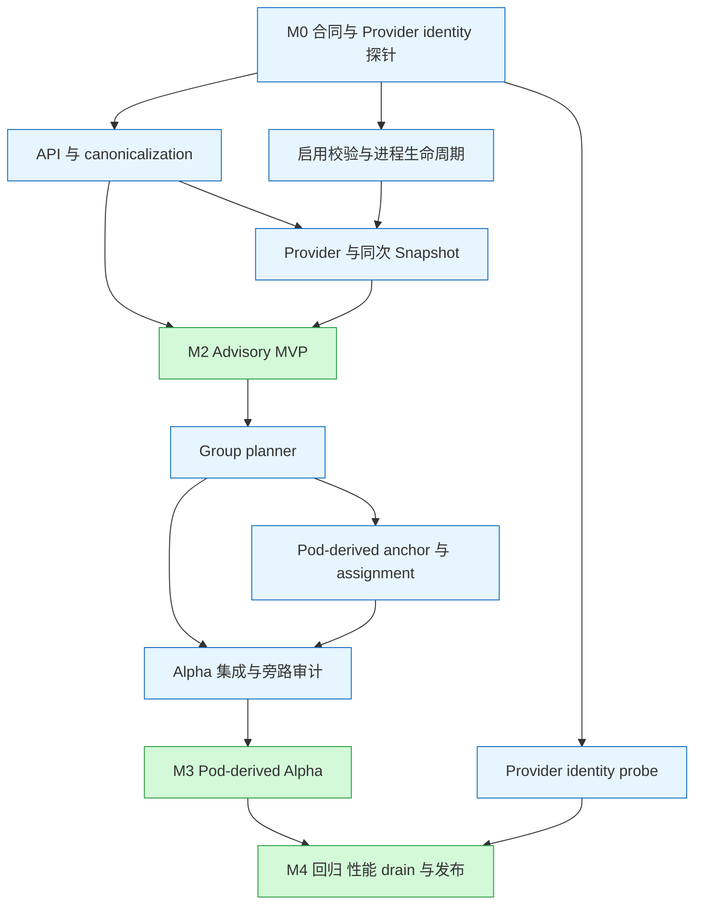

# Volcano 通用 xPU 拓扑感知调度 V4 开发计划

> 基线：[V4 设计](./99-generic-xpu-topology-aware-design-zh-v4.md)。本计划只细化其中的 Alpha 范围，不纳入独立的跨系统事务、外部设备生命周期或多 Pod 原子提交需求。
>
> 状态：待实施计划；任务均未因本文创建而完成。源码核对日期：2026-09-16；本地 HEAD：`7604cc7d3`。
> 下文“现有”指本地 checkout，“新增/建议”指拟开发内容，不代表上游已经接受。
>
> XPU-00 已启动；合同冻结草案与 fixture 规范见
> [101-generic-xpu-topology-aware-contract-review-zh-v4.md](./101-generic-xpu-topology-aware-contract-review-zh-v4.md)。

## 1. 交付目标与拆分原则

建议按 **合同冻结 → 数据与启用基础 → Advisory MVP → Pod-derived Topology Alpha → 发布验收** 推进。
V4 中的“PR 1”和“PR 3”各自包含多个跨组件改动，本计划将其拆成可建 Issue 的工作包；较大的工作包还可拆成多个 PR。

最先交付一个可安装、可配置、可解释调度结果的 Advisory MVP；随后以已绑定 Pod 的 NodeName 和 assignment annotation
完成拓扑 Alpha。跨系统事务、外部设备生命周期和多 Pod 原子提交不属于本计划范围。

### 1.1 发布能力分级

| 交付物 | 用户可验证的行为 | 放行条件 |
| --- | --- | --- |
| 数据基础 M1 | catalog、可信 Provider、NodeUID identity、同次 Session snapshot、canonical policy | 配置/API/并发一致性测试通过；尚不作为可用调度功能发布 |
| Advisory MVP M2 | `soft` topology preference、确定性 Compact、缺数据时可解释退化 | gate/plugin 同时有效；hard 仍 fail closed；不创建 per-device allocation owner |
| Pod-derived Topology Alpha M3 | 单 leader 下按 Group 规划 Node/Domain/Fabric；成功绑定的 Pod 保存 scheduler-owned assignment annotation；后续 wave/Session 从 Pod 恢复 anchor | Pod cache 恢复、NodeUID/DeviceKey 校验、缺失/冲突 Pending、普通逐 Pod Bind 回归通过 |
| 发布候选 M4 | 安装、升级、关闭、容量与性能边界可复现；明确声明 Alpha 能力边界 | 对应能力矩阵、E2E、性能报告及运维手册通过 |

贯穿所有工作包的约束：

- 复用 JobInfo/SubJobInfo、Queue/Gang/Predicate/HyperNode 和 Statement；不新建平行调度循环或 readiness 系统。
- `scope + domainClass` 必须贯通 API、catalog、Provider、索引、planner、assignment、anchor、恢复和迁移拒绝。
- hard 不降级为 soft；未知 class 对两种 mode 都是 authoring error。soft 数据不可用只能失去 preference。
- Alpha 复用现有 Statement 与逐 Pod PreBind/Bind；不新增独立跨 Session 提交状态、EvidenceStore、ActivityFence 或第二套 commit loop。
- 成功绑定的 Pod 必须保留 `spec.nodeName` 与 scheduler-owned `volcano.sh/xpu-assignment`；后续 Session 由此重建 Group anchor。
- annotation 缺失、DeviceKey 非法、NodeUID 不匹配或 Group anchor 冲突时，hard workload 保持 Pending，不猜测或选择第二个实例。
- 单 active scheduler leader 负责同一调度路径；不设计两个 scheduler 同时更新同一 Group 的 owner/fencing 语义。
- 中间 PR 保持 feature 默认关闭；不新增跨系统 owner、事务层或多 Pod Bind 原子性承诺。

### 1.2 首期范围

包含：Annotation/Mock Provider、Node-local 和显式 Fabric、PodGroup/SubGroup、Pod/VCJob authoring、单普通 Container 整卡、
基于已绑定 Pod 的稳定跨 wave anchor、单 active leader，以及一个 Provider 能否消费/确认 scheduler-selected DeviceKey 的探针。

延期：DRA claim/ResourceSlice、MIG/vGPU/共享几何、多 Container/init 生命周期、topology-aware victim selection、
自动推导 Fabric、通信 ring 优化、外部设备生命周期、多 Pod Bind 原子性、workload 同时启动屏障。
首个 Provider 的厂商目标固定为 NVIDIA；XPU-01 可用 `nvml-mock` 模拟 NVIDIA inventory/topology/health，并用真实 NVIDIA Device Plugin
接入 `nvidia.com/gpu`。HAMi 不是底层设备厂商；即使参考其分配/注入实现，也不意味着首期支持 vGPU 请求形状。

## 2. 源码基线与实际改动面

| 区域 | 已核对的现状 | 对开发计划的影响 |
| --- | --- | --- |
| [配置解析](../../../pkg/scheduler/util.go)、[加载与重载](../../../pkg/scheduler/scheduler.go) | `UnmarshalSchedulerConf` 做部分校验；`loadSchedulerConf` 存在默认配置/上一配置路径 | XPU-02 必须区分首次非法启动与热更新失败，防止回退配置丢失 xPU intent |
| [Helm values](../../../installer/helm/chart/volcano/values.yaml) | 已有 `scheduler_feature_gates`、`admission_feature_gates`、`scheduler_config_override` | 复用现有参数，增加 xPU 示例和渲染测试，无需重复造开关 |
| [自动 PodGroup](../../../pkg/controllers/podgroup/pg_controller_handler.go) | 有 `buildPodGroupFromPod`、`parseNetworkTopologyFromPod`、`shouldUpdateExistingPodGroup` | 新增 strict xPU canonicalization，不照搬无效 network mode 的默认回退 |
| [VCJob controller](../../../pkg/controllers/job/job_controller_actions.go)、[更新校验](../../../pkg/webhooks/admission/jobs/validate/admit_job.go) | 已有 Job/partition 到 PodGroup/SubGroup 的 NetworkTopology 转换；`validateJobUpdate` 对其他 spec 变化严格限制 | 新字段要覆盖两级转换，并专门实现 V4 quiescent 更新规则，不能只补 struct |
| [JobInfo.SetPodGroup](../../../pkg/scheduler/api/job_info.go) | SubJobs 仅在初次设置或 SubGroupPolicy 变化时重建 | 新 policy 的缓存失效需要覆盖顶层 policy 变化，避免保留旧 SubJob 视图 |
| [ClusterInfo](../../../pkg/scheduler/api/cluster_info.go)、[Snapshot](../../../pkg/scheduler/cache/cache.go)、[openSession](../../../pkg/scheduler/framework/session.go) | 尚无 DeviceTopology；Snapshot 在主锁下取得集群视图 | XPU-06 增加同次捕获，且 Node replacement 与 topology publish 协调 |
| [allocate](../../../pkg/scheduler/actions/allocate/allocate.go)、[recorder](../../../pkg/scheduler/actions/allocate/recorder.go) | 有 worksheet、HyperNode trial、nomination、Save/RecoverOperations 和多处分支提交 | XPU-09 审计所有分支，确保 winning placement 和 assignment annotation 不来自试算副本 |
| [Statement](../../../pkg/scheduler/framework/statement.go) | `Commit()` 无 error；Merge 转移 operations；SaveOperations 克隆 Task operations | Alpha 直接复用现有 Commit，不新增提交事务层 |
| [Bind cache](../../../pkg/scheduler/cache/cache.go)、[PreBinder](../../../pkg/scheduler/cache/interface.go) | `AddBindTask` 单项入队；`executePreBinds` 保留成功项；rollback 无错误结果 | Alpha 保持现有逐 Pod Bind，并验证 assignment annotation 随 Bind 保留 |
| [Condition](../../../pkg/scheduler/framework/session.go)、[JobUpdater](../../../pkg/scheduler/framework/job_updater.go) | Condition 按 Type 替换，再经 JobUpdater 写回 | xPU 与 gang 需要统一 outcome 选择和 controller blocker 保护 |
| [backfill](../../../pkg/scheduler/actions/backfill/backfill.go)、[preempt](../../../pkg/scheduler/actions/preempt/preempt.go)、[reclaim](../../../pkg/scheduler/actions/reclaim/reclaim.go) | allocate 之外还有直接 `Session.Allocate` 和 Statement 提交路径 | XPU-13/14 要审计旁路提交和释放，不能仅保护 allocate action |

上述核对是源码阅读，不是运行验证；本次未发现 V4 命名的 gate、plugin、snapshot 或 group anchor 的 Go 实现。

## 3. M0：先冻结哪些开发合同

M0 不是重写设计。输出短决策记录、接口草案与反例用例，解决会导致多个组件返工的问题。
“建议起点”用于安排评审，不表示最终 API 已确定。

| 决策 | 建议起点与必须产出的结论 | 阻塞的工作 |
| --- | --- | --- |
| D1：catalog 权威载体 | 固定 Alpha class 定义，使用一份只读 catalog ConfigMap/静态配置；冻结安装方式、RBAC、scheduler/webhook/controller/Provider 的统一读取和不可读行为。不实现运行期间更新 | XPU-03 的存储实现、04、05 |
| D2：Pod-derived anchor 与 assignment | 复用已绑定 Pod 的 `spec.nodeName` 和 scheduler-owned `volcano.sh/xpu-assignment` 重建 anchor；可选 PodGroup 摘要只作索引，不作事实源；不引入独立 evidence store | XPU-11、14 |
| D4：首个 Provider | 用 XPU-01 的小实验验证：scheduler-selected DeviceKey 能被 Provider/Device Plugin 消费或确认，并能写入/保留 Pod assignment annotation | XPU-01 |
| D5：API 与 schema | 冻结 class 名语法、默认值、selector 冲突判定、strict JSON、大小上限、legacy tombstone/CEL 的生成方式；确认 API server 支持的 schema 校验环境 | XPU-03、04 |
| D6：authoring 与 anchor activity | 已绑定成员存在时禁止 topology policy semantic mutation；复用 PodGroup 的现有 resourceVersion/generation 更新冲突，不新增 ActivityFence；单 leader 读取一致缓存 | XPU-04、11 |
| D7：激活与 action 兼容 | 冻结 `schedulerName → accepted activation config` 映射、digest 和 reload/drain；不能生成 assignment annotation 或恢复 anchor 的入口明确阻塞 | XPU-02、13、14 |
| D8：组合与状态归属 | 多 SubGroup、多 resource policy 仍在同一 Statement/Session 中求约束交集；每个 Pod 一份 assignment，Group anchor 从已绑定成员重建，不建立共同外部 owner | XPU-08、11、13 |

两项需要写进决策记录的实现细节：

1. **gate 关闭时允许删除 policy** 仍受 V4 §3.5 的 quiescent 限制；已有绑定成员时不能借删除绕过保护。
2. `soft` 只做 preference，不建立 hard anchor。MVP 如何体现 Group soft preference 要给出可复现评分例子；不能让软约束排除普通可行 Node。

### XPU-01：NVIDIA Provider identity 探针

在大规模修改 Statement 前，针对 NVIDIA Provider 完成分层小实验。第一层使用 `nvml-mock + NVIDIA Device Plugin` 做可重复的身份、
topology 和 annotation 模拟；第二层可用真实 NVIDIA 节点补充 runtime identity 验收：

1. 从 nvml-mock 枚举稳定 NVIDIA GPU UUID，选择非默认 UUID，验证 Provider 能将 canonical DeviceKey 传递到 Pod assignment annotation。
2. mock 层核对 NVML/Device Plugin inventory、plan 与 annotation；真实硬件层再从实际容器/NVIDIA runtime 读出设备身份，与 Pod 的
   PodUID、ResourceName、NodeUID 和 DeviceKeys 对照。
3. 重读已绑定 Pod，验证 NodeName + assignment annotation 可以恢复同一 Node-local/Fabric anchor；NodeUID 变化必须 Pending。
4. 注入 annotation 缺失、非法、重复 DeviceKey、topology 映射冲突，验证不会猜测或建立第二个 anchor。
5. 明确 nvml-mock 能覆盖的 Fabric/topology/health 故障与真实 NVIDIA Fabric 验收边界。

产物是 NVIDIA Provider 能力表、mock/真实分层日志与断言、尚缺的协议和硬件清单。nvml-mock 能证明身份和拓扑映射行为，不能替代真实
容器 UUID 验收。Provider 不能消费 scheduler-selected DeviceKey 时，Alpha 对相关 hard workload 保持 Pending。

## 4. 依赖、工作包和估算

### 4.1 依赖总览

图展示主线和可并行分支；具体依赖以 4.2 表为准。



### 4.2 可直接建 Issue 的工作包

估算单位为工程人日，含实现、对应测试和一次正常代码评审修改；不含等待 maintainer、硬件采购、厂商协议开发及大规模基础设施搭建。
它是基于当前拆分的初估，M0 和 XPU-01 后必须重估；并行不会减少总人日。

角色：A = API/controller；S = scheduler/cache/framework；R = runtime Provider；Q = 测试/发布。角色可由同一人承担。
依赖列表示完成/合入所需条件；接口冻结后可先写纯逻辑、Fake 和测试。

| ID | 工作包 / 建议 PR 主题 | 依赖 | 主责 | 人日 |
| --- | --- | --- | --- | --- |
| XPU-00 | [冻结 API、Pod-derived anchor、assignment 与验收合同](./101-generic-xpu-topology-aware-contract-review-zh-v4.md) | 无 | A/S/R | 4～6 |
| XPU-01 | Provider identity/selected DeviceKey 探针与硬件验收方案 | 00 的初版合同；结果反哺 D4 | R | 3～5 |
| XPU-02 | Feature/plugin activation、validator、process manager 骨架 | 00/D7 | S | 4～6 |
| XPU-03 | Public API、catalog、canonical types 与生成链 | 00/D1/D5 | A/S | 6～9 |
| XPU-04 | authoring canonicalization、mutation、Condition 聚合 | 02、03；D6 | A | 6～9 |
| XPU-05 | Annotation/Mock Provider、Normalizer、可信发布 | 02、03 | S | 6～9 |
| XPU-06 | topology live cache、NodeUID、immutable paired snapshot | 02、03、05 | S | 6～9 |
| XPU-07 | plugin/compiler、soft score 与 Advisory MVP | 04、06 | S | 4～6 |
| XPU-08 | 完整 Group planner、四种语义与 bounded search | 07；D8 | S | 7～11 |
| XPU-09 | Statement/Session Group plan 与提交分支审计 | 08 | S | 3～5 |
| XPU-11 | Pod-derived anchor、assignment annotation 与恢复 | 03、08；D2/D6 | S/R | 4～6 |
| XPU-13 | Alpha 提交 guard 与所有 action 入口防绕过 | 08、11；D7/D8 | S | 4～6 |
| XPU-14 | Alpha Pod/Node recovery、eviction 旁路与 drain | 11、13 | S | 4～7 |
| XPU-16 | Mock/真实 Group、Fabric、失败注入 E2E | 14 | Q/S/R | 6～10 |
| XPU-17 | metrics、性能与并发容量基线 | 07 可启动；Alpha 部分依赖 13/14 | Q/S | 4～6 |
| XPU-18 | 安装示例、升级/drain/回滚与发布清单 | 04、16、17 | A/Q | 3～5 |

Alpha 主线约 **74～110 工程人日**（XPU-00～09、11、13、14、16～18）。
M2 所需 XPU-00～07 约 **39～59 人日**，其中包含提前执行的 Provider identity 探针。
这些不是已投入工时，也不是交付承诺。

### 4.3 与 V4 原 PR 划分的对应

| V4 粗粒度阶段 | 本计划工作包 |
| --- | --- |
| PR 0：contract review | XPU-00、01 |
| PR 1：model/provider/identity | XPU-02、03、05、06 |
| PR 2：snapshot/Advisory | XPU-04、06、07 |
| PR 3：Topology Alpha 与旁路保护 | XPU-08、09、11、13、14 |
| PR 4：Fabric/Group E2E 与发布 | XPU-16～18；Fabric 模型与纯规划提前在 05/08 落地 |

## 5. M1/M2：先完成可运行的 Advisory 路径

### XPU-02：启用校验与进程生命周期

**落点**：现有 `pkg/features/volcano_features.go`、`pkg/scheduler/{util,scheduler}.go`、
`pkg/scheduler/framework/plugins.go`、`pkg/scheduler/plugins/factory.go`；新增 manager 与 activation validator，目录在 M0 冻结。

- 注册默认关闭的 `XPUTopologyAwareScheduling` 和 `xpu-topology-aware` builder；复用两个进程的 feature-gate 参数。
- 严格校验 plugin arguments：unknown key/value、重复 resource owner、identity/capability 不匹配、禁用必要 callback 均失败。
- 首次配置无效不进入调度 Ready；热更新完整验证后原子接受，失败保留旧配置及其 manager，不提前停止旧 owner。
- activation 校验覆盖 gate、plugin 参数、Provider identity、固定 catalog 是否可读与 assignment annotation contract，贯通 immutable view、Plan 和 topology snapshot。
- feature gate 是进程启动参数；只对 scheduler 配置做热更新。关闭 gate 必须先用旧配置 drain，再统一重启 scheduler/admission。
- 将 catalog/config readiness、Provider readiness、单 Node freshness 区分；单 Node 未同步只影响相应候选。
- process manager 持有 Provider/cache/topology snapshot；per-Session plugin 仅持只读 view、Group anchor 和 plan overlay。
- 在 core 层保护存量 typed policy 与 authoring blocker，不能依赖被关闭 plugin 的 callback 才拒绝任务。
- Alpha 的 reload/drain 只检查已绑定 Pod、policy mutation 和 scheduler leader 生命周期；不引入独立 activity/recovery evidence 接口。

**完成条件**：四种 gate/plugin 组合、首次启动与重载、配置不可读、digest 失配、Session 重建均有测试；manager 不重复启动；
两个 gate 都关闭时普通 workload 行为一致。完整 drain 的运行验收在 XPU-14/18 完成。

### XPU-03：API、catalog 与 canonical model

**落点**：现有 `staging/src/volcano.sh/apis/pkg/apis/{scheduling,batch}/`、CRD 生成目录；
新增共享 canonicalization/catalog/model 包。共享逻辑不得依赖 scheduler 实例或运行时分配状态。

- 增加 PodGroup/SubGroup policy 与 VCJob/partition ergonomic 字段；补 internal/versioned types、deepcopy、conversion 和 client 生成。
- 实现 default/validate/stable sort/dedup/canonical equality；canonical selector 排序、重叠 selector 检测、多 policy 冲突使用同一实现。
- 定义 NodeUID-safe DeviceKey、LocalDomainKey、FabricKey、DomainClassKey、Node/Fabric class-bearing model。
- 实现固定 catalog 读取和 reader readiness；不实现历史 catalog 或运行期间切换。
- Go/canonical model 不包含 `tier/tierName`；served schema 用 reject-only tombstone + CEL 拒绝，生成后不能丢失该规则。
- 明确 `allocationStrategy` 等禁用字段在 typed schema 与 annotation 的拒绝路径，不能只依赖客户端 Strict。

**完成条件**：三种 authoring 输入的同义 intent 得到同一 canonical spec；不同 resource/scope 的同名 class 不冲突；
通过真实 API server schema 测试证明旧字段被拒绝，而非先 prune 后接受；生成链重复运行无差异。

### XPU-04：controller/webhook 与可解释状态

**落点**：现有 `pkg/controllers/podgroup/pg_controller_handler.go`、`pkg/controllers/job/job_controller_actions.go`、
`pkg/webhooks/admission/{jobs,podgroups,pods}/`、`JobInfo.SetPodGroup`、Session/JobUpdater/status update 路径。

- 支持 direct PodGroup、VCJob、Deployment/ReplicaSet、StatefulSet、bare Pod；所有入口最终物化 `PodGroup.spec.deviceTopology`。
- strict annotation parser 拒绝重复 JSON key、未知版本/字段、超限及无效类型；typed/owner/annotation 多源比较 canonical spec。
- 解析失败或成员冲突时整组 Pending，即使 canonical spec 为空也保留 blocker；scheduler 不直接读 workload annotation。
- 实现 quiescent/no-op/活动 mutation 规则，包含删除 policy、Pod template rollout、VCJob 与生成 PodGroup 的 UID/RV CAS。
- 为 VCJob 现有更新校验加入精确的 xPU 规则，不放开其他 spec；同步更新 Job/SubJob 的 policy 与 compiled-cache 失效。
- 提前校验单普通 Container 正整数整卡、request/limit 及 Group 成员形状；scheduler 对运行时可见对象再次校验。
- 统一 outcome：controller authoring blocker 优先，之后具体 xPU reason 优于泛化资源不足；解决后清除陈旧 True，保留其他 status 字段。

**完成条件**：入口矩阵、成员不一致、活动期删除、合法 no-op、status conflict retry、controller/scheduler 交错写回均覆盖；
admission 读取失效 catalog/activation 时 fail closed。D6 的绑定成员与 semantic mutation 验收在 XPU-11/13 回补。

### XPU-05：可信 Provider 和 Normalizer

**落点**：新增 `pkg/scheduler/topology/provider/`（建议）与测试 fixtures；现有 Node informer/workqueue 入口。

- 实现 Annotation 与 Mock 两种输入；输出相同 ReplaceFacts/ClearFacts、Pending/Synced、generation/freshness 合同。
- Node RV 只做相等验证；同 generation 仅接受内容一致 heartbeat；invalid payload 保留最后有效事实但不刷新有效期。
- 规范化 catalog class、membership closure、去重、无环、resource/scope；禁止从 Link、Node 或 HyperNode 猜 hard Domain。
- Node-local facts 与 single-owner complete Fabric 分开验证；Fabric member 必须解析到当前 UID/generation/local Domain。
- Provider capability 只能引用固定 catalog 中已定义的 class；Provider 不可用不阻断有效 soft facts 发布。
- 提供可信 publisher 的最小输入规范、RBAC 与 admission 保护；拒绝 workload/scheduler 身份篡改 topology annotation。

**完成条件**：重复 ID 跨 Node 合法、同 Node 冲突非法；错误 class、循环成员、乱序更新、owner/member 变化与伪造发布全部有测试。
首期不额外开发通用硬件发现 DaemonSet；真实 facts 采集器是否需要由 XPU-01 确认，并据此调整实现范围。

### XPU-06：live cache、identity 与同次 snapshot

**落点**：现有 `pkg/scheduler/cache/{cache,event_handlers}.go`、`api/cluster_info.go`、`framework/session.go`；
新增 topology cache 与 immutable indexes。

- 协调 Node identity 变化、Provider publish 和主 cache：只出现“旧 UID + 旧 view”或“新 UID + Pending”。
- 固定锁序 `SchedulerCache.Mutex → topologyCache.mu`；parse、closure、Provider RPC、持久 I/O 在锁外。
- Snapshot 在同一临界区获取 Node/Job/Queue 与 immutable topology pointer；plugin 不再次 snapshot。
- 建立 DomainsByClass、ProvidersByClass、NodeToDomains、SchedulableByDomain 等稳定索引，发布后 map/slice 不可变。
- Node/Fabric replacement 使旧候选失效；已绑定 Pod 使用旧 NodeUID 时标记 anchor 不可恢复，不能把旧 key 重新放入候选。
- 区分 facts、health、Session-local placement overlay；不把 Node aggregate 数量当单个 Domain 的可用数量。

**完成条件**：并发 Node replacement、旧 UID ClearFacts、catalog 缺失/非法、source 删除、旧 Session 不变、锁序/race 测试通过。
Alpha 只验证 Pod-derived anchor 的失效与 Pending，不管理外部设备 owner 生命周期。

### XPU-07：Advisory MVP

**落点**：新增 `pkg/scheduler/plugins/xpu-topology-aware/`（建议），复用 JobValid/Predicate/BatchNodeOrder/EventHandler。

- compiler 使用 canonical spec、DomainClassKey 与 immutable view；分清 unknown、unsupported、Pending、stale、not enforceable。
- 实现只对有证据 topology 评分的 soft preference 与 deterministic Compact；稳定排序与 tie-break 可复现。
- Node/Fabric membership feasibility 做成可复用纯函数，供后续 hard planner 使用；soft 不因 topology 缺失过滤 Node。
- Group soft 使用既有成员/Session placement 的可解释偏好，不建立持久 hard anchor；不跨 Session 保留未经 Pod 事实确认的设备状态。
- 配置相同、workload 无 policy 时，不改变其他 plugin 的候选与评分；不注册第二个 HyperNode gradient 或 JobReadyFn。
- Provider identity 或 assignment contract 不满足时，相关 hard policy 明确失败，不静默降级为另一种设备身份。

**M2 验收演示**：安装 gate/plugin → 部署固定 catalog 并提交 facts → 用 direct PodGroup 和 Deployment annotation 分别调度 soft workload →
观察确定性 preference → 删除/过期 facts 后普通候选仍可调度 → 同一请求改 hard 后获得明确不可执行原因且无 Bind。

## 6. M3：Pod-derived Topology Alpha

这一阶段完成首个可用的 hard topology Alpha：Group anchor 从已绑定 Pod 的 `spec.nodeName` 与
`volcano.sh/xpu-assignment` annotation 恢复，复用现有 Statement 与逐 Pod Bind。它不承诺跨系统设备生命周期或多 Pod Bind 原子回滚。

### XPU-08：side-effect-free Group planner

**落点**：新增 plugin planner/model 包，扩展 `framework/session_plugins.go` 注册合同；不接管 gang readiness。

- 以 PodGroupUID/SubGroupID 标识稳定 Group，输入本轮待调度成员、普通候选交集、固定成员及 anchor。
- 分别实现 Pod+Node、Group+Node、Pod+Fabric、Group+Fabric；验证本地域与 Fabric policy 组合，以及 Job/SubGroup 双层约束。
- Group+Node 共享具体 LocalDomainKey/NodeUID；Group+Fabric 共享显式 FabricKey；Pod policy 允许各 Pod 选择不同实例。
- Fabric-only policy 使用显式成员设备并集，不隐含每 Pod 单一本地域；额外 Pod+Node policy 才增加该限制。
- 基于 plan-owned NodeInfo clone 重放 CPU/内存/Pod 资源与已有固定成员；DeviceKey 独立去重，重叠 Domain 不重复计数。
- 固定 Node 的 finalization 必须使用 AssignedNodes；不可局部换 Node/Device 后沿用旧 group plan。
- 实现 deterministic Compact、bounded backtracking、search-state/domain/attempt/deadline budget；无解与预算耗尽使用不同 reason。
- 返回完整 immutable placements、DomainSelections 和 assignments；规划阶段不产生外部副作用。

**完成条件**：V4 §11.4 场景表全部变成表驱动测试；随机打乱输入仍得到相同 plan；greedy 失败但受限回溯可解的案例有覆盖；
多 Pod 分别可放但合计 CPU/内存不足的候选被拒绝；调用 Fake 证明 planning 不访问外部 allocator。

### XPU-09：Statement/Session plan 与提交分支审计

**落点**：现有 `actions/allocate/{allocate,recorder}.go`、`framework/statement.go` 与对应测试。

- 审计普通、hard network topology、SubGroup、nomination fast path 的每个 Statement 提交分支，确保最终 Task placement 和
  `xpu-assignment` 都来自 winning Statement，而不是某个试算副本。
- 复用 `SaveOperations/RecoverOperations` 复制可试算的 Task/Node 状态，不把试算副本当作已提交事实。
- 对已 Ready Group 的新增 Task，先从已绑定 Pod 恢复 anchor，再与本次 Session 的 plan 求交集；不能为新 wave 选择第二个 Domain/Fabric。
- 普通 workload 继续使用现有 `Commit()`；Alpha 不新增新的提交入口或平行 Statement。

**完成条件**：试算多个 HyperNode、恢复最佳 Statement 后，只有 winning placement 进入 Bind；Already Ready 和多 SubGroup 不漏成员；
同一输入重复规划得到相同 DeviceKeys，且 planner 没有外部 allocator 副作用。

### XPU-11：Pod-derived anchor、assignment annotation 与恢复

**落点**：`pkg/scheduler/framework/session.go` 的 Session/HyperNode 恢复路径、Pod Bind annotation 传递路径、Pod/Node cache event 与
新增 topology model/provider 包；不新增 PodGroup status 字段作为唯一事实源。

- 定义 scheduler-owned `volcano.sh/xpu-assignment` 最小 JSON：`version`、`resourceName`、`provider`、canonical `deviceKeys`；可选的
  `localDomainKeys`、`fabricKeys`、`groupRef`、`planDigest` 只能做快速索引，必须可由 Pod 与当前 topology snapshot 重建。
- 使用已绑定/运行 Pod 的 `spec.nodeName` 作为 Node placement；`deviceKeys` 必须包含 NodeUID-safe identity，不能只使用 GPU index。
- 从 `AllocatedStatus` 且 `NodeName` 非空的成员 Pod 解析 annotation，并用同一 immutable topology snapshot 映射 LocalDomain/Fabric。
- `Group + Node` 要求所有已绑定成员位于同一 LocalDomain；`Group + Fabric` 要求成员存在共同 Fabric；缺失、冲突或无法映射时 hard Pending。
- 首 wave 尚无已绑定成员时，anchor 仅为 Session-local plan；Bind 成功后由后续 Session 从 Pod cache 重建，不提前写 PodGroup。
- 可选地在 PodGroup annotation 写 anchor 摘要作为快速索引，但摘要丢失/过期时必须扫描成员 Pod 重建，不能成为第二份账本。
- 已绑定成员存在时拒绝 topology policy semantic mutation；复用现有 resourceVersion/generation 更新冲突，不新增 ActivityFence。
- 单 active scheduler leader 负责同一 Group；不实现 active-active owner、RecordRevision 或 SchedulerEpoch。

**完成条件**：`minAvailable=4, replicas=10` 首 wave 的已绑定 Pod 提供同一 anchor，后续 6 个继续使用该 anchor；Session 重启后仍能从 Pod
恢复；缺失/冲突 annotation、NodeUID 替换和 Fabric 映射失败都保持 Pending；annotation 在 Bind 后仍可读。

### XPU-13：Alpha 提交 guard 与所有 action 入口防绕过

**落点**：allocate、`Session.Allocate/dispatch`、cache bind submission；审计所有能进入 Bind 的 action/shortcut。

Alpha 主链固定为：

```text
Group/Pod policy
  -> Session-local Group plan
  -> Statement.Allocate 选择 Node + canonical DeviceKeys
  -> BindContext/Task Pod 保存 volcano.sh/xpu-assignment
  -> 现有逐 Pod PreBind/Bind
  -> 后续 Session 从已绑定 Pod 恢复 anchor
```

- core final guard 验证 hard topology Task 能生成合法 assignment annotation；不能生成时保持 Pending/返回明确 reason。
- backfill、nomination、preemption/reclaim、gang*、shuffle 等旁路必须经过相同的 policy/assignment guard；不能绕过 hard constraint。
- preempt/reclaim/eviction 只改变 Pod 生命周期，不把 eviction 当成外部设备已释放的证明。
- 每个成功绑定 Pod 只有一份 assignment annotation；同一 Group 不允许因旁路产生第二份 anchor。

**完成条件**：普通逐 Pod Bind 回归通过；所有 hard topology 入口要么写入可校验 annotation，要么明确 Pending；
`bound-pod-anchor-recovery`、`xpu-assignment-conflict-pending` 和旁路 fixture 通过；不出现双 scheduler/双 allocator owner。

### XPU-14：Alpha Pod/Node recovery、旁路与 drain

**落点**：Session open/rebuild、Pod/Node cache event、preempt/reclaim/eviction 和 activation reload。

- Session 打开时只从已绑定/运行 Pod 重建 anchor；无已绑定成员不强行创建 anchor，未绑定 Pod 仍按本轮 plan 调度。
- Pod assignment annotation 缺失、格式非法、DeviceKey 不属于 Node 或 NodeUID 已替换时，相关 Group hard 调度保持 Pending。
- 同一 Group 的成员 anchor 冲突时不覆盖、不选择第二个实例，记录可重建 reason 并等待事实修复。
- 同一 active leader 负责调度路径；不增加 follower owner 或 fencing。
- Pod 删除、eviction、FutureIdle 和 pipeline 不被解释为外部设备已释放；可用性由现有 cache/provider 更新反映。
- reload/drain 只检查 feature、policy mutation 和 Pod 生命周期。

**M3 完成条件**：Session 重启、Pod/Node event、Node replacement、annotation 缺失/冲突和旁路场景均有测试；普通 workload 不受影响；
关闭 Alpha 前不再有受其管理的 active topology Pod。

## 7. M4：E2E、指标与发布

### XPU-16：E2E 与故障矩阵

**落点**：现有 `test/e2e/`，新增 xPU suite/fixtures（具体目录评审后确定）；复用 kind/KWOK 和既有 E2E harness。

- Mock/kind：验证 webhook/schema/controller、API server Bind 次数、Node replacement、两阶段 wave、失败与恢复。
- KWOK/模拟规模：验证 Node/Domain/Fabric churn、planner budget、候选索引及 cache 并发压力。
- 真实设备：选中 ID、Pod assignment annotation 和 runtime identity；真实 Fabric 作为独立环境项记录。
- Alpha 故障测试断言绑定 Pod 的 NodeName/annotation、anchor 数量、状态和 reason；不扩展为外部 owner 或原子回滚断言。
- 新增 CI job 的运行环境/资源标签与失败日志归档；硬件 job 没运行时报告“未验证”，不能由 Mock 结果替代。

### XPU-17：指标与性能

最小指标：Provider age/error、snapshot publish latency、plan duration/search states/budget exceeded、assignment annotation/recovery 结果
及低基数 reason。原始 DeviceID/PodUID/token 不进入 metrics label；诊断日志关联信息应有长度界限。

性能报告必须用相同 workload/topology seed 比较：plugin disabled、enabled-no-policy、soft、Mock hard。
记录 Node/Device/Domain/Fabric 数、Group 大小、scheduler P50/P95/P99、吞吐、CPU/RSS、锁等待、每轮分配量与 GC。
补充无关 heartbeat、固定 catalog 缺失/非法、Node churn、碎片和高冲突案例。

验收阈值在 M0 记录基线方法，M2 实测后冻结。可将 enabled-no-policy 的 P95 调度周期/CPU/RSS 相对增长不超过 5% 作为
**待确认目标**，需多次重复测量与噪声范围；不能把它当作已测结果。hard 还必须遵守配置的 planning budget，不能无限搜索。

### XPU-18：用户配置与发布操作

- 提供可执行的 gate/plugin/完整 scheduler ConfigMap、catalog、trusted publisher 和 soft/hard 示例，并说明 assignment annotation 是
  scheduler/provider 运行时字段，不是用户 policy 输入。
- 提供 direct PodGroup、VCJob、Deployment PodTemplate、StatefulSet、bare Pod；多副本示例解释自动 PodGroup 的 minMember 设置，
  不把 topology annotation 当成 gang 一次调度全部副本的保证。
- Helm render 核对 scheduler/admission 同名 gate 与 plugin；保持默认安装关闭。
- 演练升级、policy 变更、drain、关闭 plugin/gate、重启恢复、恢复配置；Alpha catalog 不允许运行期间修改；已有绑定 Pod 未处理前不能
  放行会改变 topology 语义的 policy 更新。
- 回滚到不含 xPU core guard 的旧二进制前，必须完成 drain 并处理存量 policy/schema。
- V3 `tier/tierName` 用显式 catalog 映射迁移；没有发布过 V3 时也保留输入拒绝测试。
- 发布说明列出 Advisory、Pod-derived Topology Alpha、真实 Node-local/Fabric 环境的验证范围与不支持请求形状。

**M4 完成条件**：按文档在干净环境可重复安装和演练；存在受保护的已绑定 topology Pod 时语义变更/关闭被拒绝；drain 完成后关闭成功；
发布能力表与测试报告一致。

## 8. 验收追踪：每个关键要求由谁交付

所有编号 Txx 是拟新增测试场景，当前文档不表示测试已存在或已经运行。

| 测试族 | 必须断言的反例/成功条件 | 工作包 | 最低验收层级 |
| --- | --- | --- | --- |
| T01 激活 | gate/plugin 四组合；非法参数；首次无效不调度；重载失败保留旧配置 | 02 | 单元 + 安装集成 |
| T02 存量保护 | config/gate 失配时已有非空 policy、空 spec 的冲突 blocker 均不能走普通路径 | 02、04、13 | 调度集成 |
| T03 canonicalization | typed/annotation 同义得到同一 canonical spec；重复/乱序不变；未知/冲突字段拒绝 | 03、04 | 单元 + API server |
| T04 schema pruning | 旧 tier/tierName 在缺省客户端模式下仍被拒绝；生成不丢 CEL | 03 | 真实 API server |
| T05 更新 | 无绑定成员时 quiescent 更新成功；已有绑定成员的 semantic mutation/删除失败；top-level 更新不留旧 SubJob policy | 04、11、13 | controller + 调度集成 |
| T06 身份 | 两 Node 同 source ID 不冲突；Node 同名换 UID 后 Pending；旧 update 不污染新 UID | 05、06 | 单元 + race |
| T07 catalog | 固定 resource/scope/class 匹配；catalog 缺失/非法时 fail closed；不产生第二份 class 定义 | 03、05、06 | 单元 + 集成 |
| T08 Provider | invalid 不完成初次同步；freshness/generation 正确；ClearFacts 不伪造已绑定 Pod 的 assignment/anchor | 05、06、14 | 单元 + 集成 |
| T09 Fabric authority | 单 owner 完整声明；member/owner 变更立即失效；同 HyperNode 不推导 Fabric | 05、06 | 单元 + E2E |
| T10 Snapshot | 并发 publish 无新 Node/旧 UID 混合；旧 view 不变；RPC 不在锁内 | 06 | race + 压力 |
| T11 soft | 缺数据/Provider 只失去 preference；不产生 per-device owner；候选不因软约束缩小 | 07 | plugin + E2E |
| T12 Domain fit | 6+2 不能满足单 Domain 8；local-scale-up 4 不扩大为 pcie-root 8 | 08 | 单元 + Mock E2E |
| T13 四种量词 | Pod 可各选 Domain，Group 必须同实例；Fabric-only 与本地+Fabric 组合不同 | 08 | 单元 + Mock E2E |
| T14 Group 完整性 | Ready 后新增、多个 SubGroup、多 resource、固定 Running 成员均纳入约束 | 08、09、11、13 | 调度集成 |
| T15 规划边界 | 普通 Predicate 淘汰节点不复活；总 CPU/内存不超量；预算耗尽专用 reason | 08 | 单元 + benchmark |
| T16 试算回滚 | trial 无外部调用；Save/Recover/Merge 只复制可试算的 Task/Node 状态；winning placement 唯一 | 09 | 单元 + 故障注入 |
| T17 最终校验 | 无关 heartbeat 不使计划失效；引用的 Domain/Fabric membership 改变必须重算；NodeUID/DeviceKey 冲突保持 Pending | 08、11、13 | 并发 + 故障注入 |
| T18 绑定 annotation | 成功绑定 Pod 的 NodeName/assignment 可读；缺失/非法 annotation 不建立 anchor；普通逐 Pod Bind 不受影响 | 11、13 | 调用计数 + API server |
| T19 抢占/旁路 | eviction/pipeline/backfill/nomination 不绕过 hard；eviction 不直接伪造外部设备释放或新 anchor | 13、14 | action 回归 + E2E |
| T20 Pod-derived 恢复 | Session restart、两阶段 wave、Node replacement、assignment 缺失/冲突；跨 wave anchor 不漂移 | 11、14、16 | API server + E2E |
| T21 观测与回归 | controller blocker 不被 gang 覆盖；resolved 清除；无 policy 决定不变；指标低基数 | 04、07、17 | 集成 + benchmark |
| T22 安装与关闭 | 双进程 gate；受保护 topology Pod/policy activity 时拒绝语义变更或关闭；drain 后关闭；旧版本回滚步骤可执行 | 02、14、18 | 安装/升级演练 |

XPU-16 将 T01～T22 中的系统级场景串成回归，不重复替代各工作包的单元测试。

### 8.1 每个 PR 的完成定义

1. 只交付其声明能力；feature 默认关闭，未支持 hard 路径显式阻塞。
2. 对应测试族通过，检查正常行为与失败后的 Pod annotation、anchor、状态和 reason；不扩展为 external owner 或多 Pod 原子回滚验收。
3. 修改公共接口时补齐所有实现/Fake；修改 API 时检查 deepcopy/conversion、CRD/CEL、client 及发布模板。
4. 修改 cache/Statement/bind 时跑相关并发和现有 gang/network-topology/device 回归。
5. 同时更新能力表、配置和 reason 文档；记录测试环境、命令、结果及 Mock/真实范围。

### 8.2 后续开发的验证入口

以下是根据现有 Makefile/CI 核对的入口，本次计划编写未运行这些代码测试。开发时按 PR 改动范围选择，
不在每个小 PR 重复跑所有硬件/规模测试。

```bash
# API 修改后，在 staging API module 生成并验证。
cd staging/src/volcano.sh/apis
bash hack/update-codegen.sh
bash hack/verify-codegen.sh
```

```bash
# 仓库根目录：按 API/生成文件影响选择。
make generate-code
make manifests
make verify

# scheduler/cache/transaction 改动的聚焦测试。
go test ./pkg/scheduler/framework ./pkg/scheduler/cache ./pkg/scheduler/actions/allocate
go test -race ./pkg/scheduler/framework ./pkg/scheduler/cache ./pkg/scheduler/actions/allocate

# release/旁路改动的回归入口。
go test ./pkg/scheduler/actions/backfill ./pkg/scheduler/actions/preempt ./pkg/scheduler/actions/reclaim

# controller/admission 改动的入口。
go test ./pkg/controllers/podgroup ./pkg/controllers/job ./pkg/webhooks/admission/...
```

现有 CI 还执行 `make unit-test`、带发行 TAG 的 `make generate-yaml`/`make verify-generated-yaml`；
现有 kind 入口为 `make e2e`/`hack/run-e2e-kind.sh`。新 xPU suite 的选择参数、fixtures、硬件标签与执行脚本在 XPU-16 明确，
不把尚未创建的测试名写成现成命令。`make unit-test` 在 macOS 与 Linux 的 race 行为不同，并发验收应显式执行 race 或使用 Linux CI。

## 9. 排期、并行方式与第一周

### 9.1 参考排期

以 **2 名熟悉 Kubernetes/Volcano 的全职工程师 + 兼职 reviewer/测试支持** 为假设，每人每周 5 工程日：

- Advisory MVP：约 41～62 人日，考虑集成余量后约 **5～8 周**。
- Pod-derived Topology Alpha 主线：约 56～88 人日，考虑集成余量后约 **7～12 周**。
- 单人串行时间需在 XPU-00/XPU-01 后重估；不能把两人排期直接当单人的可交付日期。

评审等待、硬件可用性、backend 协议补建不在以上区间；关键依赖未落定时，应更新排期，不缩减恢复或 release 验收来追赶。
这些区间用于资源讨论，不是对当前人力与设备条件的假定事实。

### 9.2 可并行与应串行的边界

| 工作流 | 适合的并行安排 | 串行门槛 |
| --- | --- | --- |
| API/controller | 03/04 与 Provider 纯逻辑并行，基于冻结的 shared types/fixtures | 固定 catalog 与 mutation authority 先确定 |
| scheduler 基础 | 02 → 05/06 → 07；公开接口冻结后提前写 planner fixture | paired snapshot 验收完成才能发布 Advisory |
| framework | 09 的 Statement/Session 审计与 11 的 Pod-derived anchor 可在 planner 后并行 | 09/11/13/14 完成才能连接 Alpha |
| Provider | 01 提前做 Provider identity probe，并与 Alpha 集成 | Provider identity probe 完成后才能冻结相关能力声明 |
| 测试/运维 | 每包写单元/故障测试，17 在 M2 开始收基线 | M4 等待能力矩阵和 drain 演练 |

只有两名工程师时，上表是可选分工，不是五条同时满负荷推进的承诺。建议一人偏 API/Provider，另一人偏 cache/framework；
`cache.go`、`statement.go`、`allocate.go` 的每次接口变更明确一个主责，避免多个 PR 同时重写同一核心路径。

### 9.3 第一周的具体产出

优先开始 XPU-00 和 XPU-01，不先交一个只有空回调的 plugin PR。

| 时间 | 工作 | 可评审产物 |
| --- | --- | --- |
| 第 1 天 | 把各项 Alpha 决策分派到负责人；核对 allocation/Bind 调用链与全部分支 | 决策记录初稿、源码触点表、action 支持矩阵草案 |
| 第 2～3 天 | 冻结 Public/canonical 类型、activation/capability、assignment annotation 与 Pod-derived anchor 规则；准备正反例 fixtures | 同义 policy、6+2、两个 class、双 policy Fabric、四种量词、NodeUID/annotation fixture 规范 |
| 第 2～4 天 | 并行做 Provider 选定 DeviceKey、annotation 保留和 Node replacement 探针 | 可重放脚本、日志与能力差距清单 |
| 第 4～5 天 | 评审最小 Alpha 提交路径、旁路 guard 与 quiescent 规则；确认不增加新的提交事务层 | 决策修订、恢复/冲突序列表、首批 PR 的明确边界 |
| 第一周结束 | 按探针和接口反馈重估 XPU-02～07、11、13、14；为未决项指定 owner | 更新后的依赖、硬件条件与排期，不假定 M0 已全部完成 |

## 10. 主要风险与调整规则

| 风险 | 尽早获得的证据 | 调整方式 |
| --- | --- | --- |
| backend 不能指定/确认 DeviceKey | XPU-01 的 Provider 探针 | Alpha 对相关 hard workload 保持 Pending；不把未验证能力纳入本计划 |
| framework review 发现 Statement/Bind 路径边界问题 | XPU-00 的最小 Alpha 合同 | 保持现有 Statement/逐 Pod Bind；在现有路径内修正 guard 和 annotation 传递 |
| admission 只读内存判断 policy activity 导致竞态 | T05 semantic mutation/绑定成员场景 | 复用现有 resourceVersion/generation 和 cache 重读；不以不存在的 anchor 放行语义变更 |
| assignment annotation 未能随 Pod Bind 保留 | XPU-11/13 的 API server 与 binder 测试 | 修正 BindContext/Pod annotation 路径；无法保留时相关 hard workload Pending |
| 数据 churn/大型 Group 使规划耗时失控 | M2 基线、T10/T15 压测 | 优化索引/局部 revalidation，保持 bounded search，超过预算 Pending |
| API 生成 prune/reject 规则失效 | T04 的真实 API server 测试 | 修正 schema 生成/后处理链；单测 parser 通过不能替代 |
| 真实 Fabric 环境不足 | XPU-01 环境清单 | 分别标注本地真实与 Fabric Mock 验证，不宣传未测硬件能力 |
| 关闭配置/旧版本回滚存在受保护 topology Pod | T22 drain 演练 | 完成 Pod/policy drain 后关闭；不引入额外 owner 清理流程 |

## 11. 本次文档交付的验证边界

本次仅新增开发计划，未实现 V4 功能。核对了 V4 全文及相关本地源码，检查了计划中的阶段依赖、源码链接、任务编号、
估算加总、Markdown fence 和空白；V4 原文件保持不变。

未运行 Volcano 单元/E2E 或硬件测试。依赖图按 Mermaid skill 做静态语法检查；本机未发现 `mmdc`，
未将 fence/节点检查称为图形渲染验证。
