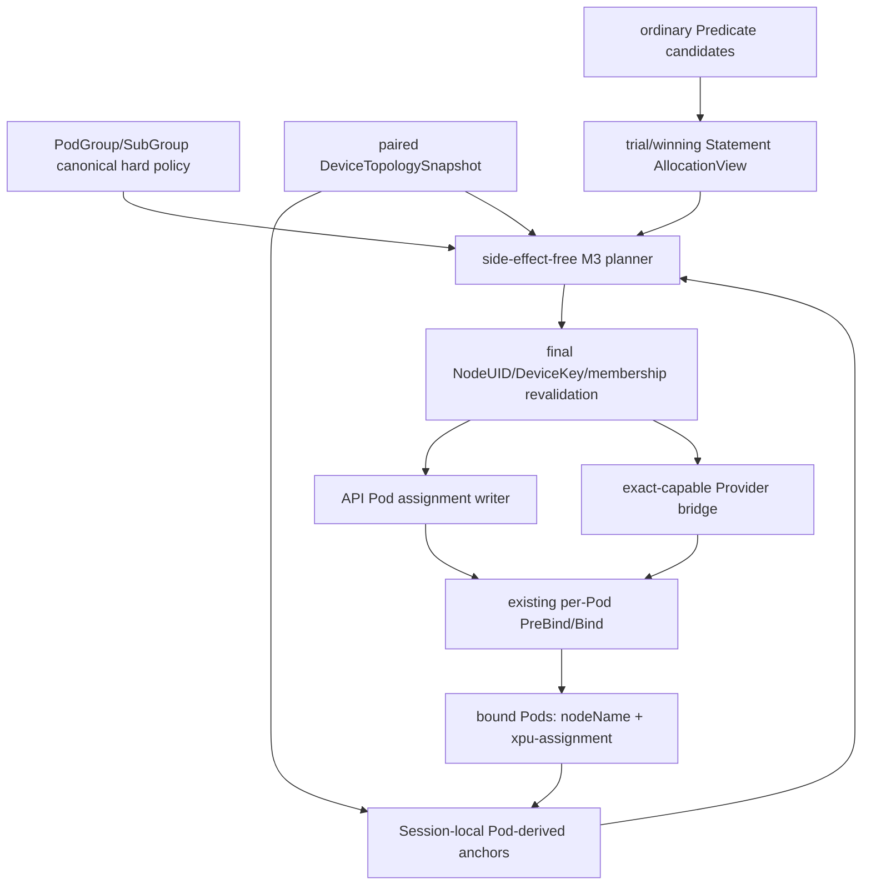

# Volcano 通用 xPU 拓扑感知调度 V4：M3 Pod-derived Topology Alpha 开发计划

> 上位设计：[V4 收敛设计](./99-generic-xpu-topology-aware-design-zh-v4.md)。
>
> 总体计划：[V4 开发计划](./100-generic-xpu-topology-aware-development-plan-zh-v4.md)。
>
> 冻结合同：[XPU-00 合同冻结记录](./101-generic-xpu-topology-aware-contract-review-zh-v4.md)。
>
> M1/M2 基线：[M1/M2 Advisory MVP 开发计划](./104-generic-xpu-topology-aware-m1-m2-advisory-mvp-development-plan-zh-v4.md)与
> [M2 安装及运行证据](./105-generic-xpu-topology-aware-m2-install-evidence-zh-v4.md)。
>
> 状态：**待实施计划**。源码复核日期：2026-09-22；本地实现基线：`5cd3f7b7e`。
> 本文描述 M3 的开发边界和验收门槛，不表示 hard topology、scheduler-selected DeviceKey、Pod assignment、Pod-derived anchor 或
> runtime UUID 已经实现。M1/M2 的 hard no-Bind guard 在 M3 全部放行条件满足前必须继续生效。

## 1. M3 结论与交付边界

M3 的目标是交付第一个 **Pod-derived hard topology Alpha**：在单 active scheduler leader 下，先由普通 Predicate 和现有
Statement 选择 Kubernetes Node，再在同一 paired topology snapshot 上为目标容器选择 canonical DeviceKeys；成功 Bind 的 Pod 保存
scheduler-owned `volcano.sh/xpu-assignment`，后续 wave/Session 从已绑定 Pod 的 `spec.nodeName + assignment` 恢复 Group anchor。

M3 不是把 M2 的 soft 分数直接改成 hard filter。它必须新增并闭合以下链路：

```text
hard typed policy
  -> complete AdmissionSet and Pod-derived anchor
  -> side-effect-free Node/Domain/Fabric/DeviceKey plan
  -> winning Statement final revalidation
  -> scheduler-owned assignment persisted to the API Pod
  -> exact-capable Provider/bridge consumes or confirms the same DeviceKeys
  -> existing per-Pod PreBind/Bind
  -> next Session derives the same Group anchor from bound Pods
```

### 1.1 M3 可以声明的能力

| 能力 | M3 完成后的声明 |
| --- | --- |
| hard Pod + Node | 每个命中 Pod 的目标设备来自一个满足 class/request 的 Node-local Domain |
| hard Group + Node | 同一稳定 Group 的成员共享一个具体 `LocalDomainKey` |
| hard Pod + Fabric | 每个 Pod 位于一个显式 Provider Fabric 内，可选择不同 Fabric 实例 |
| hard Group + Fabric | 同一稳定 Group 的成员共享一个具体 `FabricKey`，可跨 admission wave 恢复 |
| 多 policy | Job/SubGroup、Pod/Group、Node/Fabric 和多 resource policy 对每个 Task 求 AND 交集 |
| 多容器请求形状 | 多个 regular/init/restartable-init container 可以存在；每条目标 resource 只有一个消费者，并持久化完整 ContainerRef |
| assignment | 每个成功 Bind 的 Pod 保留 canonical container/resource/provider/DeviceKeys envelope |
| recovery | Session 重启后从 bound Pod 恢复 anchor；缺失、冲突或 NodeUID 不匹配时 fail closed |

### 1.2 M3 仍不能声明的能力

- 不提供跨系统 reservation、release、reconcile owner 或 DeviceKey allocation ledger；
- 不提供多 Pod 原子 Bind、原子 unbind、workload 同时启动屏障或 Kubernetes 外部事务；
- 不支持 DRA、MIG、vGPU/shared/fractional geometry，也不把 HAMi 私有 annotation 当作 generic assignment；
- 不提供 topology-aware preempt/reclaim victim selection；
- 不从 HyperNode、普通网络标签或设备数量推导 Fabric/DeviceKey；
- 不把 nvml-mock、Pod Running、Node placement 或 kubelet 任意 DeviceID 写成真实 runtime exact UUID 证据；
- 不新增 PodGroup anchor summary、EvidenceStore、ActivityFence、SchedulerEpoch 或 active-active owner。

## 2. M1/M2 后的当前源码基线

下表是本计划开始时已经存在的代码事实；“M3 缺口”是本阶段需要填补的内容。

| 区域 | 当前实现 | M3 缺口 |
| --- | --- | --- |
| activation | `topology.Activation` 已有 `AssignmentContractReady`/`HardPolicyReady()`，默认不满足 | 只能由真实 assignment Provider/持久化链的运行 readiness 置位，不能由一个静态参数伪造 |
| policy compiler | M2 compiler 已解析 canonical policy、catalog、请求数量和 readiness；任意 hard policy 返回 `XPUAssignmentNotEnforceable` | 编译结果需要保留 hard policy、ContainerRef 与 request，并交给 planner；bridge 未就绪时仍返回原 blocker |
| request shape | `taskResourceRequest` 支持多 regular/init/restartable-init container，但只返回数量 | 返回 `ContainerRef + ResourceName + Count`；exact assignment 必须能映射回唯一消费者 |
| topology snapshot | `DeviceTopologySnapshot` 已提供 NodeUID-safe DeviceKey、LocalDomain/Fabric、health、freshness 和 paired Session view | planner 需要从 immutable view 选择具体 DeviceKeys，并对 bound/session-local 已占用 key 去重 |
| soft scorer | M2 只使用 membership/health/结构容量，缺数据得 0 分 | hard planner 不能复用“结构容量即精确空闲”假设；必须有 assignment/bridge 可确认的 selected keys |
| Task annotation | `TaskInfo.PodAnnotations` 是 Session-owned clone，Bind request 会携带它 | Binding metadata 不等于 API Pod annotation 已持久化；M3 必须显式写入并验证 API Pod |
| allocate/Statement | trial 使用 `SaveOperations -> Discard -> RecoverOperations`；`Statement.Commit()` 无 error，逐 operation 提交 | trial plan 不得泄漏；winning Statement 必须重新生成并校验 plan，且在任何 Bind 入队前完成每个 Task 的 assignment 准备 |
| bind worker | `AddBindTask()` 单项入队；`executePreBinds()` 对每个 context 执行并保留成功项 | 保持逐 Pod 非原子边界；assignment 写入/校验失败的 Task 不能进入 Bind，不能宣传整组原子回滚 |
| backfill | 直接 `Session.Allocate()`，ready 后 dispatch | hard policy 必须经过同一 planner/assignment/final guard，无法形成 complete Group plan 时阻断 |
| recovery | 当前没有 production `xpu-assignment` writer/parser 或 Pod-derived anchor | Session open 需要只读已绑定 Pod，校验 assignment、NodeUID、ContainerRef 和当前 topology 后恢复 anchor |
| Provider | Annotation Provider 只发布 topology facts；stock NVIDIA Device Plugin 不确认 scheduler-selected UUID | XPU-01B 必须交付 exact-capable bridge 或明确保持 hard Pending |

### 2.1 当前提交和 Bind 调用链

```text
allocate.Action.Execute
  -> allocateResourcesForQueues
     -> normal allocateResourcesForTasks / allocateFromNomination
     -> hard-network/SubGroup allocateForJob -> allocateForSubJob
        -> SaveOperations -> Discard trial -> RecoverOperations winner
  -> Statement.Commit
     -> Statement.allocate
        -> Session.CreateBindContext
        -> SchedulerCache.AddBindTask
           -> processBindTask -> BindTask
              -> executePreBinds -> Bind

backfill.Action.Execute
  -> PredicateNodes / BatchNodeOrderFn
  -> Session.Allocate
  -> Session.dispatch
  -> SchedulerCache.AddBindTask
```

M3 必须同时覆盖两条链。只在 `Statement.Commit()` 增加检查无法保护 backfill；只在 plugin callback 增加检查也无法保护 gate/plugin
缺失时的旁路。

## 3. 编码前必须冻结的四个合同

### 3.1 G1：XPU-01B exact bridge 是 hard 放行门

stock NVIDIA Device Plugin 的 `ListAndWatch`、`GetPreferredAllocation` 和 `Allocate` 不能证明 Volcano 选择的 UUID 等于 kubelet 最终
`DevicesIds`。M3 可以在 Fake/Mock Provider 上开发 planner，但生产配置的 `AssignmentContractReady` 只有在一个明确命名的 Provider profile
同时满足以下条件后才能置为 `true`：

1. 接受 scheduler-selected `NodeUID + DeviceKey + ContainerRef + ResourceName`；
2. 只校验/消费 selected keys，不重新选择另一个 DeviceID；
3. assignment 在 kubelet 分配前已持久化到真实 API Pod；
4. Provider 无法确认、设备已占用、NodeUID/health/generation 改变时 fail closed；
5. L1 至少证明 `selected DeviceKey == bridge accepted key == kubelet DevicesIds`；
6. L2 若可用，再证明 runtime-visible UUID 与 PodUID、ContainerRef、ResourceName、NodeUID、DeviceKeys 一致。

在 XPU-01B 未完成时允许合入的只有默认关闭的纯 planner、parser、Fake 和不放行 hard Bind 的集成骨架。

### 3.2 G2：canonical assignment envelope

M2 请求合同允许多个容器存在，并允许一个 Pod 对不同目标 resource 分别有唯一消费者。M3 因而使用一个 Pod 级 envelope，而不是旧探针的
单 resource 顶层 payload：

```json
{
  "version": 1,
  "assignments": [
    {
      "container": {"kind": "regular", "name": "worker"},
      "resourceName": "nvidia.com/gpu",
      "provider": "nvidia-nvml-v1",
      "deviceKeys": ["<node-uid>/GPU-aaaaaaaa"]
    }
  ]
}
```

固定规则：

- `container.kind` 只接受 `regular/init/restartable-init`，`container.name` 必须匹配 Pod 中真实消费者；
- 每条目标 `resourceName` 恰有一个 entry，entry 的 DeviceKey 数量等于正整数 limit；
- `assignments` 按 `resourceName/provider/container.kind/container.name/deviceKeys` canonical 排序；DeviceKeys 内部排序、去重；
- `NodeName`、Domain/Fabric、GroupRef、policy fingerprint、plan digest 不进入 annotation；这些是可由 Pod/snapshot/policy 重建的派生值；
- PodUID 来自 API 对象，NodeUID 来自 DeviceKeys/当前 Node，不复制成另一份可漂移字段；
- 未绑定 Pod 上用户提供的同名 annotation 不建立 anchor；final writer 必须覆盖为 scheduler canonical 值；
- 旧 `tools/xpu-01` 单 assignment payload 只是探针历史格式，XPU-01B 必须迁移后才能作为 M3 conformance 证据。

建议新增 `pkg/scheduler/api/device_topology_assignment.go`，集中持有类型、strict decode、canonicalize、validate 和序列化；不得让
plugin、Provider 和 recovery 各维护一套 JSON struct。

### 3.3 G3：Pod assignment 的持久化时点与失败语义

`TaskInfo.PodAnnotations` 和 Binding request metadata 不是恢复证据。M3 的 final path 必须在 `AddBindTask` 前通过窄接口对 API Pod 做
resourceVersion-aware metadata Update/Patch，并使用返回对象确认 canonical annotation 已保存。推荐边界：

```text
winning plan + final revalidation
  -> PrepareXPUAssignmentForBind(task, assignment)
     -> validate Provider/bridge capability and selected keys
     -> conflict-aware API Pod metadata write
     -> update TaskInfo.PodAnnotations from returned Pod
  -> CreateBindContext
  -> AddBindTask
```

规则：

- planner/trial/score 路径不得写 API；只有最终 assignment-producing 路径可以调用 writer；
- write/validation conflict 时该 Task 不进入 Bind，plan 丢弃并在下一轮从新 snapshot 重算；
- annotation 写入成功但后续单 Pod Bind 失败时，未绑定 Pod 不构成 anchor；下一次 final plan 可以覆盖旧值；
- Alpha 不为清理未绑定 annotation 建外部事务或 ledger，但必须有幂等覆盖和诊断测试；
- 不依赖 PreBinder map 的未定义执行顺序来建立 correctness；若实现选择 PreBinder，必须先冻结有序调用或把 writer 合并到单一
  xPU finalizer。

### 3.4 G4：AdmissionSet 与逐 Pod 非原子边界

`AdmissionSet` 是 winning Statement 中本轮新增 Allocate operations 的只读逻辑视图，不是 CRD、reservation 或第二个事务对象。M3 可以要求
“每个进入 Bind 的 Task 都有完整且重新校验的 assignment”，但不能声称多个 Kubernetes Bind 原子成功。

建议只新增实现需要的最小接口：

- `Statement.AllocationView()`：返回 stable-sorted、只读的 TaskID/PodUID/NodeName 视图，不暴露可修改 operation；
- Session 的一个实际被 allocate 调用的 topology planning callback；只有 XPU-08 planner 类型稳定后再增加，不先提交空 hook；
- final plan 不存进 `SaveOperations` 克隆；winning operations 恢复后使用当前 snapshot/anchor 重算，避免 trial plan 泄漏。

## 4. M3 运行时所有权与数据流



所有权固定为：

| 状态/动作 | owner | 生命周期 |
| --- | --- | --- |
| catalog、Provider identity、assignment readiness | process-scoped TopologyManager/Provider bridge | scheduler process |
| topology facts、NodeUID coordination、paired pointer | SchedulerCache | process，copy-on-publish |
| compiled hard policy、AdmissionSet、plan、tentative DeviceKey 使用、Pod-derived anchor | xPU Session plugin | 单 Session |
| assignment annotation | scheduler 写入的 API Pod metadata | Pod 生命周期；跨 Session 恢复输入 |
| Node/CPU/memory/scalar resource accounting | 现有 NodeInfo/Statement | 现有 scheduler 事务 |
| kubelet/runtime DeviceID | exact-capable bridge + kubelet/runtime | 外部执行事实；不由 PodGroup status 代替 |

## 5. 工作包与实施顺序

### 5.1 M3-00 / XPU-01B：exact bridge 与 assignment contract closure

**目标**：先证明 hard path 有可执行后端，再允许任何 production `AssignmentContractReady=true`。

**主要修改/产物**：

- 将 `tools/xpu-01` 的 probe-only payload 迁移为 canonical assignment envelope，增加 ContainerRef/multi-resource/strict decode 反例；
- 定义 process-scoped `XPUAssignmentProvider` 最小接口：identity、capabilities、selected-key validation/consumption；
- 明确 API Pod writer 的 owner、RBAC、resourceVersion conflict 和重试边界；
- 选择并记录首个 exact bridge 机制；不能把 stock Device Plugin 的数量接口当成机制；
- 输出 capability matrix：enumerate、select、validate、persist、kubelet confirm、runtime reconcile 分列；
- 保持 Annotation Provider 只负责 topology facts，不让 workload identity 获得 Node patch 权限。

**完成条件**：至少 L0/Fake 全矩阵通过，并有一个明确命名的 L1 exact profile 证明 selected key、持久化 assignment 和 kubelet DeviceID
一致；否则本工作包只能标记 `Blocked`，M3 hard 继续 no-Bind。

### 5.2 XPU-08：side-effect-free Group planner

**目标**：对完整 AdmissionSet 计算确定性的 Node/Domain/Fabric/DeviceKey plan，不产生 API/Provider/Bind 副作用。

**建议落点**：

- `pkg/scheduler/plugins/xpu-topology-aware/planner.go`：纯 planner 与 reason；
- `pkg/scheduler/plugins/xpu-topology-aware/placement.go`：immutable plan、GroupRef、ContainerRef、assignment types 的 plugin view；
- `pkg/scheduler/plugins/xpu-topology-aware/planner_test.go`：表驱动、乱序和有限搜索测试；
- 复用 `pkg/scheduler/api/device_topology.go` 的 canonical keys/snapshot，不复制 topology model。

**算法合同**：

1. 先按 Task 展开 Job/SubGroup policy，计算 Pod/Group、Node/Fabric、多 resource 的 AND 约束；
2. 普通 Node 可行性由 Predicate/Statement 负责，planner 只在这些 Node placement 上选择 topology 实例和 DeviceKeys；
3. 同 resource 的多个 policy 先求 allowed DeviceKey 交集，再选择 request 数量，不能对重叠 Domain 重复计数；
4. Group+Node 固定一个 LocalDomainKey；Group+Fabric 固定一个 FabricKey；Pod policy 可按 Pod 选择不同实例；
5. bound assignment 和 Session-local plan 中已使用 DeviceKeys 从候选集中排除；Provider bridge 仍需在 final path 确认实际可执行；
6. Fabric capacity 只使用当前候选 Node 的 local member domains，不聚合其他 Node 的设备来满足一个 Pod；
7. Compact 次序稳定：既有 anchor、结构 exact fit、最小可容纳实例、较小 fan-out/碎片、canonical key、Task/Node key；
8. 超过实现阶段冻结的有限搜索预算时返回 retryable `XPUTopologyUnavailable`，不退化为 soft 或随机选择。

**完成条件**：四种 `applyTo × scope`、Node+Fabric AND、6+2 fragmentation、多 SubGroup/多 resource、跨 wave anchor 输入、输入乱序和
预算耗尽均有纯函数测试；Fake 证明 planner 不访问 API、Provider writer 或 binder。

### 5.3 XPU-09：AdmissionSet、Statement 与 allocate 集成

**目标**：让 trial 使用 planner 判断可行性，让 winning Statement 重算最终 plan；只有 winner 可以进入 assignment preparation。

**建议落点**：

- `pkg/scheduler/framework/statement.go`：最小只读 `AllocationView()`；
- `pkg/scheduler/framework/session_plugins.go`：实际被 allocate 调用的 topology plan callback；
- `pkg/scheduler/actions/allocate/{allocate,recorder}.go`：normal、nomination、hard-network/SubGroup trial/winner 接入；
- 对 `SaveOperations/RecoverOperations` 增加 annotation/plan 不泄漏测试。

**关键顺序**：

```text
ordinary candidates
  -> build trial Statement
  -> derive complete AdmissionSet
  -> pure feasibility plan
  -> rank/select winning Statement
  -> RecoverOperations winner
  -> rebuild AdmissionSet from recovered operations
  -> final plan + snapshot/anchor revalidation
  -> Commit
```

**完成条件**：多个 trial 中只有 winner 的 Task/Node/DeviceKeys 进入 final plan；nomination 和 recovered statement 不复用 stale plan；普通/soft
workload 的 Statement 行为不变。

### 5.4 XPU-11：assignment writer 与 Pod-derived anchor recovery

**目标**：把 final DeviceKeys 变成已绑定 Pod 可重读的事实，并在新 Session 恢复同一 Group anchor。

**建议落点**：

- `pkg/scheduler/api/device_topology_assignment.go`：envelope/parser/canonical validation；
- `pkg/scheduler/framework/session.go`：Session open recovery 和 final assignment preparation seam；
- `pkg/scheduler/cache/`：窄的 conflict-aware API Pod annotation writer，不把它变成通用 topology owner；
- `pkg/scheduler/plugins/xpu-topology-aware/recovery.go`：Group anchor reconstruction；
- PodGroup webhook/status：已有 anchor 时 semantic mutation/delete 继续按冻结合同拒绝，不新增 ActivityFence。

**恢复规则**：

- 只读取 `api.AllocatedStatus(status)` 且 `NodeName != ""` 的成员；未绑定 Pod annotation 永不建立 anchor；
- strict decode envelope，逐 entry 校验 ContainerRef、request、Provider identity、DeviceKey 数量和 NodeUID；
- 使用本 Session 的同一 snapshot 把 DeviceKeys 映射到 LocalDomain/Fabric；
- Group+Node 所有成员必须得到同一 LocalDomainKey，Group+Fabric 必须存在共同 FabricKey；
- 缺失、非法、stale、Node replacement 或冲突时 hard Group Pending，不覆盖旧成员、不选择第二实例；
- 不把 PodGroup condition、日志或 metrics 当作恢复 authority。

**完成条件**：API server 中 assignment 在 Bind 后可重读；`minAvailable=4, replicas=10` 首 wave 建立 anchor，Session 重启后后续 6 个成员
继续使用同一 anchor；缺失/冲突/NodeUID replacement 反例 fail closed。

### 5.5 XPU-13：final guard 与所有 assignment-producing 入口

**目标**：只有“完整 plan + 持久化 assignment + bridge 确认 + final revalidation”同时成立的 hard Task 才能进入 Bind。

**覆盖入口**：

- `Statement.Allocate`/`Statement.allocate`/`Commit`；
- `Session.Allocate`/`dispatch`，覆盖 backfill；
- nomination 最终落点；
- `CreateBindContext`/`AddBindTask` 前的最后保护；
- gate/plugin/catalog/provider/assignment writer 缺失时的 core fail-closed 路径。

final guard 至少重新检查：policy fingerprint、snapshot revision、NodeName+NodeUID、Domain/Fabric membership、DeviceKey health/ownership、
ContainerRef/request、Provider identity/capability、assignment persistence 结果。任何变化均丢弃本轮 plan并返回最具体 reason。

**完成条件**：allocate、backfill、nomination、plugin absent、gate off、bridge not ready、writer conflict 和 stale snapshot 均不能绕过 hard no-Bind；
普通 workload 与 M2 soft 仍走原行为。

### 5.6 XPU-14：Pod/Node recovery 与非 assignment action 审计

**目标**：验证 Session/Pod/Node 生命周期不会伪造 anchor、释放事实或第二份 assignment。

**审计范围**：

- Session restart、Node informer initial list、Pod add/update/delete、Node same-name UID replacement；
- preempt/reclaim/gangpreempt/gangreclaim 只提交 Evict/Pipeline，不创建或改写 assignment；
- shuffle/eviction/Pod deletion 不被解释为外部设备已经释放；
- assignment write 成功但 Bind 失败、部分 Pod Bind 成功、后续 wave 到达；
- leader restart 后只从 API Pod 恢复，不从旧 Session plan、PodGroup condition 或日志恢复。

**完成条件**：所有缺失/冲突/迟到事件返回稳定 reason；已绑定成功成员仍可形成 anchor，未绑定成员可重试；文档和测试明确逐 Pod Bind
非原子，不出现 external allocation owner 或隐式 release 声明。

## 6. 建议 PR 拆分

以下“PR9～PR14”是本地 M1/M2 八步之后的建议顺序，不代表上游 PR 编号已经预留。

| 顺序 | 建议主题 | 工作包 | 主要产物 | 合入门槛 |
| --- | --- | --- | --- | --- |
| PR9 | assignment contract and exact bridge probe | M3-00/XPU-01B | canonical envelope、ContainerRef、Provider contract、API writer PoC、capability matrix | 不改变 hard no-Bind；selected/actual 证据明确 |
| PR10 | side-effect-free hard planner | XPU-08 | planner、四种语义、multi-policy/resource、deterministic/预算测试 | 无 API/Provider/Bind 副作用 |
| PR11 | winning Statement integration | XPU-09 | AllocationView、AdmissionSet、trial/winner 重算 | trial 不泄漏；普通/soft 回归通过 |
| PR12 | assignment persistence and Pod-derived recovery | XPU-11 | API Pod writer、Bind retention、anchor recovery | API-server round-trip、跨 Session/wave 通过 |
| PR13 | hard final guard and bypass protection | XPU-13 | allocate/backfill/nomination/core guard | 无完整 assignment 不得 Bind |
| PR14 | recovery, failure matrix and M3 evidence | XPU-14 | Node/Pod event、partial Bind、action audit、kind evidence | M3 验收矩阵通过，能力边界记录完整 |

并行边界：

- PR9 的 bridge 探针与 PR10 的纯 planner 可以并行；
- PR11 等待 PR10 的 plan 类型稳定，但不要求 production bridge 已 Ready；
- PR12 可以先使用 Fake writer/provider 做单元测试，真实 hard 放行必须等待 PR9 的 L1 exact profile；
- PR13/14 必须在 PR11/12 之后，不能用临时 guard 绕过 assignment persistence。

## 7. 验收矩阵

| ID | 场景 | 必须断言 |
| --- | --- | --- |
| M3-01 | bridge 未就绪 | `AssignmentContractReady=false`，hard 无 Bind，reason=`XPUAssignmentNotEnforceable` |
| M3-02 | exact bridge 正例 | selected DeviceKey、persisted assignment、bridge accepted key、kubelet DeviceID 一致；L2 未运行时明确标注 |
| M3-03 | request/ContainerRef | regular/init/restartable-init 唯一消费者正确持久化；重复消费者、request-only、分数、limit mismatch 拒绝 |
| M3-04 | Pod+Node / Group+Node | Pod 可选不同 local domain；Group 固定一个 LocalDomainKey |
| M3-05 | Pod+Fabric / Group+Fabric | 只使用显式 Fabric；Group 跨 Node/wave 保持同一 FabricKey |
| M3-06 | Node+Fabric AND | 每个 Pod 的 local domain 属于共同 Fabric；不能只满足其中一个 policy |
| M3-07 | fragmentation | Domain free shape 为 6+2、请求 8 时失败，不能跨 Domain 拼接 |
| M3-08 | multi SubGroup/resource | policy 交集和 assignment envelope 均完整；同 resource 无重复 entry/DeviceKey |
| M3-09 | deterministic/budget | 输入乱序得到同 plan；预算耗尽明确 Pending，不随机或降级 soft |
| M3-10 | trial/winner | Save/Discard/Recover 后只有 winner 产生 final plan/assignment；stale trial DeviceKeys 不复用 |
| M3-11 | API Pod persistence | Bind 前 API Pod 可重读 canonical assignment；仅 Binding metadata 不算通过 |
| M3-12 | cross-wave recovery | `minAvailable=4, replicas=10` 后续 6 个使用首 wave 的同一 Group anchor |
| M3-13 | Session restart | 新 Session 只从 bound Pod + paired snapshot 恢复同一 anchor |
| M3-14 | missing/conflict/replacement | assignment 缺失/非法、成员 anchor 冲突、NodeUID replacement 均 hard Pending |
| M3-15 | bypass | allocate、backfill、nomination、dispatch、AddBindTask 前均无法绕过 final guard |
| M3-16 | other actions | preempt/reclaim/gang*/shuffle 不创建 assignment、不伪造 release/anchor |
| M3-17 | partial Bind | 成功 Pod 可作为事实，失败/未绑定 Pod 不构成 anchor；不声明整组原子性 |
| M3-18 | baseline | gate/plugin off 且无 policy、普通 workload、M2 soft 行为与性能语义不变 |
| M3-19 | race/immutability | concurrent Session/snapshot/Pod events 无 race；旧 Session plan/anchor 不被新 publish 修改 |

## 8. 验证入口与证据分层

### 8.1 聚焦测试

```bash
go test ./pkg/scheduler/api ./pkg/scheduler/topology/... ./pkg/scheduler/plugins/xpu-topology-aware/...
go test ./pkg/scheduler/framework ./pkg/scheduler/actions/allocate ./pkg/scheduler/actions/backfill ./pkg/scheduler/cache
go test ./pkg/webhooks/admission/podgroups/... ./pkg/controllers/podgroup

go test -race ./pkg/scheduler/topology/... ./pkg/scheduler/plugins/xpu-topology-aware/... ./pkg/scheduler/framework ./pkg/scheduler/cache
```

新增 planner 测试应包含固定 table cases、随机输入顺序和 bounded-search/fuzz 入口；不能只验证一个单 Pod/单 Node 正例。

### 8.2 生成与仓库门禁

```bash
bash hack/verify-codegen.sh
make verify
TAG=latest make verify-generated-yaml
bash hack/verify-xpu-topology-aware-helm.sh
git diff --check
```

### 8.3 API server/kind 证据

最小可重放证据必须包含：

1. feature gate/plugin/catalog/Provider/assignment writer 配置与镜像版本；
2. scheduler 对 Pod metadata 和 `podgroups/status` 的最小 RBAC；
3. direct PodGroup hard policy 经 API server round-trip 后未被 prune；
4. final assignment 的 API Pod GET 输出、NodeName、PodUID、ContainerRef、ResourceName、NodeUID-safe DeviceKeys；
5. bridge accepted key、kubelet `DevicesIds`，以及可用时的 runtime UUID；
6. cross-wave/Session restart 的 anchor 恢复结果；
7. assignment 缺失、冲突、Node replacement、bridge mismatch、backfill bypass 负例；
8. 普通 workload/M2 soft 回归和 hard no silent fallback。

证据分层必须写成 `L0/Fake`、`L1 mock/bridge`、`L2 real runtime`。M3 core 代码可在 L0/L1 合入并保持默认关闭；只有完成本文定义的
exact profile 放行条件后，才可把对应 Provider 的 hard Alpha 标记为可用。L1 不得替代 L2 的真实 CUDA/runtime 声明。

## 9. 估算与人员安排

沿用总体计划的实现估算，M3 已编号工作包约 **22～35 工程人日**，XPU-01B 需要在 bridge 机制冻结后单独估算：

| 工作包 | 人日 | 建议主责 |
| --- | --- | --- |
| XPU-01B / M3-00 | 待探针后估算 | scheduler + runtime/provider |
| XPU-08 | 7～11 | scheduler/plugin |
| XPU-09 | 3～5 | scheduler/actions/framework |
| XPU-11 | 4～6 | scheduler/cache/provider |
| XPU-13 | 4～6 | scheduler/actions/framework |
| XPU-14 | 4～7 | scheduler/cache/test |

建议两条并行线：

- A：XPU-01B bridge/Pod writer → XPU-11 assignment/recovery；
- B：XPU-08 pure planner → XPU-09 Statement integration；
- 汇合：XPU-13 final guard → XPU-14 failure/recovery evidence。

`framework/statement.go`、`framework/session.go`、`cache/cache.go` 和 assignment schema 每阶段只设一个主责，避免并行 PR 同时修改提交边界。

## 10. Stop gate 与风险处理

| 风险/发现 | 必须动作 |
| --- | --- |
| Provider 只能枚举或给 preference，不能消费/确认 selected DeviceKey | 保持 `AssignmentContractReady=false`；M3 hard 不放行，返回 `XPUAssignmentNotEnforceable` |
| API Pod 重读不到 assignment，只有 Binding metadata 可见 | 停止 XPU-11/13；实现显式 conflict-aware Pod write，不能把 BindContext 当恢复证据 |
| 旧 probe payload 与 multi-container/multi-resource envelope 不一致 | 先完成 M3-00 schema/fixture 迁移，不同时维护两套 production parser |
| planner 需要从其他 Node 聚合 Fabric capacity 才能满足一个 Pod | 拒绝该 plan；Pod 绑定单 Node，capacity 必须是候选 Node local capacity |
| trial Statement 写 API/调用 Provider/修改持久状态 | 停止 XPU-09；副作用只能发生在 winner final path |
| Save/Recover 后沿用 trial DeviceKeys | final winner 重新规划和 revalidate；补 stale snapshot/nomination 反例 |
| backfill 可在无 assignment 时 Bind hard Task | M3 不放行；将同一 final guard 放到 `Session.Allocate/dispatch` 或更靠近 AddBindTask 的核心路径 |
| exact 实现要求外部 reservation/ledger/batch Bind | 另立后续需求；不得偷偷扩大 M3 Alpha 或宣称原子性 |
| 普通 GPU Pod 占用的具体 DeviceID 不可见且 bridge 无法确认可用性 | 对该 Provider/profile 保持 hard Pending，或把可执行 profile 限制到有权威 selected-key 确认的受管资源池 |
| policy semantic mutation 与已绑定 anchor 冲突 | 按冻结 D6 拒绝 mutation/delete；不迁移已绑定 Pod，不创建第二个 anchor |
| Node 同名换 UID 后旧 assignment 仍被接受 | M3 不放行；NodeUID/DeviceKey final guard 和 recovery 必须同时失败 |

## 11. 本阶段明确不做

- 不修改 Public `DeviceTopologySpec` 增加具体 Device/Domain/Fabric ID；
- 不把 assignment 写入 PodGroup spec/status，不增加 anchor CRD、ConfigMap ledger 或外部 EvidenceStore；
- 不新增全局 framework reservation API、`CommitWithParticipants`、`AddBindBatch`、BatchBinder 或多 Pod PreBind barrier；
- 不接管 kubelet scalar accounting，不在 topology cache 再扣一份普通 Node resource；
- 不实现 Provider 动态切换、catalog 热更新、active-active fencing、升级/drain/回滚状态机；
- 不支持 VCJob、Deployment、StatefulSet、bare Pod 的新 topology authoring ergonomic source；
- 不实现 DRA/MIG/vGPU/shared geometry、动态 Fabric 推导、通信 ring 优化或 topology-aware victim selection；
- 不把真实硬件、性能和发布运维的未运行项写成 M3 已验证；这些属于 M4/XPU-16～18。

## 12. M3 完成条件

只有同时满足以下条件，才可以标记 M3 完成：

1. XPU-08/09/11/13/14 的代码、测试和文档全部落地，M3-01～M3-19 有可追踪结果；
2. 至少一个明确命名的 exact-capable Provider profile 通过 selected DeviceKey、API Pod assignment、kubelet DeviceID 的 L1 对账；
3. hard policy 在 bridge/writer/readiness 任一缺失时仍 fail closed，无 allocate/backfill/nomination/Bind 旁路；
4. Group hard 在跨 wave/Session restart 后从 bound Pods 恢复相同 LocalDomain/Fabric anchor；
5. 普通 workload 和 M2 soft 回归通过；默认安装仍关闭该 Alpha；
6. 逐 Pod Bind、mock/真实硬件、外部 lifecycle 和不支持请求形状的边界写入 capability note。

如果只有 pure planner、Fake assignment 或 Mock Provider 测试通过，应标记对应 PR/工作包完成，而不是标记 M3 完成。
