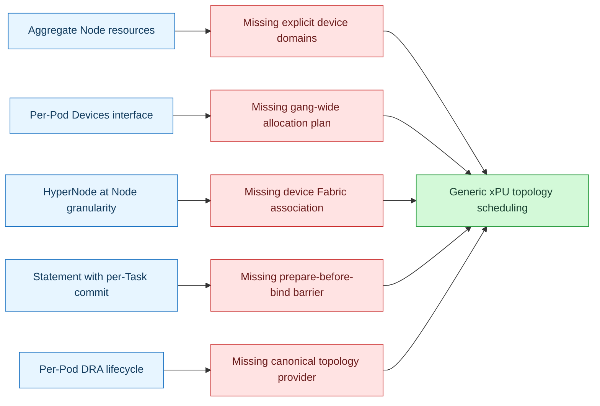
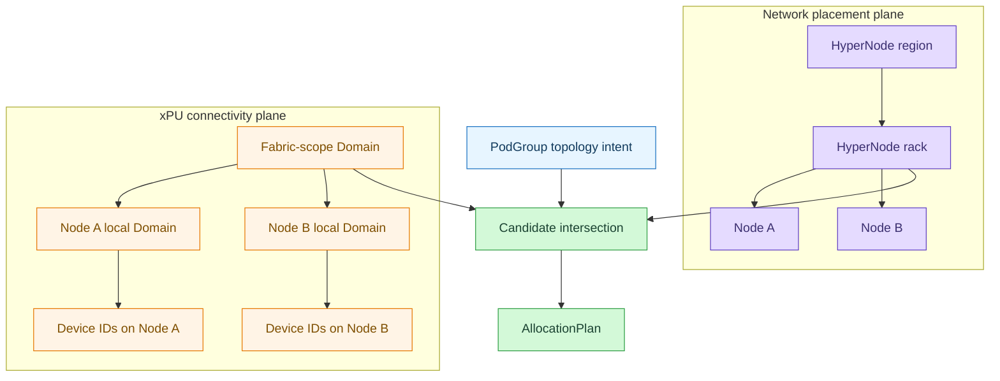
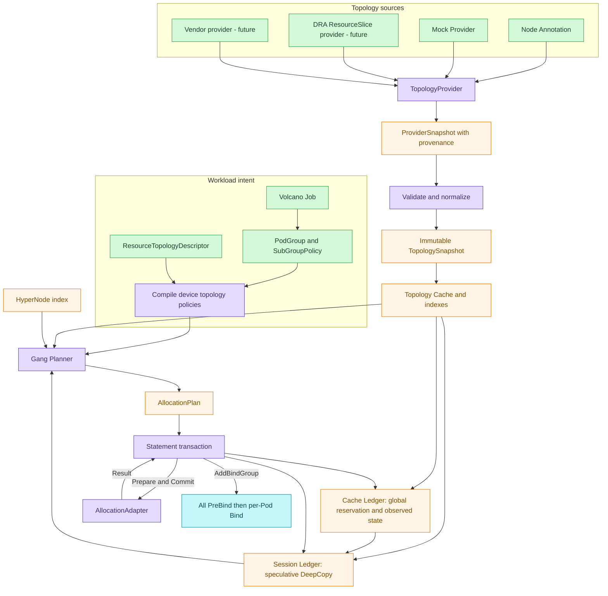
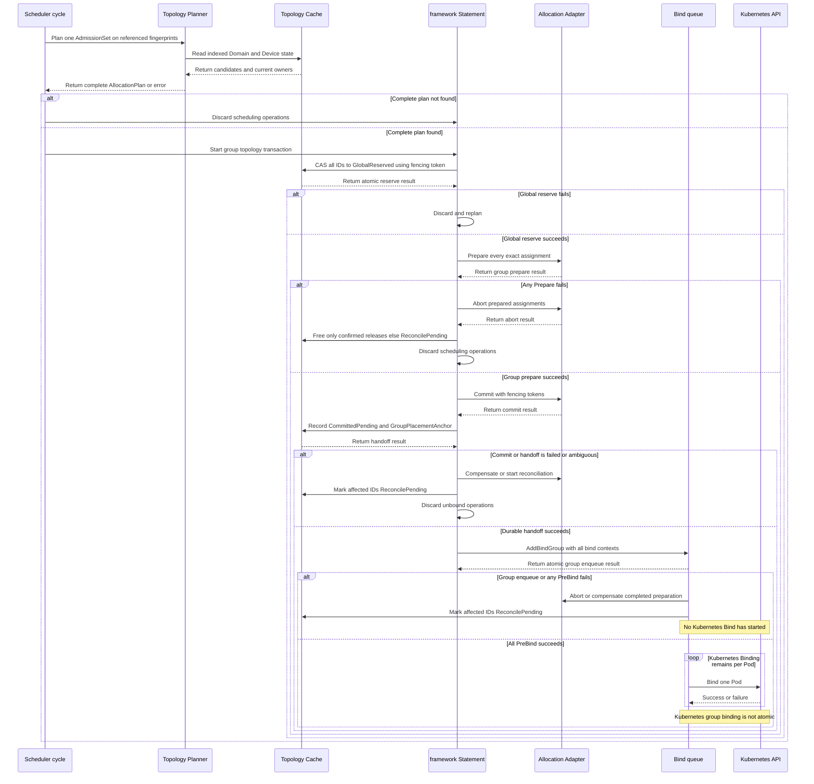

# Volcano 通用 xPU 拓扑感知调度设计

> 状态：结构化设计提案，不代表 Volcano 已实现或社区已接受
>
> 关联议题：[volcano-sh/volcano#5751](https://github.com/volcano-sh/volcano/issues/5751)
>
> 本地源码核验 checkout HEAD：`066835c315403ea8c1c79a40c37f4186bc0b641b`；其父提交：`caf21f3d447c8f6d52fc0e48ab6db2b2f3773373`
>
> Issue/上游核验时间：2026-09-10；Issue 当时为 Open，上游 `master` 为 `606c628d364db8de18c045e947d5255ef058aa26`
>
> 本文角色：通用设计主文档；NVIDIA 纵向证据保留在
> [`01-nvidia-gpu-topology-aware-design-zh.md`](./01-nvidia-gpu-topology-aware-design-zh.md)

## 1. 文档状态与决策摘要

### 1.1 这份文档解决什么问题

Issue #5751 需要的不是一个厂商设备分配器，也不是一组拓扑 CRD，而是一条完整的 scheduler-side 调度链路：

```text
工作负载意图
  -> 规范化物理拓扑
  -> 设备可用状态
  -> Fabric / HyperNode / Node / Domain / Device ID 联合规划
  -> PodGroup 整组预留
  -> 设备分配准备
  -> Pod 绑定
```

本文把此前分散在类型定义、厂商示例、代码目录和 PR 计划中的讨论，收敛为五类边界：

1. Public API 只表达用户意图；
2. Provider 只表达已观察到的物理拓扑；
3. Cache 拥有跨 Session 的已提交状态，Session Ledger 拥有可回滚的推演状态；
4. Planner 产生一个整组 `AllocationPlan`；
5. `Statement` 协调 Reserve、Prepare、Commit 和 Rollback，但复用现有设备回调完成推演期记账。

### 1.2 状态标签

本文使用以下标签，避免把设计提议写成当前实现：

| 标签 | 含义 |
| --- | --- |
| 当前实现 | 本地源码基线中已经存在并完成源码核验 |
| 可复用能力 | 当前已有，但尚未组成 #5751 的完整链路 |
| 本文提议 | 本设计建议新增或调整的行为 |
| 后续研究 | 不进入第一阶段验收范围 |

### 1.3 本稿默认提案（待社区确认）

| 主题 | 状态 | 本稿默认 |
| --- | --- | --- |
| 核心抽象 | Proposed | `Device + Domain + Membership + optional Link`，核心枚举不出现厂商互联名 |
| Domain 范围 | Proposed | 第一版只定义 `Node` 和 `Fabric` 两种 scope |
| Public API | Open | 倾向 `hard/soft`、`Pod/Group`、`scope`、`tier/tierName`；Partition 复用现有 SubGroup |
| Public API 排除项 | Proposed | 不暴露厂商 attributes、设备 ID、Domain ID、allocation policy、热状态或 reservation |
| 拓扑来源 | Proposed | 第一阶段使用 Mock/Annotation Provider；不新增 xPU 拓扑 CRD |
| HyperNode | Proposed | 描述 Node 级网络层次；Fabric 规划只缩小其候选，不成为设备 Domain 的父节点 |
| 动态状态 | Proposed | `Health` 与 `AllocationState` 正交；Cache Ledger 保存跨 Session 状态，Session Ledger 隔离 dry-run |
| 调度顺序 | Proposed | HyperNode candidates -> Fabric/Node Domain -> Exact Device IDs -> group Reservation |
| 事务屏障 | Proposed | AdmissionSet 完成最终 CAS、Adapter Prepare/Commit 与组级 PreBind 后，才开始任何 Kubernetes Bind |
| hard 保证 | Open | 默认 Adapter 无法落实指定 ID 时 fail closed，不静默降级为 best effort |
| 第一阶段范围 | Open | 倾向整卡 Node-local 实现；Fabric 用 Mock 验证；MIG/vGPU 通用化后续研究 |

### 1.4 推荐阅读路径

- 评审设计边界：阅读第 2、4、5、10、14 节；
- 评审 Public API：阅读第 6 节与附录 A；
- 实现 Provider/Cache/Planner：阅读第 7、8、9 节与附录 B、C；
- 实现事务和 Adapter：阅读第 10 节；
- 制定验收计划：阅读第 11、12、13 节。

## 2. 问题定义、场景与范围

### 2.1 总量满足不等于拓扑满足

假设一台 16-NPU Node 有两个互不连通的 8-NPU HCCS Domain：

```text
Domain A: 6 个空闲 NPU
Domain B: 2 个空闲 NPU
Node 总空闲: 8 个 NPU
```

一个要求 8 个 NPU 且必须位于同一 HCCS Domain 的 Pod，不能使用这台 Node。只检查扩展资源总量会错误地得到“可调度”。同一问题也会出现在多个 NVLink Island、局部 NVSwitch Domain 或其他 xPU 高速互联域中。

### 2.2 为什么必须在 scheduler 中完成

只依赖 kubelet 或 Device Plugin 的 `GetPreferredAllocation` 太晚，因为 Node 已经选定。它无法让 Volcano：

- 因同域空闲数不足而提前拒绝 Node；
- 在 Node、Domain 和 Device ID 之间联合比较方案；
- 为一个 PodGroup 在任何 Pod 绑定前完成整组规划；
- 避免并发规划重复选择同一 Device ID；
- 将跨节点网络范围和节点内设备域同时纳入决策。

因此，scheduler 必须在调度周期内看到规范化的物理拓扑、稳定设备身份和可预留状态。

### 2.3 三类拓扑场景

| 场景 | 物理事实 | 调度要求 |
| --- | --- | --- |
| 单 Node 多设备域 | 一台 Node 内存在多个互不等价的 HCCS/NVLink/NVSwitch Domain | 每个 Pod 的设备必须从一个满足约束的 Node-scope Domain 中选择 |
| 普通多 Node 集群 | xPU scale-up 互联只在 Node 内；Node 间使用 IB/RoCE | 每个 Pod 独立满足 local Domain；PodGroup 的 Node 范围由 HyperNode/网络策略约束；不得虚构跨 Node xPU Fabric |
| 跨 Node xPU Fabric | NVL72 等系统把多个计算 Node 放入同一 scale-up Fabric | PodGroup 可跨 Node，但所有目标设备必须属于同一个 Fabric-scope Domain |

### 2.4 目标

第一阶段设计必须支持：

- vendor-neutral Device、Node Domain、Fabric Domain、Membership、Health 和 Availability；
- Mock/Annotation Provider，并为未来 CRD、厂商 API、Device Plugin companion 和 DRA 保留接口；
- `hard` 与 `soft` 两种工作负载语义；
- Node-scope 同域过滤和确定性 compact 分配；
- PodGroup 整组 Plan、Reserve、Prepare 和失败回滚；
- exact-ID Adapter 能力协商；
- 明确的不可调度 reason、可观测性和性能基线；
- KWOK/Mock 下的 Node-local 与 NVL72 模拟，不要求真实 NVL72 硬件。

### 2.5 非目标

第一阶段不做以下承诺：

- 不把 NCCL/HCCL 运行时逻辑 Ring 当作物理拓扑真相；
- 不让 scheduler 直接加载 NVML 或厂商运行时库；
- 不定义或提交新的 xPU 拓扑 CRD；
- 不把实时吞吐、拥塞率和链路错误率作为调度输入；
- 不承诺多个 Kubernetes Pod Binding 具有 API 级原子性；
- 不把 MIG/vGPU 实例视为独立的物理互联端点；
- 不要求真实 NVL72、Ascend 或 MetaX 硬件完成第一阶段 CI；
- 不宣称当前 Volcano 已经实现 #5751。

## 3. 当前 Volcano 行为与缺口

本节首先描述本地源码基线。2026-09-10 额外抽查了上游 `master` 的 scheduler devices、DRA、Statement、Cache 和 network-topology-aware 关键路径；可见差异集中在 DRA 容量/任务状态同步和 Ascend 错误分类，没有发现 #5751 所需的通用 Provider、Device Domain Ledger 或 group Prepare barrier。该结论只是当日定向抽查，不是全仓差异证明，实施前仍需重新核验。

### 3.1 可复用能力

| 能力 | 当前源码落点 | 可以复用什么 | 不能推导什么 |
| --- | --- | --- | --- |
| per-Pod 设备接口 | `pkg/scheduler/api/shared_device_pool.go` 的 `Devices` | `FilterNode`、`ScoreNode`、`Allocate`、`Release`、`DeepCopy` | 不等于通用 Domain/Fabric 模型或 gang planner |
| 设备注册信息 | `pkg/scheduler/api/devices/device_info.go` 的 `DeviceInfo` | ID、NUMA、Health、CustomInfo、DevicePairScore 等已有字段 | 字段存在不等于通用调度路径已经消费 |
| Ascend HAMi 拓扑选择 | `pkg/scheduler/api/devices/ascend/hami/device_info.go` 的 `selectDevicesWithTopology` | 按 `NetworkID` 分组并优先使用设备较多的组 | 单组不足时会继续拼接下一组，因此是集中倾向，不是 hard same-domain 保证 |
| 设备预留返回值 | `pkg/scheduler/api/devices/reservation.go` 的 `DeviceReservation` | 把 per-Pod Annotation/Opaque 信息带到 bind | 不等于整组 Reservation 或全组 Prepare 屏障 |
| 设备 Allocate/Release 回调 | `pkg/scheduler/plugins/predicates/predicates.go` | 随 `Statement.Allocate/Discard` 做单 Task 预留与回滚 | 不保证整个 PodGroup 同时成功 |
| 调度事务 | `pkg/scheduler/framework/statement.go` | speculative Allocate、逆序 Discard、Save/Recover、Commit | 当前 Commit 按 operation 逐 Task 加入 bind queue |
| DRA 生命周期 | `pkg/scheduler/plugins/predicates` 和 Kubernetes DynamicResources 插件 | Filter、Reserve、Unreserve、PreBind、失败回滚 | 不等于 `ResourceSlice -> canonical xPU topology` 或 gang-wide exact-ID barrier |
| HyperNode | `network-topology-aware` plugin 和 HyperNode API | Node/HyperNode 层级、hard/soft、tier、梯度搜索 | 不表达 Node 内 Device/Domain/Link/Health/Reservation；当前 gradient hook 由首个启用插件独占，不能叠加求交 |
| 绑定链路 | `SchedulerCache.AddBindTask`、PreBind、Binder | 单 Pod 的准备、Annotation 和 Binding | 不提供全 PodGroup API 原子绑定 |

### 3.2 当前关键调用链

```text
Scheduler.runOnce
  -> framework.OpenSession
  -> SchedulerCache.Snapshot
  -> allocate.Action.Execute
  -> HyperNode search / Predicate / NodeOrder
  -> Statement.Allocate
  -> AllocateFunc callbacks
  -> gang JobReady
  -> Statement.Discard or Statement.Commit
  -> AddBindTask per operation
  -> asynchronous PreBind
  -> Binder.Bind
```

当前 `Statement` 已经是事务骨架，但还缺少 #5751 要求的“整组设备准备完成后再开放绑定”屏障。把多次 per-Pod `Devices.Allocate()` 放在同一个 `Statement` 中，只证明它们能随 `Discard` 回滚，不证明 Adapter Prepare 或后续 Bind 已经整组原子化。

### 3.3 #5751 仍然缺失的能力

- vendor-neutral Device Domain 和 cross-node Fabric Domain 模型；
- Provider 到 canonical snapshot 的规范化边界；
- scheduler-owned 的 Free/Reserved/Allocated/Health ledger；
- HyperNode 与 xPU Fabric 的联合候选求交；
- Node-local Domain hard filter 和通用 soft score；
- 贯穿一个 `AdmissionSet` 的 `AllocationPlan`，并为后续成员维护 `GroupPlacementAnchor`；
- exact Device ID 的能力协商和 Adapter；
- Adapter Prepare 失败时整组 Abort/Unreserve；
- scheduler 重启、source epoch/fingerprint 漂移和健康变化后的 reconciliation；
- #5751 明确要求的功能、并发和规模测试。

### 3.4 当前能力到目标能力



## 4. 术语与统一语义

### 4.1 核心术语

| 术语 | 规范语义 |
| --- | --- |
| Device | 可被分配和互斥占用的设备身份；第一阶段指整卡 |
| Device Domain | 一组在同一性能边界内的 Device；可以是 Node scope 或 Fabric scope |
| Membership | Domain 到 Device/子 Domain 的显式 connectivity 关系；Node/HyperNode 只作 placement association |
| Link | 可选的设备对连接能力，用于 soft score，不替代 hard Domain membership |
| HyperNode | Volcano 现有的 Node/HyperNode 网络层级对象 |
| Topology Snapshot | 某一 Cache revision 下的只读物理拓扑和索引 |
| Cache Ledger | 跨 Session 的 GlobalReserved/CommittedPending/Allocated/ReconcilePending、owner 和恢复依据 |
| Session Ledger | 从 Cache snapshot 构造、可 DeepCopy/Save/Recover 的 TentativeReserved 推演状态 |
| TopologyGroup | `applyTo=Group` 的稳定作用单元，即 PodGroup 或实际生成的 SubGroup |
| AdmissionSet | 本次 winning Statement 准备共同 handoff 的全部新 Allocate operations；未 Ready 时至少覆盖 readiness 缺口，已 Ready 时是本轮增量 cohort |
| GroupPlacementAnchor | 首次 group admission 确立、后续成员继续遵守并可恢复的 Domain/Fabric 选择 |
| AllocationPlan | 一次调度对一个 AdmissionSet 的 Node、Domain 以及 Exact 路径 Device ID 的决定 |
| Reservation | 带 fencing token、尚未绑定但已经全局排他的 Device ID 占用 |
| Adapter | 把选定 ID 落实到 HAMi/vGPU、DRA 或其他分配机制的边界 |

### 4.2 Domain 与 HyperNode 是两张不同的图



关键边界：

- HyperNode 的成员是 Node 或 HyperNode，不是 Device；
- FabricDomain 表达 xPU scale-up 连接，不等同于 IB/RoCE 网络范围；
- 普通多 Node 集群即使共享一个 rack HyperNode，也不能自动生成 FabricDomain；
- NVL72 等真实跨 Node fabric 可以同时引用相关 HyperNode，但不继承 HyperNode；
- 第一阶段不向 HyperNode 写入 Device IDs、free、reserved 或 health 等热状态。

Issue #5751 所称的 HyperNode lightweight summary，在本文中解释为“按 HyperNode 建立的 scheduler 内存派生索引”，用于快速缩小候选；它不是新增到 HyperNode CRD 的高频设备热状态字段。

### 4.3 hard、soft、exact 与 best effort

| 维度 | 值 | 含义 |
| --- | --- | --- |
| 工作负载约束 | `hard` | 找不到符合 Domain 的方案时不可调度 |
| 工作负载约束 | `soft` | 优先满足 Domain；允许可解释地退化 |
| Adapter 能力 | `Exact` | 能执行 Planner 选择的具体 Device IDs |
| Adapter 能力 | `BestEffort` | 只能选择 Node 或提供偏好，最终 ID 可能改变 |

`hard` 是用户语义，`Exact` 是执行能力。只有 `hard + Exact` 才能形成端到端保证。

## 5. 总体架构与所有权

### 5.1 组件架构



### 5.2 组件责任表

| 组件 | 拥有什么 | 不拥有什么 |
| --- | --- | --- |
| Public API | resource、applyTo、mode、scope、tier/tierName 等 intent | Device ID、Domain ID、provider payload、reservation |
| ResourceTopologyDescriptor | identity resource、count interpreter、domain-class contract、Adapter capability routing | workload-specific desired state |
| Provider | source parser、provenance、freshness、observed topology/health | workload policy、Filter/Score、allocation owner |
| Normalizer | stable identity、合法性、冲突检测、canonical graph/index 构造 | 调度策略 |
| Topology Cache | immutable physical snapshot、索引、SnapshotRevision | 厂商解析逻辑 |
| Cache Ledger | 跨 Session 的 global reservation、committed/observed owner、待协调状态和恢复依据 | dry-run 中间结果和 Public API |
| Session Ledger | Cache snapshot 的可变副本、speculative Free/Reserved、增量 Domain summary | 绕过 `DeepCopy` 的全局 dry-run 写入 |
| Planner | Fabric/HyperNode/Node/Domain/Device ID 联合决策 | 持久化状态、设备协议编码 |
| xPU topology plugin | 注册调度 hooks、编译 policy、调用 Planner/transaction | 单独 watch source 或复制一份 device ledger |
| Statement | 协调现有 Allocate/Deallocate 回调和整组 Prepare/Commit/Abort/Discard | 拓扑发现、厂商协议或第二套独立 ledger |
| AllocationAdapter | capability、Prepare/Commit/Abort/Reconcile、协议编码 | 重新选择 Node/Domain/Device IDs |
| HyperNode | Node 级网络层次和稳定关联 | 每个 Device 的热状态 |

### 5.3 建议代码边界

以下路径均为本文提议，不表示文件已经存在：

```text
staging/src/volcano.sh/apis/pkg/apis/scheduling/
  types.go                         public workload intent

pkg/scheduler/api/
  device_topology.go               canonical scheduler model
  device_topology_policy.go        compiled policy
  device_topology_state.go         ledger-facing state

pkg/scheduler/topology/
  provider/                        source ingestion
  cache/                           snapshot, indexes, ledger
  planner/                         gang plan and deterministic selection
  adapter/                         exact-ID enforcement

pkg/scheduler/plugins/xputopology/
  plugin.go                        framework integration
  predicate.go                     node-local hard filter
  score.go                         soft score
  reservation.go                   session write-set and before-commit hook

pkg/scheduler/framework/
  statement.go                     prepare-before-bind transaction boundary
```

是否最终放入这些具体 package，由实现 PR 的 import cycle、复用关系和社区 review 决定；本文固定的是所有权，而不是目录名。

## 6. 用户侧 Workload API

### 6.1 Public API 最小集合

Public API 只描述“我想怎么调度”，不描述 scheduler 当前选中了什么：

```go
type DeviceTopologyMode string

const (
    HardDeviceTopologyMode DeviceTopologyMode = "hard"
    SoftDeviceTopologyMode DeviceTopologyMode = "soft"
)

type DeviceTopologyApplyTo string

const (
    DeviceTopologyApplyToPod   DeviceTopologyApplyTo = "Pod"
    DeviceTopologyApplyToGroup DeviceTopologyApplyTo = "Group"
)

type DeviceTopologyDomainScope string

const (
    DeviceTopologyDomainScopeNode   DeviceTopologyDomainScope = "Node"
    DeviceTopologyDomainScopeFabric DeviceTopologyDomainScope = "Fabric"
)

type DeviceTopologyDomainSelector struct {
    Scope    DeviceTopologyDomainScope `json:"scope"`
    Tier     *int32                    `json:"tier,omitempty"`
    TierName string                    `json:"tierName,omitempty"`
}

type DeviceTopologyPolicy struct {
    ResourceName corev1.ResourceName          `json:"resourceName"`
    ApplyTo      DeviceTopologyApplyTo        `json:"applyTo,omitempty"`
    Mode         DeviceTopologyMode           `json:"mode,omitempty"`
    Domain       DeviceTopologyDomainSelector `json:"domain"`
    PodSelector  *metav1.LabelSelector        `json:"podSelector,omitempty"`
}

type DeviceTopologySpec struct {
    Policies []DeviceTopologyPolicy `json:"policies,omitempty"`
}
```

建议在 `PodGroupSpec` 和 `SubGroupPolicySpec` 增加 `DeviceTopology *DeviceTopologySpec`。Volcano Job/Task/Partition 的 ergonomic 字段可以映射到这两个 scheduling API 对象，但不应形成另一套独立语义。

### 6.2 ApplyTo 与现有 Grouping 的关系

| 字段位置 | `applyTo` | 作用范围 |
| --- | --- | --- |
| `PodGroupSpec.DeviceTopology` | `Pod` | 对每个匹配 Pod 独立应用 |
| `PodGroupSpec.DeviceTopology` | `Group` | 对整个 PodGroup 应用 |
| `SubGroupPolicySpec.DeviceTopology` | `Pod` | 对该 SubGroup 内每个 Pod 独立应用 |
| `SubGroupPolicySpec.DeviceTopology` | `Group` | 对每个由 SubGroupPolicy 形成的 SubGroup 应用 |

不再定义 `target: Partition`。Partition/TP/PP/EP 分组复用现有 `SubGroupPolicy`、`LabelSelector` 和 `MatchLabelKeys`。

### 6.3 默认值与校验

建议第一版使用以下规则：

- `mode` 默认 `hard`；
- `applyTo` 默认 `Pod`；
- `tier` 与 `tierName` 互斥，且至少设置一个；
- `tier=0` 表示该 `(resourceName, scope)` 合同中最紧的层级，数值越大表示覆盖范围越宽；它表示精确目标层级，不是 `highestTierAllowed`；
- `tierName` 由管理员侧 `ResourceTopologyDescriptor` 发布并映射到一个 tier identity；同一 resource+scope 下可以有多个 Domain 共享同一个 tierName；
- `scope=Node` 可用于 `Pod`；若用于 `Group`，其语义是整个 Group 必须位于同一 Kubernetes Node 和同一 Node Domain；
- `scope=Fabric` 只对 Provider 明确发布的 FabricDomain 生效，不能从共享 HyperNode 推导；
- `podSelector` 只允许用于 PodGroup 级的 `applyTo=Pod`；
- 同一作用域中的 hard policy 使用 AND 语义；soft policy 第一版按相同权重累计 satisfaction/score，不宣称逻辑 AND；
- `tierName` 在 Session Open/policy compile 时解析为 canonical tier identity；解析失败的 hard policy fail closed；
- 未配置 `DeviceTopology` 时，行为与当前 Volcano 完全一致。

### 6.4 第一版刻意不暴露的字段

| 不进入 Public API | 原因 |
| --- | --- |
| `matchAttributes` | 会把 vendor-neutral API 变成厂商查询语言 |
| `allocationPolicy` | 第一版只有稳定的 compact 语义；Spread/Any 尚未定义清楚 |
| Device/Domain IDs | 它们是 scheduler 决策和 Provider identity，不是用户 desired state |
| selected Node/Fabric | 属于调度结果，不是用户意图 |
| free/reserved/allocated/health | 高频热状态，不应进入 workload spec |
| snapshot revision/source version | scheduler 并发控制和 Provider 版本细节 |
| Adapter 名称 | 集群能力和管理员配置，不应耦合到可移植 workload |

### 6.5 管理员侧 ResourceTopologyDescriptor

`resourceName` 本身不能说明怎样把 Pod request 解释成互斥 Device ID。本文提议由插件配置或 Provider capability 发布 internal `ResourceTopologyDescriptor`，至少声明：

```text
identity-bearing resource name
allocation unit: exclusive whole device or unsupported shared unit
Pod request to device-count interpreter
supported domain scopes and advertised tierName contract
candidate Adapters and per-Node capabilities
whether hard topology is supported
```

第一阶段只接受能够按 Kubernetes/Volcano 现有 Pod request 计算语义解析为正整数整卡数量的 identity resource。多 Container、Init Container 等请求计算必须复用 scheduler 已有资源请求逻辑，不能在 topology plugin 内另算一遍。HAMi/vGPU 的 memory/core 等辅助资源不自动等于 Device 个数；未配置明确映射的共享或分数资源，对 hard topology 返回不支持。

`tierName` 是 descriptor 对 workload 发布的集群合同，不是 Provider 私有字符串。Provider 可以把 `local-scale-up` 映射为 HCCS、NVLink island 等厂商事实，但同一 descriptor revision 下必须保持稳定、可发现并可校验。是否把它更名为 `domainClass`，仍留给 Public API review 决定。

### 6.6 Ascend Node-local 示例

```yaml
spec:
  deviceTopology:
    policies:
      - resourceName: huawei.com/Ascend910
        applyTo: Pod
        mode: hard
        domain:
          scope: Node
          tierName: local-scale-up
```

语义是“每个 Pod 请求的 Ascend 设备必须共同属于一个 Node-scope `local-scale-up` Domain”。Provider 可以把它映射到 HCCS，但 scheduler policy 不检查字符串 `hccs`。

### 6.7 NVL72 Group 示例

```yaml
spec:
  deviceTopology:
    policies:
      - resourceName: nvidia.com/gpu
        applyTo: Pod
        mode: hard
        domain:
          scope: Node
          tierName: local-scale-up
      - resourceName: nvidia.com/gpu
        applyTo: Group
        mode: hard
        domain:
          scope: Fabric
          tierName: scale-up-fabric
```

第一条要求每个 Pod 的本地 GPU 组合有效；第二条要求整个 PodGroup 的 GPU 位于同一个显式 FabricDomain。普通 IB/RoCE rack 即使满足 network topology policy，也不能满足第二条。

## 7. Canonical Scheduler Model

### 7.1 模型分层

Canonical model 必须把五类生命周期不同的数据分开：

| 层 | 内容 | 更新来源 | 可变性 |
| --- | --- | --- | --- |
| Physical topology | Device identity、Domain membership、Parent、optional Link | Provider | source epoch/generation 级更新 |
| Observed health | Healthy、Unhealthy、Unknown | Provider/Adapter observation | 事件驱动 |
| Cache allocation ledger | Free、GlobalReserved/Preparing、CommittedPending、Allocated、ReconcilePending、Owner | final CAS + commit handoff + reconciliation | 跨 Session/实例更新 |
| Session allocation ledger | Free、TentativeReserved、Owner | Cache snapshot + speculative transaction | Session 内高频更新，可回滚 |
| Derived indexes | Node/Scope/Tier/DeviceToDomains/Domain summary | Normalizer/Cache | 随源状态增量更新 |

现有 `devices.DeviceInfo` 继续服务厂商 allocator；Provider/Normalizer 把其中可验证的 identity/topology 映射成新命名的 `TopologyDevice`。两者第一阶段不直接合并，也不得各自维护一份 allocation truth。`TopologyDevice` 不同时充当物理对象、健康权威和 allocation ledger。Provider 上报的 health observation 进入 `DeviceState.Health`；scheduler 根据 workload、reservation 和 Adapter 观察维护 `AllocationState`。本文中的 `Availability` 或 `SchedulableFree` 均严格表示 `Health == Healthy && AllocationState == Free`，不能用独立的 `Healthy` 和 `Free` 计数相减推断。

每个 Device key 的事实来源必须唯一：Topology Provider 是 identity/membership authority；配置选定的 Health Provider 是 health observation authority（可以与 Topology Provider 为同一实现）；Adapter/ResourceClaim 是 allocation observation authority。Adapter 除非同时注册为该 Device 的 Health Provider，否则不能覆盖健康状态。Ledger 只是这些 observation 与 scheduler transaction 的物化视图，不创造新的硬件事实。

### 7.2 稳定身份

设备 ID 不能假设在集群内天然唯一。`npu0`、`device0` 等名称通常只在 Node 内唯一，内部 key 至少应包含：

```text
ResourceName + NodeName + ProviderDeviceID
```

Node-scope Domain key 至少包含：

```text
ResourceName + NodeName + ProviderDomainID
```

Fabric-scope Domain ID 必须由权威 Provider 保证在对应 ResourceName 下集群唯一。Public API 不暴露这些 key。

稳定身份规则：

- 同一物理设备在 Provider 刷新后必须得到同一个 canonical key；
- GPU Index、Node annotation 数组下标等易漂移值不能单独作为身份；
- MIG/vGPU 等子设备必须保留 `ParentDeviceKey`；
- Provider 变更 ID 时视为 remove + add，不得继承旧 owner；若旧 key 仍可能有外部分配，新 key 先 quarantine，不能直接当作 Free；
- Snapshot revision 变化时，只重新验证 Plan 实际引用 key 的 membership fingerprint；无关 Node 更新不应使全部 reservation 失效。

### 7.3 Domain membership graph

Domain 的权威 connectivity membership 只能指向 Device 或子 Domain；Node/HyperNode 引用只是 placement association，不能自动把该 Node 上全部同类设备纳入 Fabric。一个 Device 也可能同时属于 NUMA、PCIe、NVLink 等重叠性能域，因此 canonical model 不能假设所有关系组成一棵严格树。

第一阶段采用以下约束：

- 一个 Domain 可以有多个父 Domain，但 Provider 通过父 Domain 的 `MemberRef{Kind: Domain}` 提交权威关系；Normalizer 派生 Parent/Child 索引，graph 必须无环；
- `MemberRef{Kind: Device|Domain, Key}` 是 Provider observation 的权威 connectivity membership；`NodeNames`/`HyperNodeNames` 由 member closure 派生，或只作为非传递的 placement association；
- Fabric observation 必须显式指出每个 Node 贡献的 Device 或 local Domain，裸 `fabricRef` 不能证明设备属于该 Fabric；
- `ChildIDs`、`DeviceToDomains`、`NodeToDomains`、tier indexes 和 `EffectiveDeviceIDs` 均由 Normalizer 派生；
- 不同时把 parent 和 child 当作两份可独立修改的真源；
- Normalizer 沿无环 parent/child graph 计算传递闭包，将子 Domain 的 Device 物化为去重后的 `EffectiveDeviceIDs`；Domain summary 只按这份派生集合逐 Device 计数；
- Node-scope Domain 的所有 Device 必须属于同一个 Node；
- Fabric-scope Domain 可以包含多个 Node，但不能凭网络可达性自动推导。

合并多个 Node 对同一 Fabric 的 observation 时，Normalizer 保存每个来源的 `{ProviderInstanceEpoch, SourceGeneration, MembershipFingerprint}`，并由这些成员版本形成 fabric version vector。成员冲突或版本回退时保留上一个已验证 snapshot，而不是把不完整的本轮 observation 发布为新 FabricDomain。

### 7.4 可选 Link capability

显式 Domain/Membership 是 hard constraint 的唯一依据。为了支持 soft score 和 HAMi 一类 pair score 输入，internal model 可以保留可选 Link：

```go
type DeviceLink struct {
    Source      DeviceKey
    Target      DeviceKey
    Score       int64
    LinkClass   string
    Attributes  map[string]string
}
```

约束如下：

- `LinkClass` 和 attributes 只用于 Provider provenance、debug 或受控的评分 capability；
- core algorithm 不写 `if LinkClass == "HCCS"` 一类厂商条件；
- pair score 不能推导 hard Domain，除非某 Provider 明确声明并验证一套可审计的 domain derivation contract；
- 非对称或缺失 Link 只能影响 soft score，不能导致 scheduler panic；
- 若 MVP 启用 Link，Provider 必须声明 `higher-is-better`，把同一 resource 内的值归一化到 `[0,100]`；双向值取较小值，任一方向缺失即视为 link score unavailable；
- 不跨 resource/Provider 直接比较原始分数，也不把缺边默认为某种物理链路；
- 第一阶段 hard filter 即使没有任何 Link 数据也必须正确工作。

### 7.5 Snapshot revision、source epoch 与 fingerprint

一次 scheduling session 使用不可变的 `DeviceTopologySnapshot`。Provider 更新先生成下一代 snapshot，不得在一次 Filter/Score/Plan 中间原地修改物理 graph。

版本信息分为三层：

- `SnapshotRevision`：Cache 内部单调递增，只用于标识整个只读快照和观测；
- `{ProviderInstanceEpoch, SourceGeneration}`：每个 Provider 实例自己的版本；Provider 重启必须产生新 epoch，generation 只要求在同一 epoch 内单调；
- `MembershipFingerprint`：每个实际 Device/Domain 的稳定 identity、member closure 和关键属性摘要。

Plan 可以记录创建时的 SnapshotRevision，但并不要求提交时全局 revision 完全相等；它必须 pin 实际引用对象的 fingerprint/version vector。这样无关 Node 的更新不会造成全局重试。

动态状态分为两层，不能用一个全局可变 ledger 直接承载所有 dry-run：

- `Cache Ledger` 保存跨 Session/调度器实例的 `GlobalReserved/Preparing`、commit handoff、已观察 allocation、reconciliation 和 owner；
- `Session Ledger` 从 Cache snapshot 构造，并随现有 `Devices.DeepCopy`、package-level `framework.SaveOperations`、`(*Statement).RecoverOperations` 和 Allocate/Deallocate 回调维护 `TentativeReserved`；
- 候选 dry-run 只修改 Session Ledger；胜出 Statement 在 Adapter Prepare 前，以 `{SchedulerEpoch, PlanID, ReservationID}` 为 owner fencing token，对全部 Device key 做一次原子 CAS：`Free -> GlobalReserved/Preparing`；
- CAS 任一项失败则整组失败，两个 Session/调度器实例不能同时 Prepare 同一 Device；只有 CAS 成功后才能触发外部 Adapter Prepare。

Reserve 必须携带引用对象的 fingerprint/version vector，并在 Session 恢复胜出方案、进入 group Prepare 前再次对 Cache 状态加锁或 CAS，检查：

1. Device 仍存在且 membership 未变化；
2. Health 仍为 Healthy；
3. AllocationState 仍为 Free；
4. 没有其他有效 Reservation Owner；
5. 当前 plan 使用的 hard Domain 仍然有效。

任一条件失效，整个 Plan 重试或回滚，不能只给失败 Task 换一张卡后继续使用旧计划。

### 7.6 Device 与 Reservation 状态

```mermaid
flowchart LR
    subgraph health["DeviceHealth dimension"]
        unknown["Unknown"]
        healthy["Healthy"]
        unhealthy["Unhealthy"]

        unknown -->|Valid observation| healthy
        healthy -->|Health event| unhealthy
        unhealthy -->|Recovery confirmed| healthy
        healthy -->|Observation expired| unknown
        unhealthy -->|Observation expired| unknown
    end

    subgraph allocation["DeviceAllocationState dimension"]
        free["Free"]
        healthGate{"Health is Healthy"}
        casGate{"Winning plan CAS"}
        reserved["GlobalReserved / Preparing"]
        handoff["CommittedPending"]
        allocated["Allocated"]
        reconcile["ReconcilePending"]

        free --> healthGate
        healthGate -->|Yes| casGate
        healthGate -->|No| free
        casGate -->|Success| reserved
        casGate -->|Conflict| free
        reserved -->|Rollback confirmed before external handoff| free
        reserved -->|Prepare and commit intent accepted| handoff
        reserved -->|Abort or commit outcome is ambiguous| reconcile
        handoff -->|Authoritative allocation observed| allocated
        handoff -->|Commit or bind outcome is ambiguous| reconcile
        allocated -->|Release or compensation requested| reconcile
        reconcile -->|Release confirmed| free
        reconcile -->|Allocation still exists| allocated
        allocated -->|Health degrades: retain owner and block reuse| allocated
    end

    healthy -.->|Reservation allowed| healthGate
    unknown -.->|New reservation denied| healthGate
    unhealthy -.->|New reservation denied| healthGate

    classDef good fill:#d3f9d8,stroke:#2f9e44,color:#1b4332
    classDef bad fill:#ffe3e3,stroke:#c92a2a,color:#7f1d1d
    classDef neutral fill:#f8f9fa,stroke:#868e96,color:#343a40
    classDef reservedStyle fill:#fff4e6,stroke:#e67700,color:#7f4f00
    classDef allocatedStyle fill:#e5dbff,stroke:#5f3dc4,color:#2b1b5a
    classDef decision fill:#e7f5ff,stroke:#1971c2,color:#102a43
    class healthy good
    class unhealthy bad
    class unknown,free neutral
    class reserved reservedStyle
    class handoff,allocated,reconcile allocatedStyle
    class healthGate,casGate decision
```



这里有两个重要语义：

- `Unhealthy` 不是 allocation state。已分配设备健康恶化时仍保留 owner，避免被错误复用；
- `CommittedPending` 表示 scheduler 已完成准备并进入 bind handoff，不自动等价于 Pod 已绑定。Commit/Bind 结果不确定时必须进入 `ReconcilePending`，只有确认 release 后才能回到 `Free`；`Allocated` 由 Adapter、ResourceClaim 或已绑定 Pod 的权威观察确认。

图中画的是跨 Session 的 Cache Ledger。候选比较期间的 `TentativeReserved` 只存在于 Session Ledger，不会触发 Adapter，也不会对其他 Session 声称全局排他。

### 7.7 MIG/vGPU 边界

第一阶段以整卡为可验收分配单元。Canonical model 预留 `ParentDeviceKey` 和 share/instance attributes，但：

- 子实例继承 Parent 的物理互联 membership；
- 对物理 Link 和 hard Domain 计数时必须按 Parent 去重；
- 容量切分、显存/核心份额和实例生命周期继续由 deviceshare/Adapter 负责；
- 在跨厂商子设备语义完成验证前，不把 MIG/vGPU 字段加入 Public API。

## 8. Provider、Normalize 与 Cache

### 8.1 Provider 合同

Provider 是 source-specific ingestion boundary，而不是 scheduling plugin：

```go
type TopologyProvider interface {
    Name() string
    Start(ctx context.Context, sink EventSink) error
    Snapshot(ctx context.Context) (*ProviderSnapshot, error)
}
```

`ProviderSnapshot` 是 observation model，至少携带：

```text
source
provider instance epoch and source generation
observedAt
node observations
fabric observations
device health observations
provenance
```

Provider 可以解析 Annotation、CRD、DRA `ResourceSlice` 或厂商 API，但不得提供 `FilterNode`、`ScoreNode`、`IsSuitableForPod` 等策略方法。

### 8.2 第一阶段 Provider

| Provider | 用途 | 第一阶段状态 |
| --- | --- | --- |
| `MockProvider` | 确定性单测、并发测试、规模 benchmark、NVL72 模拟 | 必须实现 |
| `NodeAnnotationProvider` | Node-local 设备、Domain、health 的 MVP 输入 | 必须实现 |
| Fabric mock merge | 通过显式 `fabricMembership` 和成员 version vector 合并多个 Node observation | 必须验证，不建立 CRD |
| DRA Provider | 从 `ResourceSlice` 归一化 topology/attributes | 后续研究/实现 |
| Vendor Provider | Ascend/NVIDIA/MetaX companion 或 API | 后续按厂商证据实现 |
| Topology CRD Provider | 在 schema 被多厂商验证后再考虑 | 延后 |

Annotation 是 Provider 的输入格式，不是 canonical API，也不是长期 workload API。

### 8.3 多 Provider 所有权与冲突

第一阶段不做模糊的多源字段级 merge。采用“一块拓扑一个权威来源”：

- 一个 `(ResourceName, NodeName)` 只能由一个启用的 Provider 拥有 Node-local topology；
- 一个 `(ResourceName, FabricDomainID)` 只能有一个权威 Provider；
- 重复 owner、身份冲突、不同 membership 或同 epoch generation 回退必须拒绝新 snapshot，并保留最后一个已验证版本；
- provenance 必须跟随 canonical object，用于日志、reason 和 reconciliation；
- Provider priority/field-level merge 只有在真实集成需求出现后再设计，不能用“last write wins”。

### 8.4 新鲜度与错误策略

| 情况 | hard 请求 | soft 请求 |
| --- | --- | --- |
| snapshot 未就绪 | fail closed | 默认不使用拓扑分数，并记录 reason |
| observation 超过 TTL | fail closed | 可按管理员配置退化；不得伪装为满足 |
| Domain membership 非法或成环 | 拒绝该 source generation | 同左 |
| Device health Unknown | 禁止新 reservation | exact score 不使用该 ID；BestEffort advisory 不因此硬过滤 Node |
| Link 缺失 | 不影响显式 Domain hard filter | 使用中性/最低可解释分数 |
| Provider generation 回退 | 拒绝更新 | 同左 |

### 8.5 Cache 与派生索引

Cache 至少维护：

```text
Resources[ResourceName]
Devices[DeviceKey]
Domains[DomainKey]
DeviceToDomains[DeviceKey]
NodeToDomains[NodeName]
DomainsByScope[Scope]
DomainsByTier[Scope][Tier]
DomainsByTierName[Scope][TierName]
DeviceState[DeviceKey]
DomainState[DomainKey]
Reservations[ReservationID]
```

Filter/Score hot path 必须从 Node 和已编译的 scope/tier 索引直接取得候选 Domain，再读取 `DomainState`；不能对每个 Pod、每个 Node 重扫全部 Device。

当一个 Device 的 Health 或 AllocationState 变化时，Cache 通过派生的 `DeviceToDomains` 增量更新所有 effective Domain 的 summary。更新必须按 Device key 去重，避免重叠 Domain/父子关系双重计数。

### 8.6 Reconciliation 的权威来源

| 集成路径 | Allocated 的恢复证据 | Release 的恢复证据 |
| --- | --- | --- |
| exact Device Plugin/HAMi | 已绑定 Pod 的 scheduler-owned 分配 Annotation + Adapter 校验 | Pod 删除/终止和 Adapter 释放确认 |
| DRA | `ResourceClaim` allocation 和 driver 状态 | Claim deallocation/删除 |
| BestEffort Device Plugin | 只能恢复 Node 级使用量，未必能恢复 scheduler 选择的 ID | 不提供 hard exact-ID 语义 |

Scheduler 重启后，纯内存且未产生权威外部证据的 Reservation 一律失效；已提交但未确认的条目进入 reconciliation，不得直接复用，也不得永久占用。

## 9. 调度语义与规划算法

### 9.1 Policy compilation

在 Session Open 或 Job/SubJob 构造阶段把 Public API 编译成 internal policy：

- 解析和校验 `LabelSelector`；
- 把 `tierName` 映射到当前 snapshot 的 canonical tier identity；
- 明确作用对象是单 Pod、PodGroup 还是具体 SubGroup；
- 把同一 resource/作用域的多条 policy 合并为 AND；
- 记录 hard/soft、scope、exact enforcement requirement；
- 缓存解析结果，hot path 不重复做字符串查找。

编译结果必须绑定 descriptor revision 及其实际引用的 tier mapping fingerprint。新 snapshot 改变该映射时，旧编译结果不得继续使用；无关 Node 的 SnapshotRevision 变化不要求重新编译。

### 9.2 统一规划顺序

对一个需要满足 gang readiness 的集合，Planner 按以下顺序工作：

```text
Select explicit FabricDomain candidates
  -> intersect existing HyperNode/network candidates
  -> select candidate Nodes
  -> filter Node-local DeviceDomains
  -> Exact path selects concrete Device IDs
  -> BestEffort path stops at advisory Node/Domain score
  -> build one AllocationPlan for the AdmissionSet
  -> reserve the plan as one transaction
```

这不是五个互相独立、各自重新选一次对象的插件。下游只能验证或缩小上游决定，不能静默换 Domain 或 Device ID。

### 9.3 hard filter

对每个 hard policy：

1. 找出 scope/tier 匹配且 health/freshness 有效的 Domain；
2. 对 Node scope，验证单个目标 Pod 或 Group 的所需数量能在同一个 Node Domain 中满足；
3. 对 Fabric scope，验证全部目标 Tasks 的候选 Node/Device 属于同一个显式 FabricDomain；
4. 使用 `DomainState.SchedulableFree`，即同时满足 Healthy 与 Free 的 Device 集合，并排除其他 reservation；
5. 验证当前 resource 的 Adapter 提供 Exact enforcement；
6. 无完整方案时返回结构化 reason，不允许跨域拼接凑总量。

典型原因：

```text
XPU_TOPOLOGY_NO_MATCHING_DOMAIN
XPU_TOPOLOGY_FRAGMENTED_CAPACITY
XPU_TOPOLOGY_STALE_SNAPSHOT
XPU_TOPOLOGY_DEVICE_UNHEALTHY
XPU_TOPOLOGY_RESERVATION_CONFLICT
XPU_TOPOLOGY_EXACT_ENFORCEMENT_UNAVAILABLE
```

### 9.4 soft score

第一版采用确定性的 lexicographic compact objective：

1. 满足更多 preferred policy；
2. 使用更少的 Domain；
3. 使用更少的 Node；
4. 最小化分配后的不可用碎片；
5. 若 Provider 提供可信 Link capability，再比较 pair score；
6. 最终按 Domain key、NodeName、Device key 做稳定 tie-break。

等价比较 tuple 为 `(-satisfiedSoftPolicies, usedDomainCount, usedNodeCount, residualCapacityInSelectedDomains, -normalizedLinkScore, sortedDomainKeys, sortedDeviceKeys)`，按字典序取最小。进入现有 NodeOrder 聚合前，xPU soft score 再归一化到 `[0,100]`；第一版所有 soft policy 权重相等，不增加 Public `weight`。

soft 可以跨 Domain，但必须记录 `satisfied=false` 和退化原因。没有 Link 数据时仍能进行 Domain-level compact，不应把 Link 缺失变成随机结果。若该 resource/Node 只有 BestEffort Adapter，soft policy 只贡献规范化的 advisory score，不创建 Device ID plan/reservation，也不把 topology observation 缺失变成硬过滤。

厂商特有的 `preserve`、`spread`、虚拟设备 binpack 等策略先作为 internal capability 或 Adapter 既有行为，不进入第一版 Public API。

### 9.5 Gang plan

`AllocationPlan` 必须包含：

```text
PlanID
TopologyGroupID / AdmissionSetID
GroupPlacementAnchor or proposed anchor update
SnapshotRevision plus referenced fingerprints/version vectors
selected FabricDomain and HyperNode references
per Task/resource: NodeName, local Domain IDs, Exact path concrete Device IDs
per assignment: selected Adapter and resolved enforcement capability
policy satisfaction and scoring explanation
```

Planner 可以使用 backtracking、best-fit 或受预算限制的组合搜索，但输出必须确定性。若搜索预算耗尽，应返回可区分于“资源不足”的 reason，不能悄悄接受未验证方案。

这里的 “Group” 和 “required Tasks” 不能等同于 PodGroup 的全部 replicas。本文建议引入两个 internal 概念：

- `TopologyGroup`：`applyTo=Group` 的稳定作用单元；它是整个 PodGroup，或由一条 `SubGroupPolicy` 实际生成的 SubGroup；
- `AdmissionSet`：本次 winning Statement 准备共同 handoff 的全部新 Allocate operations。Group 尚未 Ready 时，它至少包含使 `JobReady`/`SubJobReady` 成立的确定性最小集合；Group 已经 Ready 时，它是本轮实际选出的增量 admission cohort，不能因为 readiness 已满足而退化为空集。

生命周期语义如下：

1. 已经 Binding/Running 且仍拥有可恢复设备 assignment 的 active members 不再重复 Reserve/Bind，但它们的 Node/Domain/Fabric 是本轮规划的固定约束；
2. 当前胜出 `Statement` 中全部新 Allocate operations 都属于 `AdmissionSet`，必须完成 Plan、Session Reserve、最终 CAS 和 Adapter Prepare，才允许组级入队；
3. `minMember < replicas` 时，首次成功 admission 为 `TopologyGroup` 建立 `GroupPlacementAnchor`；后续新增成员必须继续满足同一 anchor，不能把 “Group” 偷换为每批独立的 admission batch；
4. 已完成且已经 release 的成员不再占用 Device；只要 `TopologyGroup` 仍存活，anchor 仍需由持久证据恢复；
5. scheduler restart 后，anchor 必须来自 PodGroup status/受控 annotation、已绑定 Pod 的 exact-ID 证据或 Adapter/Claim；无法无歧义恢复时，hard Group fail closed；
6. Pod 集合、readiness 或相关 membership fingerprint 在计划期间改变时，旧 `AdmissionSet` 作废并重新规划。

现有 `MinMember`、`MinTaskMember`、`MinResources`、`SubGroupSize` 和 `MinSubGroups` 继续决定首次 readiness；xPU plugin 不另造一套 gang 数量语义。Job Ready 后的每个增量 AdmissionSet 仍完整执行 anchor 校验和 handoff。`Succeeded` 是否继续计入现有 readiness 由 Volcano 当前规则决定，但已经 release 的历史 assignment 不应重新占用设备。

`TopologyGroupID` 必须稳定：PodGroup 级使用 PodGroup UID；动态 SubGroup 使用 PodGroup UID、SubGroupPolicy name 和规范编码的 match values 组合。`GroupPlacementAnchor` 的具体持久化对象仍是 Public API 冻结前的 P0 决策，但任何选择都必须保存：TopologyGroupID、ResourceName、policy fingerprint、Domain keys、membership fingerprints、fencing token、record revision/phase 和结构化 evidence reference。写入者只能是持有 leadership 的 scheduler，使用 Kubernetes `resourceVersion` 或等价 CAS；anchor 在 TopologyGroup 终止且不存在 active/committed owner 后才可清理。

首次建立或修改 anchor 必须成为 group handoff 的一部分：携带同一 fencing token 的 anchor 证据持久化成功后，才能执行 `AddBindGroup`。若 anchor 写入失败，本轮不开始 Kubernetes Bind；若写入结果不明，则进入 reconciliation，而不是为同一 TopologyGroup 选择第二个 anchor。

### 9.6 调度扩展点映射

当前 `Session.HyperNodeGradientForJobFn` 和 `HyperNodeGradientForSubJobFn` 明确采用 first-plugin-wins。新插件再注册一个 gradient 函数不会和 `network-topology-aware` 自动求交，因此本文不采用“双 gradient plugin”方案。

建议的组合方式是：

1. 仍由 `network-topology-aware` 产生 HyperNode gradients；
2. `allocateForJob/allocateForSubJob` 在每个 gradient 候选内沿用现有 Predicate、quota、DRF 和 Node score；
3. 新增可组合的 Job/SubJob 级 `GroupTopologyPlanFn`，输入只能是上述阶段仍然合法的 Node/candidate matrix；
4. Planner 只允许缩小候选并分配 Domain/Device ID，不得重新引入已被其他 Predicate 排除的 Node；
5. soft 分数通过现有 score aggregation 合并，不独占 HyperNode gradient。

因此 Fabric/HyperNode “求交”指对同一候选 Node 集合做集合约束，不表示两个 gradient 回调天然可组合。Fabric 实现前必须先提交 framework composition PR，并覆盖两个插件同时启用的测试。

| 阶段 | 当前可复用 hook | 本文提议 |
| --- | --- | --- |
| policy 构造 | `OpenSession`、`JobInfo`、`SubJobInfo` | 编译 `DeviceTopologySpec` |
| network 候选 | first-plugin-wins HyperNode gradient/order | 保留现有 gradient owner；不注册第二个 gradient provider |
| group topology plan | 当前无可组合 hook | 在标准 Predicate 后增加 `GroupTopologyPlanFn`，只缩小候选 |
| Node filter | Predicate | Node-local Domain hard filter |
| Node/plan score | NodeOrder/BatchNodeOrder | Domain compact + optional Link score |
| speculative reserve | `AllocateFunc` / `DeallocateFunc` | 对 plan 中的具体 ID 做可回滚 reservation |
| group readiness | `JobReady` / `SubJobReady` | 只有完整 AdmissionSet 才能进入最终 CAS/Prepare |
| transaction | `Statement` | 增加整组 Prepare/Abort 屏障 |
| enforcement | Device Allocate/Release、DRA lifecycle | 统一 `AllocationAdapter` capability |

仅实现一个 per-Task `NodeOrderFn` 不足以解决 gang-wide Fabric/Device ID 联合规划；需要 Job/SubJob 级 planner 或等价的 allocate-action 集成点。

### 9.7 Preemption 与 Pipeline 边界

preemption dry-run 可以在隔离的 Session Ledger 中模拟 victim 释放，并产生 Node/Domain nomination，但仍被 victim 占用的 Device 不能进入 Cache Ledger 的 `GlobalReserved/Preparing`。第一阶段不为 xPU 新增 `WaitingForVictimRelease` 外部状态：

- Pipelined Task 只保留 Node/Domain 候选和可重建的 plan hint；
- 只有 Adapter/Pod observation 确认 victim 已 release 后，才重新验证 fingerprint、执行最终 CAS 和 Adapter Prepare；
- victim release 前不得把 FutureIdle 当作 SchedulableFree，也不得启动 `AddBindGroup`；
- 如果 release 后原 Device 已被其他 owner 占用，则重做整组 plan，不沿用陈旧 ID。

后续若要持久化 device-level pipeline，再单独设计带 victim dependency 和 fencing token 的 `WaitingForRelease` 状态。

## 10. PodGroup 事务、Statement 与 Enforcement

### 10.1 正确的事务顺序



`AddBindGroup` 是本文提议的新 cache 操作：它在同一临界区预校验全部 Task/Node/context，并以一个 group queue item 入队；worker 必须先完成全部成员的 PreBind，任一失败则逆序补偿，且开始零次 Kubernetes Bind。参与组级流程的 PreBinder 必须提供幂等 Abort/Unreserve，或被证明没有外部副作用；补偿结果不明时相关 ID 进入 `ReconcilePending`。全部 PreBind 成功后仍只能逐 Pod 调用 Kubernetes Binding，因此后半段不具备 API 原子性。

Adapter Commit、Cache handoff 和 group enqueue 都必须返回结果并使用幂等 fencing token。任何跨系统 Commit 的部分成功都进入 `ReconcilePending`，不能把 Device 直接标成 Free，也不能在已有 Pod 入队后再声称可以整组回滚。

### 10.2 事务不变量

1. 一个 Device key 同一时刻最多属于一个有效 owner；
2. 一个 Reservation 必须 pin 实际引用对象的 membership fingerprint 和 source epoch；
3. AdmissionSet 中任一 Task 无完整 assignment，整个 Plan 失败；
4. 任一 Reserve 或 Prepare 失败，逆序 Abort 已准备 Adapter，再释放全部 Device；
5. 所有 Adapter Prepare 成功前，不允许任何 Pod 进入 bind queue；
6. `Statement.Discard`、引用 fingerprint 变化、健康恶化和调度异常必须触发幂等 rollback；
7. Adapter 不能重新选择 Planner 未授权的 Device ID；
8. Commit handoff 不代表所有 Pod 已经绑定；bind failure 必须进入 compensation/reconciliation；
9. scheduler 重启后，无法从 fencing token 和外部证据恢复的 reservation 必须 quarantine/reconcile，不能直接 Free；
10. release、preemption 和 eviction 必须沿同一个 owner/ledger 路径归还设备。

任何会产生外部副作用的 Prepare/Commit，都必须先生成 `{SchedulerEpoch, PlanID, ReservationID}` 并让 token 进入 ResourceClaim、受控 Pod/PodGroup annotation 或 Adapter 自己的持久记录。`SchedulerEpoch` 必须来自可比较的领导任期/实例 epoch，旧 epoch 的重放不得覆盖新 owner。只存在于内存的 Prepared/HandoffPending 在进程崩溃后没有足够证据直接释放；对应 Device 必须 quarantine，直到 Adapter reconciliation 判定 allocation 存在或 release 已确认。

### 10.3 Statement 集成方式

当前 `Statement.Commit()` 返回 `void`，并按 operation 逐个调用 `AddBindTask`。第一阶段不替换 maintainer 建议的复用路径：

- topology speculative reservation 由现有同步 `AllocateFunc` 完成，并通过 `event.Err` 让 `Statement.Allocate()` 失败；
- `GroupTopologyPlanFn` 先把不可变的 per-Task assignment 写入 Session plan context；`AllocateFunc` 只消费该 assignment 并更新 Session Ledger，不能临时重选 Domain/Device；
- `DeallocateFunc` 负责 `Discard` 时幂等撤销 Session Ledger 的 `TentativeReserved`；
- topology device state 必须参与 `Devices.DeepCopy`；
- `SaveOperations` 只保存 Task assignment/Plan 引用，不取得全局 owner；`RecoverOperations` 通过重放 Allocate 回调重建并重新验证 Session write-set；
- `Merge` 转移 operation 与 plan context 的唯一所有权，不能复制一份会重复 Commit 的 participant。

真正缺失的是：完整 gang plan 的上下文、胜出方案落入 Cache Ledger 的最终 CAS、外部 Adapter Prepare，以及 “全部 PreBind 成功才开始 Bind” 的组级闸门。建议首先新增最小的 `BeforeStatementCommit` hook，而不是直接强制一套平行 transaction framework：

```go
type BeforeStatementCommitFn func(
    ctx context.Context,
    operations []OperationView,
) (*GroupCommitHandle, error)
```

概念流程：

```text
Statement speculative Allocate
  -> existing AllocateFunc updates Session TentativeReserved
  -> JobReady/SubJobReady confirms AdmissionSet
  -> BeforeStatementCommit does final cache CAS and Adapter Prepare/Commit
  -> AddBindGroup atomically enqueues one group item
  -> group worker completes all PreBind before any Kubernetes Bind
  -> clear operations

any error
  -> compensate or mark ReconcilePending as appropriate
  -> existing Statement.Discard
```

`Statement.Commit(ctx)` 必须改为返回 `error`，在 group handoff 完成前不能清空 operations。若后续出现多个非 xPU participant，再把该 hook 泛化为有明确注册顺序、逆序 Abort、Save/Merge/Recover 和错误合同的 participant API；第一阶段不预先冻结该泛化接口。

### 10.4 AllocationAdapter

```go
type EnforcementMode string

const (
    EnforcementExact      EnforcementMode = "Exact"
    EnforcementBestEffort EnforcementMode = "BestEffort"
)

type AllocationAdapter interface {
    Name() string
    ResolveCapabilities(
        ctx context.Context,
        resourceName corev1.ResourceName,
        nodeName string,
        request DeviceRequest,
    ) (AdapterCapability, error)
    Prepare(ctx context.Context, plan *AllocationPlan) ([]PreparedAllocation, error)
    Commit(ctx context.Context, allocations []PreparedAllocation) error
    Abort(ctx context.Context, allocations []PreparedAllocation) error
    Release(ctx context.Context, allocations []ObservedAllocation) error
    Reconcile(ctx context.Context) ([]ObservedAllocation, error)
}
```

Adapter capability 按 resource、Node 和 request 解析，不能用一个全局 `EnforcementMode()` 代表所有设备模式。一个 `AllocationPlan` 可以包含多个 `TaskResourceAssignment`，每项记录 ResourceName、DeviceKeys、AdapterName 和 capability。多 Adapter 按稳定名称顺序 Prepare/Commit，失败时逆序 Abort；任一 Abort/Release 失败都把相关 ID 留在 `ReconcilePending`。

Adapter 负责协议执行，不负责规划。不同路径的边界如下：

| 路径 | 可以复用 | 必须进一步验证 | hard exact-ID |
| --- | --- | --- | --- |
| HAMi/Volcano vGPU | 已有具体 ID 选择、Annotation 传递和 Allocate/Release | 对应 Device Plugin 是否严格执行指定 ID；多 Task Prepare/Abort | 验证通过后可以 |
| DRA | Kubernetes Filter/Reserve/Unreserve/PreBind 生命周期 | ResourceSlice domain 映射、多个 Claim 的整组准备、driver allocation 语义 | 取决于 driver/claim contract |
| Native Device Plugin | Node 扩展资源数量、kubelet 分配 | scheduler 通常不能决定最终 UUID | 否，只能 best effort |

### 10.5 capability 矩阵

| workload mode | Adapter | 行为 |
| --- | --- | --- |
| hard | Exact | 正常 Plan/Reserve/Prepare；任何阶段失败均 fail closed |
| hard | BestEffort | 不可调度，返回 exact enforcement unavailable |
| soft | Exact | 尽量满足，允许记录退化后继续 |
| soft | BestEffort | 只贡献 Node/Domain advisory score，不创建具体 ID reservation |

管理员不得通过插件配置把 hard 静默改成 soft。若社区希望允许显式降级，必须设计独立且可见的 API/策略，不属于第一版默认行为。

BestEffort 路径没有 “Planner 先选 ID、Adapter 再换 ID” 的语义：`TaskResourceAssignment.DeviceKeys` 为空，只沿用现有扩展资源数量记账。最终 ID 若能从 kubelet/driver 观察到，可在 bind 后进入 Cache Ledger；若无法观察，则不得伪造 per-ID owner。Provider 缺失、Health Unknown 或 Link 缺失在 soft advisory 路径中只让该拓扑分数缺席，不得改变基础 Node 资源可调度性。

### 10.6 Kubernetes Binding 的现实边界

即使整组 Plan、Reserve 和 Adapter Prepare 都在 bind 前完成，Kubernetes 仍按 Pod 提交 Binding。第一个 Pod 成功而第二个 Pod 的 API 请求失败时，scheduler 不能把第一个 Pod 原子“解绑”。

第一阶段只承诺：

> 在任何 Pod 开始绑定之前，AdmissionSet 中所有 Exact assignments 的 Node、Domain、Device ID global reservation、Adapter Prepare/Commit 和全组 PreBind 已经成功。

更强的 all-or-nothing 启动语义需要 SchedulingGate、工作负载启动 barrier、控制器补偿或运行时协议，不能由本设计虚假承诺。

## 11. 失败策略与可观测性

### 11.1 失败与恢复矩阵

| 事件 | 新 reservation | 已有 reservation | 已分配设备 |
| --- | --- | --- | --- |
| Provider 尚未 ready | hard 拒绝；soft 按明确配置退化 | 不创建 | 由既有 owner/reconciliation 管理 |
| Snapshot 过期 | hard 拒绝 | Abort；确认 release 后重试，否则 ReconcilePending | 保留 owner，等待权威观察 |
| 引用对象 fingerprint 改变 | 重做 Plan | 整组重新验证；失败则 Abort | 比对 stable key、epoch 和 membership |
| Device 变为 Unknown | 禁止 | Abort 未提交 plan | 保留 owner，不复用 |
| Device 变为 Unhealthy | 禁止 | Abort；结果不明则 ReconcilePending | 保留 owner，触发事件和恢复策略 |
| Reserve 冲突 | 重做完整 Plan | 不允许局部换卡 | 不影响原 owner |
| 任一 Adapter Prepare 失败 | 不进入 bind queue | 逆序 Abort；只释放已确认项，其余 ReconcilePending | 不应产生可复用的新 allocation |
| Adapter Commit 部分失败 | 不进入 bind queue | 执行补偿并标记 reconciliation | 不得把不确定 ID 重新分配 |
| 单 Pod Bind 失败 | 不再承诺 API 原子回滚 | 对失败/未绑定成员做补偿 | 已成功绑定成员由控制器策略处理 |
| scheduler 重启 | 等 Provider/Adapter 恢复后再开放 | Session tentative 可丢弃；外部结果不明则 quarantine | 从 fencing token、Pod/Claim/Adapter 恢复 |
| Pod release/eviction | 等 ledger 更新后可再分配 | 不适用 | Adapter release + observation 后转 Free |

### 11.2 结构化 reason

每次 hard filter、Plan、Reserve、Prepare 和 reconciliation 失败应产生结构化 reason code，并附带可控基数的上下文：

```text
resourceName
policy scope and tier
workload identity
candidate Node or Domain count
required count
largest free-in-domain count
snapshot revision and referenced fingerprint
provider name
adapter capability
```

日志中可以包含具体 Device/Domain key；Kubernetes Event 和 metrics label 不应直接使用高基数 Device ID、Pod UID 或 Reservation ID。

### 11.3 Metrics

建议至少提供：

```text
volcano_xpu_topology_snapshot_revision
volcano_xpu_topology_snapshot_age_seconds
volcano_xpu_topology_provider_errors_total{provider,reason}
volcano_xpu_topology_plan_duration_seconds{mode,scope,result}
volcano_xpu_topology_plan_candidates{stage}
volcano_xpu_topology_reservations{state}
volcano_xpu_topology_reservation_conflicts_total{resource}
volcano_xpu_topology_adapter_operations_total{adapter,operation,result}
volcano_xpu_topology_reconciliation_total{result,reason}
```

不得把 Device ID、Domain ID、Reservation ID 直接作为 metrics label。

### 11.4 输入安全与边界

AnnotationProvider 至少必须限制：

- payload 总大小、resource/device/domain/member/link 数量；
- schema version 和未知字段策略；
- ID、resource name、tier/tierName 的格式和长度；
- 重复 key、悬空引用、跨 Node 非法 membership 和 graph cycle；
- provider instance epoch、同 epoch source generation 单调性与 timestamp 合法性；
- 非权威用户修改 Node annotation 的 RBAC 风险；
- 日志中避免原样输出超大或恶意 payload。

大规模 Fabric 不应长期依赖完整 Node Annotation。第一阶段 Annotation 只服务于 MVP 和 Mock，后续存储选择必须以实际 size、更新频率和多厂商证据为依据。

## 12. 验证计划与验收标准

### 12.1 Model/Provider 单元测试

- 同一 Provider 输入产生确定性 canonical keys 和 indexes；
- 重复 ID、悬空 Device、跨 Node membership、循环 Parent、同 epoch generation 回退被拒绝；
- `tierName` 在同一 resource+scope 下唯一映射到一个 tier identity，多个 Domain 可共享且可编译；
- 多 Provider owner 冲突被拒绝，不使用 last-write-wins；
- Fabric 只有显式 Device/local-Domain member refs 才能形成，Node 引用不会自动纳入全部设备；
- parent/child 传递闭包物化为去重 `EffectiveDeviceIDs`，Fabric version vector 缺成员或冲突时不发布；
- observation TTL 到期后 hard policy fail closed；
- Link 缺失或非对称不会影响 Domain hard filter，也不会 panic；
- 重叠 Domain 下 Device 状态变化只计数一次；
- `SchedulableFree` 只统计 Healthy 与 Free 的交集；Provider 改 ID 且旧 allocation 未清时新 key 被 quarantine。

### 12.2 Planner/Reservation 单元测试

| 用例 | 期望 |
| --- | --- |
| 单 Node 两域 free=6+2，请求 8，hard same-domain | 失败，reason 为 fragmented capacity，零 reservation |
| 单 Node 一域 free=8，请求 8 | 成功，8 个 ID 都来自一个 Domain |
| free=6+2，请求 8，soft + Exact | 可跨域退化，plan 记录未满足 preferred policy 并预留实际 IDs |
| 两个等价 Domain | 使用稳定 tie-break，多次运行结果一致 |
| 两个 Session/调度器实例并发提交 PodGroup | 只有一个整组 CAS 成功，不得同时 Prepare 相同 Device key |
| 第二个 Task 规划失败 | 第一个 Task 的 reservation 一并释放 |
| Reserve 前引用对象 fingerprint 改变 | 整个旧 Plan 失败并重新规划；无关 Node revision 不影响 |
| Reserved Device 健康恶化 | 整组 Abort，不把该设备转给其他 workload |
| hard + BestEffort Adapter | fail closed |
| soft + BestEffort Adapter | 只贡献 advisory score，零 concrete-ID reservation |
| minMember 小于 replicas | 首次 AdmissionSet 建立 GroupPlacementAnchor，后续成员继续满足 anchor |
| restart 后 anchor 可恢复 | 从受控状态/Pod exact-ID/Adapter 证据恢复并继续调度 |
| restart 后 hard Group anchor 不可恢复 | fail closed，不为后续成员重新选择另一 Domain/Fabric |

### 12.3 Framework 集成测试

- `AllocateFunc` 预留具体 IDs，`DeallocateFunc` 可幂等释放；
- `Statement.Discard` 通过现有 Deallocate 回调逆序撤销 Session tentative state；
- `BeforeStatementCommit` 的最终 CAS 或任一 Adapter Prepare 失败时不调用 `AddBindGroup`；
- `AddBindGroup` 原子接收一个 group queue item，任一成员 PreBind 失败时开始零次 Kubernetes Bind；
- `Statement.Commit(ctx)` 返回错误，失败前不清空 operations；
- Save/Recover dry-run 不泄漏 reservation 或 owner；
- preemption dry-run 使用隔离 ledger；victim 真正 release 前不写入 global reservation 或执行 Adapter Prepare；
- DRA 多 Claim 的部分 Prepare 失败不会留下孤立 allocation；
- Adapter Commit 成功后模拟 scheduler crash，重启从 fencing token 恢复 CommittedPending，不把 ID 当 Free；
- Abort/Release 返回错误时 Device 留在 ReconcilePending，直到权威观察确认；
- bind 失败触发 Adapter compensation 和 reconciliation，而不是把 ID 立即误标 Free。

### 12.4 KWOK/Mock E2E

至少覆盖：

1. 100+ Mock Nodes，每 Node 两个 Domain；
2. Ascend 风格 16 设备、两个 8-device Domain；
3. NVIDIA 风格多个 local Domain，但不依赖真实 GPU；
4. 普通 IB/RoCE 多 Node 不生成 FabricDomain；
5. 多 Node 发布同一 Fabric ID/epoch 与显式 `fabricMemberships` 的 NVL72 mock；
6. PodGroup、SubGroup/TP group 的 Node+Fabric 组合策略；
7. Provider health、membership、epoch/generation 和 fingerprint 变化；
8. 并发 PodGroups、释放、抢占与 scheduler restart。

### 12.5 性能验收

Benchmark 必须比较 plugin disabled baseline、无 topology policy、hard policy 和 soft policy，至少记录：

- scheduling throughput；
- P50/P95/P99 plan latency；
- snapshot normalize/update cost；
- per Node/per Device memory overhead；
- reservation conflict rate；
- Domain/Device candidate count；
- Provider event burst 下的 session open 和 cache update 开销。

具体阈值应在 PR 1 设计评审或 benchmark 基线建立后由维护者确认，不能在没有基线时随意承诺百分比。

### 12.6 Issue #5751 需求映射

| Issue 要求 | 设计章节 | 验收证据 |
| --- | --- | --- |
| vendor-neutral topology model | 第 4、7 节 | model/provider tests |
| Node-local 与 cross-node Fabric | 第 2、4、9 节 | 6+2 与 NVL72 mock |
| provider abstraction | 第 5、8 节 | Mock/Annotation provider tests |
| hard/soft、compact、reason | 第 6、9、11 节 | planner tests 和 events |
| free/allocated/reserved/unhealthy cache | 第 7、8 节 | ledger/state/reconciliation tests |
| whole-gang plan/reserve/rollback | 第 9、10 节 | AdmissionSet、anchor、framework transaction tests |
| Device Plugin/DRA enforcement boundary | 第 10 节 | capability matrix 和 adapter tests |
| HyperNode integration | 第 4、5、9 节 | candidate intersection E2E |
| performance and scale | 本节 | benchmark report |
| documentation | 全文 | design + user guide |

## 13. 兼容性与分阶段交付

### 13.1 兼容原则

- 插件和相关 feature gate 默认关闭；
- 没有 `DeviceTopology` policy 时不改变现有调度结果；
- Provider 不 ready 不影响未使用该功能的 workload；
- 新字段遵循 API conversion、defaulting、validation、deepcopy、OpenAPI 和 protobuf 的现有流程；
- 先用 internal fixtures 验证语义，再冻结 Public API；
- 每个阶段都能独立测试和回滚，不能一次 PR 同时引入 CRD、Plugin、DRA 和真实厂商适配。

### 13.2 推荐 PR 切分

| PR | 内容 | 明确不包含 | 退出条件 |
| --- | --- | --- | --- |
| PR 1 | Design only | 任何代码/API | 社区确认模型、事务、hard/exact 边界 |
| PR 2 | canonical internal model + MockProvider + validation/index | Public API、调度 hook | 6+2 等纯模型测试通过 |
| PR 3 | AnnotationProvider + Cache/Session Ledger + Reconcile skeleton | CRD、真实 Adapter | epoch/fingerprint/health/concurrency tests 通过 |
| PR 4 | Node-local Planner + internal policy fixtures | Public API freeze、Fabric enforcement | hard/soft/compact、determinism 通过 |
| PR 5 | PodGroup/SubGroup Public API、GroupPlacementAnchor 合同与 controller conversion | 新拓扑 CRD | compatibility、late admission、anchor recovery tests 通过 |
| PR 6 | framework composition：`GroupTopologyPlanFn` + dual-plugin wiring | Fabric enforcement | 只能缩小现有候选；两个插件并用测试通过 |
| PR 7 | FabricDomain mock + HyperNode candidate intersection | 真实 NVL72 | 显式 membership、普通集群不误判、NVL72 mock 通过 |
| PR 8 | final CAS + `BeforeStatementCommit` + `AddBindGroup` | vendor-specific logic | Prepare/PreBind 失败时零 Kubernetes Bind |
| PR 9 | 首个真实 exact-ID Adapter，随后 DRA/厂商 Adapter | 静默 best effort | 端到端 ID 执行、崩溃恢复与 fencing 证据通过 |

Public API 放在 internal semantics 之后冻结，是为了降低兼容性成本；如果社区要求先提交 API，PR 2–5 可以调整顺序，但不能在语义和 validation 尚未验证时标记稳定。

### 13.3 分层完成定义

Prototype DoD 至少满足：

- plugin disabled 时零行为变化；
- Mock/Annotation 可发布稳定整卡 Device 和两个 Node Domain；
- hard 6+2 场景明确拒绝；
- soft 场景可解释退化；
- AdmissionSet 完整 Plan、Session tentative 与 Cache global reservation；
- Mock Adapter 任一 Prepare/PreBind 失败时零 Kubernetes Bind；
- 并发、健康变化、fingerprint 变化和 mock restart reconciliation 测试；
- benchmark 与 disabled baseline 对比报告。

Alpha usable DoD 还必须具备至少一个真实、可恢复的 Exact integration，证明具体 ID 执行、fencing、scheduler crash、Abort/Release 失败和 reconciliation；Mock Adapter 不能替代该条件。

Fabric simulation DoD 在 Prototype 稳定后增加显式 Fabric membership 与 NVL72 mock；它验证调度语义，不代表真实 NVL72 硬件或性能已经验证。

## 14. 设计决策与开放问题

### 14.1 本稿用于消除内部矛盾的默认选择

| 早期方案 | 本稿处理 |
| --- | --- |
| `target: Pod/PodGroup/Partition` | 改为 `applyTo: Pod/Group`；Partition 复用 SubGroup |
| Public `matchAttributes` | 删除；vendor metadata 只留 internal/provider |
| Public `Compact/Spread/Any` | 第一版删除；internal 默认 Compact |
| 立即新增 `XPUNodeTopology`/`XPUFabricTopology` CRD | 延后；第一版 Mock/Annotation Provider |
| HyperNode 成为 FabricDomain 父节点 | 拒绝；两张图只关联并做候选交集 |
| HyperNode 保存 device free/reserved | 拒绝；热状态归 Cache/Session Ledger |
| Pair score 充当 hard Domain | 拒绝；hard 只认显式 Membership |
| Health 与 Free/Reserved/Allocated 放在同一 enum | 拒绝；使用正交维度 |
| Commit 后再 Adapter Prepare | 拒绝；Prepare 必须在任何 bind enqueue 前完成 |
| Device ID 是全局裸字符串 | 改为 resource+node+provider ID 的 canonical key |
| 所有 Provider 字段级 merge | 第一版采用单一权威 owner，冲突拒绝 |

### 14.2 需要社区/实现前确认的问题

本稿可以携带这些问题进入 Design PR 讨论，但 P0 未确认前不应把设计标为 Accepted，也会阻塞对应实现阶段：

| 优先级 | 问题 | 本稿推荐 | 阻塞阶段 |
| --- | --- | --- | --- |
| P0 | 是否接受最小 `BeforeStatementCommit` + `AddBindGroup`，而不是首版冻结通用 participant？ | 接受；复用 Allocate/Deallocate，通用 participant 延后 | PR 8 |
| P0 | 第一个真实 Exact Adapter 选择 HAMi/vGPU 还是 DRA driver？ | 选择能证明具体 ID、fencing 与崩溃恢复的一条最短路径；DRA mock 只算 Prototype | PR 9 |
| P0 | `hard` 遇到 BestEffort 是否允许显式降级？ | 第一版不允许，fail closed | PR 5/9 |
| P0 | Public API 是先进入 PodGroup，还是同时暴露 VCJob Job/Task/Partition ergonomic fields？ | 以 PodGroup/SubGroup 为真源；VCJob 分步映射 | PR 5 |
| P0 | GroupPlacementAnchor 持久化在哪里？ | 优先受控 PodGroup status/annotation；同时必须能从 exact-ID/Adapter 证据校验恢复 | PR 5/9 |
| P0 | identity resource 如何映射为整卡 Device count？ | 管理员 `ResourceTopologyDescriptor`；未声明的共享资源不支持 hard | PR 2/5 |
| P0 | 第一阶段交付范围是否为整卡 Node-local + Fabric simulation？ | 是；真实 Fabric 和共享实例分别后续验证 | PR 1–9 |
| P1 | Public `tier/tierName` 是否改为 `domainClass`？ | 由 descriptor 发布稳定 class；保留数值 tier 仅在合同足够清晰时 | PR 5 |
| P1 | soft score 的 Link capability 是否进入 MVP？ | 可先只做 Domain compact；启用 Link 时遵守 `[0,100]` 归一化合同 | PR 4 |
| P1 | Fabric 与 HyperNode association 的配置来源是什么？ | 第一版显式 Provider membership 引用；不改 HyperNode API/CR 热状态 | PR 7 |
| P1 | committed reservation 在不同 Adapter 中何时转为 Allocated？ | 以各 Adapter 的权威 allocation observation 为准 | PR 9 |
| P2 | 何时需要通用拓扑 CRD？ | 至少两个真实 Provider 证明 Annotation/DRA 不足后再设计 | 后续 |
| P2 | MIG/vGPU 通用子设备模型 | 保留 Parent key，第一阶段不作为验收对象 | 后续 |

### 14.3 建议由项目负责人先拍板的七项

为了避免实现团队在基础契约上并行分叉，建议在 PR 1 评审中先确认：

1. `hard + BestEffort` 是否明确 fail closed；
2. 首版是否采用最小 `BeforeStatementCommit` + `AddBindGroup`，通用 participant 延后；
3. 第一阶段是否接受“整卡 Node-local 实现 + Fabric Mock”；
4. Public API 是否以 PodGroup/SubGroup 为唯一 scheduling 语义真源；
5. `GroupPlacementAnchor` 选择受控 PodGroup 状态还是其他可持久恢复载体；
6. `ResourceTopologyDescriptor` 如何把 identity resource 映射为整卡数量；
7. 第一个真实 Exact Adapter 选择 HAMi/vGPU 还是 DRA driver。

## 附录 A. Public API 说明

### A.1 类型落点

Public API 类型应先加入 internal scheduling API，再按 Volcano 现有代码生成流程同步 versioned API、conversion、deepcopy、OpenAPI/protobuf。不要只修改 `v1beta1/types.go` 而遗漏 internal type 和生成物。

建议对象关系：

```text
PodGroupSpec.DeviceTopology
  -> policies applied to Pod or whole PodGroup

SubGroupPolicySpec.DeviceTopology
  -> policies applied to each Pod or each generated SubGroup

VCJob Job/Task/Partition fields
  -> controller converts to the two scheduling API locations above
```

### A.2 API validation 清单

- enum validation：`hard/soft`、`Pod/Group`、`Node/Fabric`；
- `tier >= 0`；
- `tier` XOR `tierName`；
- `tierName` 长度和 DNS-like 命名约束由社区决定；
- policy list 的 list semantics 明确为 atomic 或 map keyed；
- 同 resource 多 policy 的重复/冲突检查；
- `podSelector` 与 `applyTo`/字段位置的 CEL validation；
- VCJob 到 PodGroup conversion 不丢 selector、scope、mode；
- version round-trip 和 protobuf field number 不冲突。

## 附录 B. Internal API 草案

以下类型只用于明确边界，不是可直接提交的最终 Go API：

```go
type DeviceKey struct {
    ResourceName corev1.ResourceName
    NodeName     string
    ID           string
}

type DomainKey struct {
    ResourceName corev1.ResourceName
    Scope        DeviceDomainScope
    NodeName     string // required only for Node scope
    ID           string // cluster-unique for Fabric scope
}

type TopologyDevice struct {
    Key             DeviceKey
    ParentDeviceKey *DeviceKey
    DomainKeys      sets.Set[DomainKey] // derived effective membership index
    Attributes      map[string]string
}

type DomainMemberRef struct {
    Kind      DomainMemberKind // Device or Domain
    DeviceKey *DeviceKey
    DomainKey *DomainKey
}

type DeviceDomainInfo struct {
    Key                 DomainKey
    Tier                int32
    TierName            string
    ParentKeys          sets.Set[DomainKey]
    DirectMembers       []DomainMemberRef
    EffectiveDeviceKeys sets.Set[DeviceKey] // normalized transitive leaf closure
    NodeNames           sets.Set[string]    // derived placement association
    HyperNodeNames      sets.Set[string]    // derived or explicit non-membership reference
    Attributes          map[string]string
}

type ResourceTopologyDescriptor struct {
    ResourceName      corev1.ResourceName
    AllocationUnit    AllocationUnit // MVP: ExclusiveWholeDevice
    DomainClassByName map[string]DomainClassContract
    AdapterRoutes     []AdapterRoute
}

type DeviceTopologySnapshot struct {
    SnapshotRevision uint64
    ProviderVersions map[string]ProviderVersion // instance epoch + source generation
    Resources        map[corev1.ResourceName]*ResourceTopology
}

type DeviceState struct {
    Key             DeviceKey
    Health          DeviceHealth
    AllocationState DeviceAllocationState
    Owner           *DeviceAllocationOwner
}

type GroupPlacementAnchor struct {
    TopologyGroupID        string
    DomainKeys             []DomainKey
    ReferencedFingerprints map[ObjectKey]string
    EvidenceRef            string // controlled status/annotation, Claim, or Adapter record
}

type DeviceDomainState struct {
    Key             DomainKey
    Total           int32
    Healthy         int32
    Free            int32
    SchedulableFree int32 // Health == Healthy && AllocationState == Free
    Reserved        int32
    Allocated       int32
    SnapshotRevision uint64
}

type AllocationPlan struct {
    ID                     string
    TopologyGroupID        string
    AdmissionSetID         string
    GroupPlacementAnchor   *GroupPlacementAnchor
    SnapshotRevision       uint64 // observability, not a global equality precondition
    ReferencedFingerprints map[ObjectKey]string
    FabricVersionVectors   map[DomainKey]VersionVector
    Tasks                  map[TaskID][]TaskResourceAssignment
    Explanation            PlanExplanation
}

type TaskResourceAssignment struct {
    ResourceName corev1.ResourceName
    NodeName     string
    DomainKeys   []DomainKey
    DeviceKeys   []DeviceKey // required for Exact; empty for BestEffort advisory
    AdapterName  string
    Capability   AdapterCapability
}
```

接口边界：

```go
type Planner interface {
    Plan(snapshot *DeviceTopologySnapshot, ledger LedgerReader, request *GangAllocationRequest) (*AllocationPlan, error)
}

type SessionLedger interface {
    TentativeReserve(plan *AllocationPlan) error
    RollbackTentative(planID string)
    DeepCopy() SessionLedger
}

type CacheLedger interface {
    ReserveAtomic(plan *AllocationPlan, token FencingToken) (*Reservation, error)
    MarkCommittedPending(reservationID string) error
    MarkReconcilePending(reservationID string, cause error) error
    ConfirmAllocated(observation ObservedAllocation) error
    ConfirmReleased(observation ObservedRelease) error
}

type AllocationAdapter interface {
    Name() string
    ResolveCapabilities(
        context.Context,
        corev1.ResourceName,
        string,
        DeviceRequest,
    ) (AdapterCapability, error)
    Prepare(context.Context, *AllocationPlan) ([]PreparedAllocation, error)
    Commit(context.Context, []PreparedAllocation) error
    Abort(context.Context, []PreparedAllocation) error
    Release(context.Context, []ObservedAllocation) error
    Reconcile(context.Context) ([]ObservedAllocation, error)
}
```

## 附录 C. Annotation/Mock payload 边界

建议 Node Annotation payload 只表达该 Node 的 observation：

```json
{
  "version": "v1alpha1",
  "providerInstanceEpoch": "publisher-boot-7f31",
  "sourceGeneration": "42",
  "observedAt": "2026-09-10T08:00:00Z",
  "resources": [
    {
      "resourceName": "example.com/xpu",
      "devices": [
        {"id": "xpu0", "health": "Healthy"},
        {"id": "xpu1", "health": "Healthy"}
      ],
      "domains": [
        {
          "id": "local-domain-0",
          "tier": 0,
          "tierName": "local-scale-up",
          "deviceIDs": ["xpu0", "xpu1"]
        }
      ],
      "fabricMemberships": [
        {
          "id": "fabric-rack-01",
          "fabricEpoch": "partition-7",
          "tier": 0,
          "tierName": "scale-up-fabric",
          "memberDomainIDs": ["local-domain-0"]
        }
      ]
    }
  ]
}
```

Provider 从 annotation owner 得到 NodeName，并自动把 local Domain 设为 Node scope。`providerInstanceEpoch` 标识可信 publisher 实例，`sourceGeneration` 只需在该 epoch 内单调。每个 `fabricMembership` 必须列出本 Node 贡献的 `memberDomainIDs` 或 `memberDeviceIDs`；NodeName 本身不隐含其全部设备。多个 Node 只有在显式发布相同、合法且权威的 Fabric ID/epoch，并且所有成员引用可验证时，才能合并为 FabricDomain。Normalizer 保存各 Node observation 的 provider epoch、source generation 和 membership fingerprint 作为 version vector。

该 JSON 是 Provider 私有、可演化的 ingestion schema，不是 Kubernetes CRD，也不应直接成为 scheduler canonical struct。

## 附录 D. 设计材料关系

本稿与此前材料的关系：

| 材料 | 保留角色 | 不再承担的角色 |
| --- | --- | --- |
| `xpu-拓扑感知调度.md` | 早期模型、示例与备选方案素材 | 不作为已收敛 API 合同 |
| `xpu-拓扑感知调度-收敛.md` | Public/Internal/Provider/Cache/Planner/Adapter 边界来源 | 不继续以 76 个同级章节作为主文档 |
| `01-nvidia-gpu-topology-aware-design-zh.md` | NVIDIA/HAMi 纵向证据和厂商专题 | 不直接代表 Generic API |
| 本文 | 通用语义、所有权、事务、验收和路线的主文档 | 不替代厂商级源码验证 |

后续若完成 Ascend、MetaX 等纵向调研，可新增厂商专题和 `90-xpu-topology-comparison-zh.md`；只有跨厂商都成立的结论才回写本文。

## 附录 E. 当前源码证据索引

以下索引对应本地源码基线，并已在 2026-09-10 对当日上游关键路径做抽查；阅读者仍应在实现 PR 前重新核验：

| 主题 | 文件/标识符 |
| --- | --- |
| Devices interface | `pkg/scheduler/api/shared_device_pool.go`：`Devices` |
| DeviceInfo/PairScore | `pkg/scheduler/api/devices/device_info.go`：`DeviceInfo`、`DevicePairScore` |
| Ascend NetworkID selection | `pkg/scheduler/api/devices/ascend/hami/device_info.go`：`selectDevicesWithTopology` |
| per-Pod reservation carrier | `pkg/scheduler/api/devices/reservation.go`：`DeviceReservation` |
| device Allocate/Release callbacks | `pkg/scheduler/plugins/predicates/predicates.go`：`AllocateFunc`、`DeallocateFunc` |
| DRA lifecycle | `pkg/scheduler/plugins/predicates/predicates.go`：Reserve/Unreserve/PreBind registration and execution |
| Statement transaction | `pkg/scheduler/framework/statement.go`：`Allocate`、`Discard`、`Commit` |
| HyperNode gradient composition | `pkg/scheduler/framework/session_plugins.go`：`HyperNodeGradientForJobFn`、`HyperNodeGradientForSubJobFn`（first-plugin-wins） |
| bind pipeline | `pkg/scheduler/cache/cache.go`：`AddBindTask`、`executePreBinds`、`BindTask`、`Bind` |
| network topology plugin | `pkg/scheduler/plugins/network-topology-aware/network_topology_aware.go` |
| PodGroup/SubGroup API | `staging/src/volcano.sh/apis/pkg/apis/scheduling/types.go` and `v1beta1/types.go` |
| HyperNode API | `staging/src/volcano.sh/apis/pkg/apis/topology/v1alpha1/hypernode_types.go` |
| NVIDIA vendor slice | `docs/design/xpu-topology-aware/01-nvidia-gpu-topology-aware-design-zh.md` |

## 附录 F. 参考资料

- [Volcano Issue #5751: Support Generic xPU Topology-Aware Scheduling](https://github.com/volcano-sh/volcano/issues/5751)
- [维护者关于通用 Provider 与 Allocate/DeAllocate 事务复用的回复](https://github.com/volcano-sh/volcano/issues/5751#issuecomment-5099295333)
- [维护者关于最终方案必须 device-agnostic 的回复](https://github.com/volcano-sh/volcano/issues/5751#issuecomment-5389907322)
- [关于 HyperNode gradient 与 Node predicate 接入点的待答问题](https://github.com/volcano-sh/volcano/issues/5751#issuecomment-5147818724)
- [Volcano Network Topology Aware Scheduling design](../Network%20Topology%20Aware%20Scheduling.md)
- [Kubernetes Device Plugin API](https://kubernetes.io/docs/concepts/extend-kubernetes/compute-storage-net/device-plugins/)
- [Kubernetes Dynamic Resource Allocation](https://kubernetes.io/docs/concepts/resource-management/dynamic-resource-allocation/)
- [NVIDIA NVLink and NVSwitch](https://www.nvidia.com/en-us/data-center/nvlink/)
- [NVIDIA Kubernetes Device Plugin](https://github.com/NVIDIA/k8s-device-plugin)
- [HAMi GPU topology scheduling](https://project-hami.io/docs/developers/gpu-topology-scheduling)
